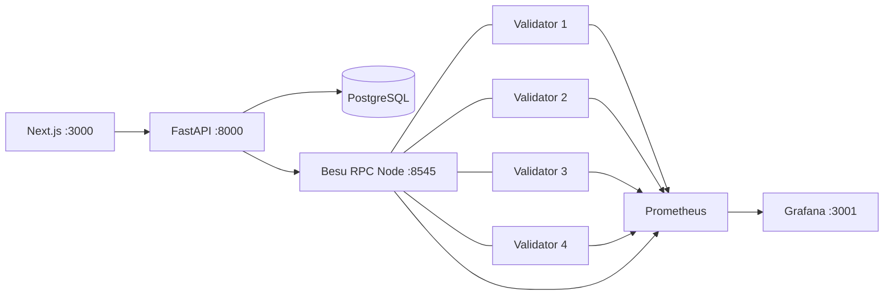
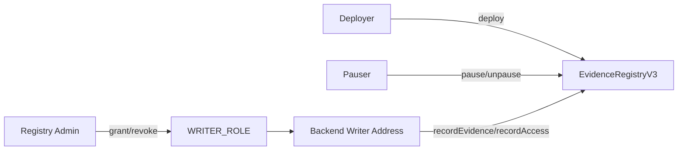

# Setup Guide

> **วัตถุประสงค์:** พา Developer ตั้งแต่ clone repository จนถึง network, contract, Backend และ Frontend ที่พร้อมใช้งาน
> **Last Verified Date:** 2026-09-12
> **Parent Revision:** `133aa9b3716c735748c96ac4ad9fba047fddc35f` (base revision; submodule/docs update pending commit)
> **Blockchain Revision:** `3a92ec3f2096d812c588d8bf8eea209e60a27717`
> **Smart Contract Version:** `EvidenceRegistryV3` (V3-only runtime)
> **Network Technology:** Hyperledger Besu 26.7.0, QBFT, private EVM, Chain ID `20260720`
> **Intended Audience:** Team Member, Developer, Operator

## สิ่งที่จะถูกสร้าง



Backend ใช้ RPC Node เป็น gateway ส่วน Validators ทำ QBFT consensus โดย Prometheus/Grafana อยู่ข้างระบบเพื่อสังเกตการณ์ ไม่ได้เป็น control plane ของ application

## Software ที่ต้องมี

| Software | ใครติดตั้ง | วิธีตรวจ | หมายเหตุจาก source |
|---|---|---|---|
| Git | Developer | `git --version` | ต้องรองรับ Git submodule |
| Docker Desktop | Developer | `docker --version` | ต้องให้ Docker Engine ทำงานอยู่ |
| Docker Compose v2 | มากับ Docker Desktop | `docker compose version` | scripts ใช้รูปแบบ `docker compose` |
| Python | Developer | `python --version` | Blockchain package รองรับ `>=3.11,<3.13` |
| Node.js/npm | Developer | `node --version`, `npm --version` | Frontend ใช้ Next.js 16.2.6 |
| Foundry | Developer | `forge --version`, `cast --version` | CI pin Foundry 1.7.1; Solidity 0.8.24 |
| Git Bash | Developer บน Windows | `bash --version` | network scripts เป็น Bash |
| PowerShell | มีใน Windows | `$PSVersionTable.PSVersion` | ใช้รัน Backend/Frontend และ RPC checks |
| Besu | Docker pull | ไม่ติดตั้ง binary บน host | image default `hyperledger/besu:26.7.0` |
| Prometheus | Docker pull | ดูจาก `docker compose ps` | image `prom/prometheus:v2.53.1` |
| Grafana | Docker pull | เปิด `http://localhost:3001` | image `grafana/grafana:11.1.0` |

หาก Foundry ไม่อยู่ใน PATH ให้เรียก executable จากตำแหน่งติดตั้งจริงของผู้ใช้หรือเพิ่ม directory นั้นใน process PATH ก่อน ห้ามเขียน path ของผู้ใช้คนหนึ่งเป็นค่ากลางของทีม

## Clone และ Submodule

### Clone ใหม่

```powershell
git clone --recurse-submodules https://github.com/laziesv/CapstoneProject.git
cd CapstoneProject
git submodule status
```

### Clone ไว้แล้วแต่ submodule ยังไม่พร้อม

```powershell
git submodule sync --recursive
git submodule update --init --recursive
git submodule status
```

Parent repository เก็บเพียง pointer ไปยัง commit ของ `blockchain/` ไม่ได้เก็บ source ภายใน submodule โดยตรง ดังนั้น workflow ที่ถูกต้องคือ commit/push ใน Blockchain repository ก่อน แล้วจึง commit pointer ใหม่ใน Parent repository มิฉะนั้นเพื่อนร่วมทีมจะ checkout pointer ที่ remote ยังไม่มี

## Environment Files

ใช้ไฟล์ตัวอย่างเป็น template และเก็บไฟล์จริงเฉพาะเครื่อง ห้าม commit `.env`

```powershell
Copy-Item backend\.env.example backend\.env
Copy-Item blockchain\.env.example blockchain\.env
Copy-Item blockchain\network\besu\.env.example blockchain\network\besu\.env
```

Backend โหลด `backend/.env` ด้วย absolute path และ `override=False` ดังนั้น process environment เช่น `$env:DB_NAME` มี priority เหนือค่าในไฟล์

### Backend variables

| Variable | Purpose | Secret | ใช้ค่าร่วมได้ | เปลี่ยนหลัง deploy | Used by |
|---|---|---:|---:|---:|---|
| `DB_HOST` | PostgreSQL host | No | Yes | No | SQLAlchemy/Alembic |
| `DB_PORT` | PostgreSQL port | No | Yes | No | SQLAlchemy/Alembic |
| `DB_NAME` | Database name | No | Usually no | No | SQLAlchemy/Alembic |
| `DB_USER` | Database user | Sensitive | Sometimes | No | SQLAlchemy/Alembic |
| `DB_PASSWORD` | Database password | Yes | No | No | SQLAlchemy/Alembic |
| `BLOCKCHAIN_ENABLED` | เปิด integration | No | Yes | No | Backend config |
| `BLOCKCHAIN_RPC_URL` | RPC endpoint | No | Machine-specific | No | Blockchain client |
| `BLOCKCHAIN_CHAIN_ID` | Expected chain ID | No | Yes | If chain changes | Client validation |
| `BLOCKCHAIN_CONTRACT_ADDRESS` | V3 deployment address | Public | Per chain | Yes | Client/Explorer |
| `BLOCKCHAIN_ARTIFACT_PATH` | Runtime ABI artifact | No | Yes | No | Provider |
| `BLOCKCHAIN_WRITER_PRIVATE_KEY` | Signer สำหรับ writes | **Yes** | Only under explicit dev policy | If writer rotates | Writer client |
| `BLOCKCHAIN_DEPLOYMENT_BLOCK` | จุดเริ่ม event scan | Public | Per deployment | Yes | CoC/Explorer |
| `BLOCKCHAIN_CONFIRMATIONS` | จำนวน confirmations | No | Yes | Policy | Receipt wait |
| `BLOCKCHAIN_REQUEST_TIMEOUT_SECONDS` | RPC request timeout | No | Yes | No | Web3 provider |
| `BLOCKCHAIN_CONFIRMATION_TIMEOUT_SECONDS` | Receipt wait timeout | No | Yes | No | Writer flow |
| `BLOCKCHAIN_CONFIRMATION_POLL_INTERVAL_SECONDS` | Receipt polling interval | No | Yes | No | Writer flow |
| `QBFT_BLOCK_PERIOD_SECONDS` | Block period ที่ Backend คาด | No | Match genesis | If genesis changes | Health/recovery |
| `BLOCKCHAIN_MAX_BLOCK_AGE_SECONDS` | อายุ block สูงสุดก่อนถือว่า stalled | No | Match policy | No | write preflight |

### Blockchain client/deployment variables

| Variable | Purpose | Secret | หมายเหตุ |
|---|---|---:|---|
| `RPC_URL` | endpoint สำหรับ scripts/client | No | ปกติ `127.0.0.1:8545` |
| `CHAIN_ID` | expected chain | No | reference `20260720` |
| `CONTRACT_ADDRESS` | deployed V3 address | Public | ต้องตรง local chain |
| `ARTIFACT_PATH` | ABI/bytecode artifact | No | committed runtime artifact |
| `MIN_CONFIRMATIONS` | confirmation policy | No | script/client setting |
| `REGISTRY_ADMIN_ADDRESS` | admin role address | Public | address ไม่ใช่ private key |
| `WRITER_ADDRESS` | backend writer role address | Public | grant `WRITER_ROLE` ให้ address นี้ |
| `DEPLOYER_PRIVATE_KEY` | deploy signer | **Yes** | ห้าม log/commit |
| `ADMIN_PRIVATE_KEY` | role admin signer | **Yes** | ห้าม log/commit |
| `PAUSER_PRIVATE_KEY` | pause signer | **Yes** | optional ตาม operation |
| `WRITER_PRIVATE_KEY` | write signer | **Yes** | ห้าม log/commit |
| `UNAUTHORIZED_PRIVATE_KEY` | negative-test signer | **Yes** | ใช้เฉพาะ controlled test |

### Besu network variables

| กลุ่ม | Variables | Purpose |
|---|---|---|
| Image | `BESU_VERSION`, `BESU_IMAGE` | เลือก Besu image; default source ใช้ 26.7.0 |
| Identity | `CHAIN_ID`, `NETWORK_ID` | chain/network identity |
| Host ports | `RPC_HTTP_PORT`, `RPC_WS_PORT` | expose RPC จาก host; HTTP default 8545 |
| Network | `BESU_SUBNET`, `VALIDATOR_1_IP` ถึง `VALIDATOR_4_IP`, `RPC_NODE_IP` | deterministic Docker network addresses |
| QBFT | `QBFT_BLOCK_PERIOD_SECONDS`, `QBFT_EPOCH_LENGTH`, `QBFT_REQUEST_TIMEOUT_SECONDS` | genesis consensus parameters |
| Metrics | `METRICS_PORT` | Besu metrics endpoint ภายใน network |
| Health | `MIN_PEERS`, `PEER_WAIT_SECONDS`, `BLOCK_WAIT_SECONDS` | startup health-check policy |
| Grafana | `GRAFANA_ADMIN_USER`, `GRAFANA_ADMIN_PASSWORD` | local dashboard login; password เป็น secret |

ดู source ตัวแปรครบถ้วนจากไฟล์ `.env.example` เท่านั้น อย่าแสดงค่าจาก `.env` จริง

## Local Development Policy

สมาชิกทีมสามารถมี local chain คนละชุดได้ Node keys, block history, transaction hash, contract address และ deployment block จึงไม่จำเป็นต้องเหมือนกัน Network topology, Chain ID และ contract behavior สามารถใช้มาตรฐานเดียวกันได้

ทีมอาจเลือก shared development keys เพื่อความสะดวกใน environment ที่ไม่มีข้อมูลสำคัญ แต่ private key ต้องผ่านช่องทางลับและไม่เข้าระบบ Git สำหรับ production ต้องแยก key ตามบทบาทและจัดการด้วย secret manager

## ติดตั้ง Dependencies

### Blockchain package

```powershell
cd blockchain
python -m venv .venv
.\.venv\Scripts\python.exe -m pip install -e ".[dev]"
git submodule update --init --recursive
forge build
cd ..
```

### Backend

```powershell
cd backend
python -m venv .venv
.\.venv\Scripts\python.exe -m pip install -r requirements.txt
cd ..
```

`backend/requirements.txt` ประกาศ Watermark runtime packages (NumPy, OpenCV, scikit-image, PyWavelets, qrcode/Pillow และ pyzbar), Web3 dependencies และ editable Blockchain submodule package แล้ว จึงต้อง init submodule ก่อนติดตั้ง Backend บน Linux ต้องติดตั้ง native `libzbar0` เพิ่มเพื่อให้ `pyzbar` โหลดได้

### Frontend

```powershell
cd frontend
npm ci
cd ..
```

## Generate Network

คำสั่งนี้สร้าง validator identities, RPC identity, QBFT genesis และ static peers ตาม script ปัจจุบัน

```powershell
cd blockchain
bash network/besu/scripts/generate-network.sh
```

Output สำคัญอยู่ใต้ `network/besu/generated/` และ node configuration อยู่ใต้ `network/besu/nodes/` ห้าม commit หรือแชร์ private node keys ที่ generate แล้ว

> [!CAUTION]
> option `--force` ลบ generated identity/genesis เดิมและทำให้ chain identity เปลี่ยน ใช้เฉพาะตอนตั้ง chain ใหม่ที่ยืนยันแล้วว่า state เดิมไม่ต้องเก็บ

## Start และ Validate Network

จาก `blockchain/`:

```powershell
bash network/besu/scripts/start-network.sh
docker compose --project-directory network/besu ps
python network/besu/scripts/health-check.py --rpc-url http://127.0.0.1:8545 --expected-chain-id 20260720
python network/besu/scripts/validate-generated-network.py --root network/besu --expected-validators 4
```

หรือใช้ Compose โดยตรงจาก project directory ที่ถูกต้อง:

```powershell
docker compose --project-directory network/besu up -d
```

Expected services คือ data-init 5 งานที่จบหลังเตรียม ownership และ runtime 7 services ได้แก่ Validator 1-4, RPC Node, Prometheus และ Grafana คำว่า `UP` เพียงอย่างเดียวยังไม่ยืนยันว่า QBFT ผลิต block ต้องตรวจ block progression เพิ่ม

### RPC แบบ read-only

```powershell
$body = '{"jsonrpc":"2.0","method":"eth_chainId","params":[],"id":1}'
Invoke-RestMethod -Uri 'http://127.0.0.1:8545' -Method Post -ContentType 'application/json' -Body $body

$body = '{"jsonrpc":"2.0","method":"eth_blockNumber","params":[],"id":2}'
Invoke-RestMethod -Uri 'http://127.0.0.1:8545' -Method Post -ContentType 'application/json' -Body $body
```

URI ต้องเป็น string URL จริง ไม่ใช่ Markdown link เช่น `[http://...](http://...)`

## Deploy EvidenceRegistryV3

Deployment เป็น write operation จริง ทำเมื่อสร้าง chain ใหม่หรือมี change ที่ตรวจทานแล้วเท่านั้น

```powershell
cd blockchain
bash network/besu/scripts/deploy-registry.sh
```

Script ทำ forge clean/build, deploy `EvidenceRegistryV3`, grant `WRITER_ROLE`, ตรวจ receipt/code และเขียน deployment manifest กับ `contract-address.env` ใช้ V3 เท่านั้น ห้าม deploy V2

หลัง deploy ให้ตรวจแบบ read-only:

```powershell
python scripts/verify_deployment.py --manifest network/besu/deployments/20260720/EvidenceRegistryV3.json
```

### Role separation



Backend writer ไม่ควรถือ admin role โดยไม่จำเป็น

## Update Backend หลัง Deploy

อัปเดต local `backend/.env` เท่านั้น:

```ini
BLOCKCHAIN_ENABLED=true
BLOCKCHAIN_CHAIN_ID=20260720
BLOCKCHAIN_CONTRACT_ADDRESS=<address-from-this-chain>
BLOCKCHAIN_DEPLOYMENT_BLOCK=<deployment-block-from-manifest>
BLOCKCHAIN_ARTIFACT_PATH=blockchain/artifacts/EvidenceRegistryV3.json
```

กำหนด `BLOCKCHAIN_WRITER_PRIVATE_KEY` ผ่าน secret/runtime environment โดยไม่ echo ค่า จากนั้น restart Backend process เต็มรูปแบบ โดยเฉพาะเมื่อแก้ Python client ใน submodule เพราะ watcher ที่เริ่มจาก `backend/` อาจไม่ได้ reload module ที่อยู่นอก watch directory

## Alembic และ Database

App startup ไม่รัน migration อัตโนมัติ ต้องรันด้วยผู้ดูแลจาก `backend/`:

```powershell
$env:DB_NAME = '<target-database>'
.\.venv\Scripts\python.exe -m alembic current
.\.venv\Scripts\python.exe -m alembic heads
.\.venv\Scripts\python.exe -m alembic upgrade head
.\.venv\Scripts\python.exe -m alembic check
```

Head ปัจจุบันคือ `c7d9e2a4f6b1` อย่ารันกับ DB จริงโดยไม่ยืนยัน `DB_NAME` ก่อน การ import `app.main` ยังทดสอบ DB connection และ seed admin/sample data ตามเงื่อนไข จึงไม่ใช่ read-only import

## Run Backend

```powershell
cd backend
.\.venv\Scripts\python.exe -m uvicorn app.main:app --host 127.0.0.1 --port 8000 --reload
```

หาก port ถูกใช้:

```powershell
netstat -ano | findstr :8000
Get-Process -Id <ACTUAL_PID>
Stop-Process -Id <ACTUAL_PID>
```

แทน `<ACTUAL_PID>` ด้วยตัวเลขจริง ห้ามพิมพ์เครื่องหมาย `< >` เป็นส่วนของคำสั่ง

## Run Frontend

```powershell
cd frontend
npm run dev
```

Backend CORS ปัจจุบันอนุญาต `http://localhost:3000` หาก Next.js เลื่อนไป port 3001 เพราะ server เดิมยังทำงาน ให้หยุด process เดิมแล้วเริ่มบน 3000 แทน อย่าใช้ 3001 ร่วมกับ Grafana ซึ่งใช้ port นี้อยู่

## Grafana

เปิด `http://localhost:3001` และใช้ local credentials จาก environment โดยไม่เผยแพร่ password

Normal expected state:

| Signal | Expected |
|---|---|
| Besu Nodes Online | 5 |
| Validators Online | 4 |
| RPC Node | UP |
| RPC peers | ประมาณ 4 ตาม topology |
| Synchronizer | IN SYNC |
| Block height | เพิ่มต่อเนื่องตาม block period ประมาณ 5 วินาที |

## Stop, Start, Restart และ Down

จาก `blockchain/`:

```powershell
bash network/besu/scripts/stop-network.sh
docker compose --project-directory network/besu start
docker compose --project-directory network/besu restart rpc-node
docker compose --project-directory network/besu down
```

- `stop` และ `start` รักษา containers/volumes
- `restart` เหมาะกับ service เฉพาะตัว แต่ RPC txpool เป็น volatile และอาจหายเมื่อ restart
- `down` ลบ containers/network แต่ named volumes ยังอยู่
- `down -v` ลบ chain state และ monitoring data จึงห้ามใช้เป็น troubleshooting ทั่วไป
