# Architecture and Flows

> **วัตถุประสงค์:** อธิบายสถาปัตยกรรมและลำดับทำงานจริงของ Blockchain Integration แบบ end-to-end
> **Last Verified Date:** 2026-09-10
> **Parent Revision:** `de54028e4cf704068ac7dcabfe4c7767be2336f5`
> **Blockchain Revision:** `1fdfe5a839105c0fec6c9ada98d04b82d8f04d06`
> **Smart Contract Version:** `EvidenceRegistryV3` (V3-only runtime)
> **Network Technology:** Hyperledger Besu 26.7.0, QBFT, private EVM, Chain ID `20260720`
> **Intended Audience:** Developer, Architect, Operator, Security Reviewer, AI

## 1. System Context

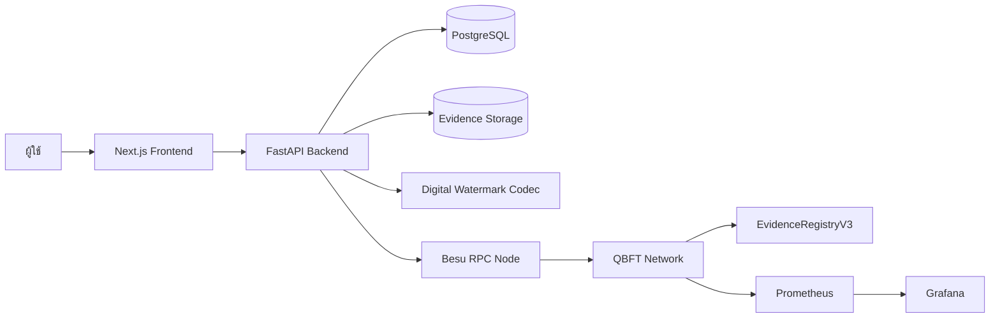

Frontend ไม่ถือ private key และไม่ติดต่อ Besu โดยตรง Backend เป็น orchestration boundary ที่ตรวจ auth/case access, จัดการ DB/files, เรียก Watermark codec และเรียก Python Blockchain client

## 2. Deployment Topology

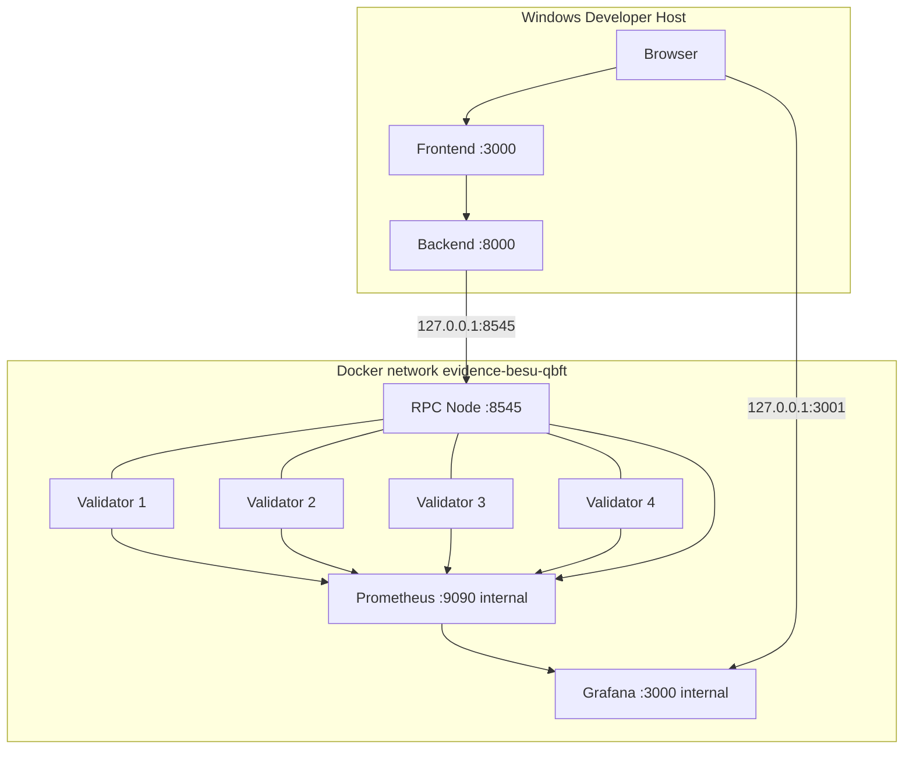

RPC Node ไม่เป็น Validator; Validators ไม่ expose host RPC ใน compose ปัจจุบัน Metrics port 9545 อยู่ภายใน Docker network

## 3. QBFT Consensus

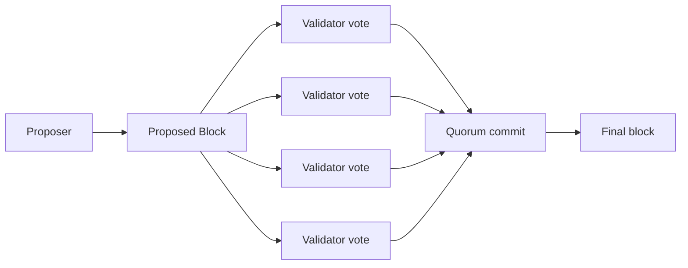

Topology 4 validators ต้องการ quorum 3 สำหรับการผลิต block ตาม fault model ของ QBFT: 4/4 ปกติ, 3/4 degraded แต่ยังเดิน, 2/4 หยุดผลิต block ค่า genesis ปัจจุบันมี block period 5 วินาที, epoch length 30000 และ request timeout 10 วินาที

## 4. Data Ownership

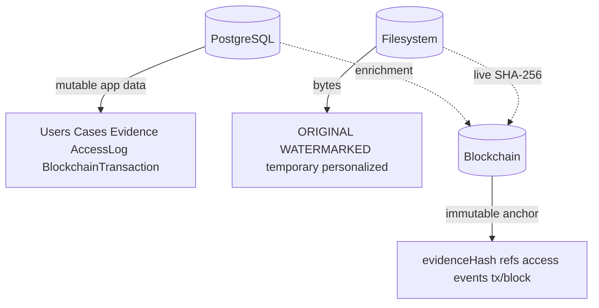

| ข้อมูล | Authority | หมายเหตุ |
|---|---|---|
| Evidence identity/ref | UUID ในแอป + deterministic derivation | Blockchain เก็บ opaque `evidenceRef` |
| Original bytes integrity | Blockchain `evidenceHash` | current file hash ต้องเทียบกับ chain |
| User name/email/badge | PostgreSQL | ห้ามใส่ PII บน chain |
| Access chronology | Blockchain event order | DB ใช้เสริมรายละเอียดและ reconciliation |
| File bytes/path | Filesystem + DB metadata | Blockchain ไม่เก็บไฟล์/path |
| Operational health | RPC + Prometheus/Grafana | ไม่ใช่ Chain of Custody |

## 5. EvidenceRegistryV3 Data Model

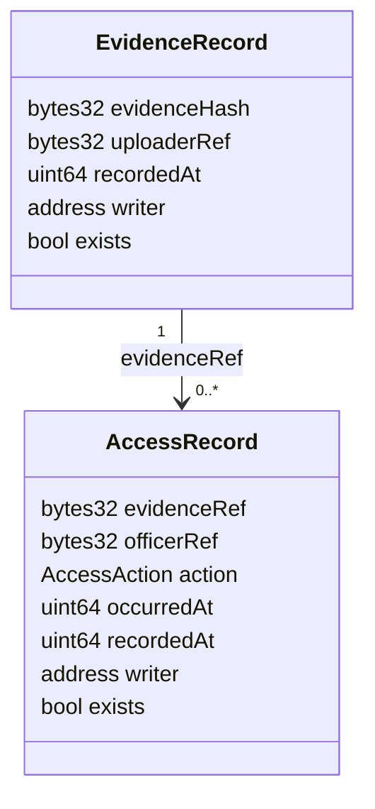

สัญญาเก็บ EvidenceRecord ตาม `evidenceRef` และ AccessRecord ตาม `accessSessionRef` การอ่าน session จึงไม่ต้อง scan event ตั้งแต่ block 0 ส่วน event ใช้ reconstruct chronology และ tx metadata

## 6. Reference Derivation

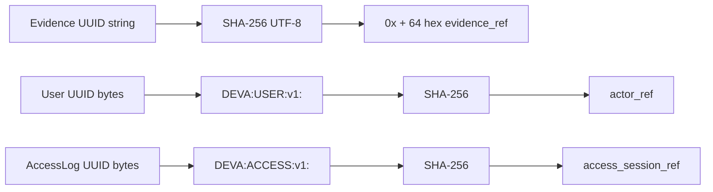

`evidence_ref` ใช้ algorithm เดียวกับค่าที่ Static Watermark encode หลัง hash UUID ส่วน actor/session มี namespace เพื่อป้องกันการชนกันข้ามชนิดข้อมูล

## 7. Hash Trust Model

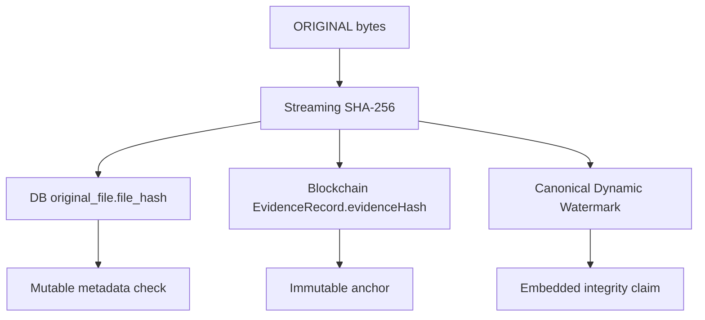

`Blockchain evidenceHash` เป็น anchor หลัก, current Original SHA-256 คือสิ่งที่มีอยู่จริงบน storage, DB hash เป็น metadata ที่แก้ได้ และ canonical Dynamic Watermark เป็น claim ที่อ่านจากภาพ ทั้งสามต้องแยกผลการตรวจ ไม่ลดเหลือ boolean เดียว

## 8. Upload Success Flow

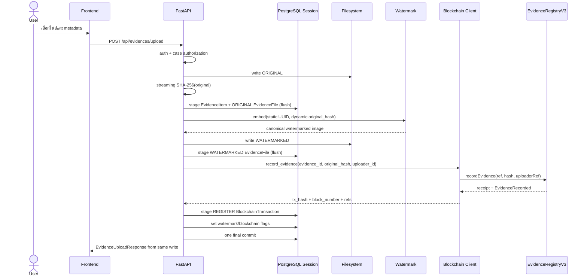

Response ใช้ tx hash/block จาก `recordEvidence` ครั้งเดียว ไม่มี `getEvidence()` read-back เพิ่ม Cardinality คือ 1 upload = 1 `recordEvidence` transaction

### Upload transaction boundary

`EvidenceFileRepository.create()` ใช้ `flush()` ไม่ commit ทำให้ EvidenceItem, ORIGINAL/WATERMARKED rows, registration metadata และ flags อยู่ใน caller transaction เดียว Filesystem ไม่ transactional จึง track เฉพาะ path ที่ invocation นี้สร้าง และลบแบบ best-effort เมื่อ exception

> [!WARNING]
> Atomic commit ข้าม PostgreSQL และ Blockchain ไม่มีจริง หาก chain transaction confirm แล้ว DB commit ล้ม ไม่สามารถ rollback chain ได้ Current code ไม่ retry `recordEvidence` อัตโนมัติ แต่ต้อง reconcile ด้วย tx/evidence ref ตาม incident

## 9. Upload Failure Flow

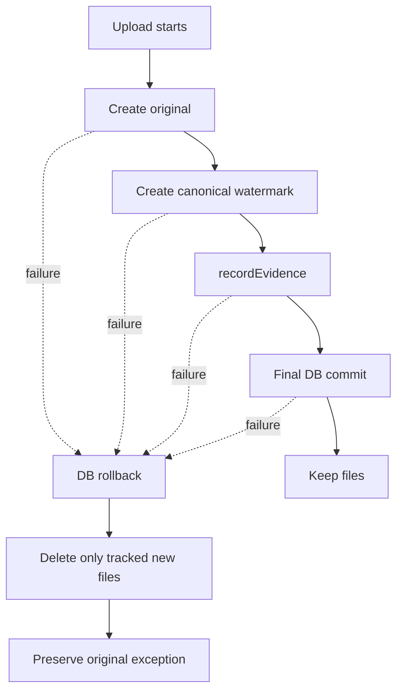

Cleanup failure ไม่แทนที่ upload error เดิม และไม่ลบ path ที่มีอยู่ก่อน invocation

## 10. Canonical Watermark Embed

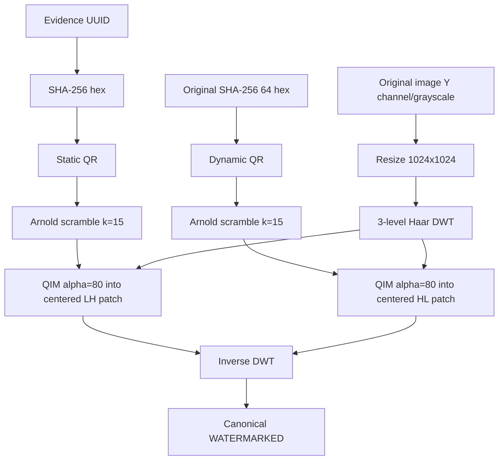

`np.random.seed(SHA256(dynamic))` ถูกเรียกตอน embed แต่ไม่มี random operation หลังจากนั้นที่มีผลต่อ selection/location ทั้งตำแหน่ง, QIM และ Arnold transform เป็น deterministic จึงไม่ต้องรู้ Dynamic ล่วงหน้าเพื่อ extract

## 11. Watermark Extract

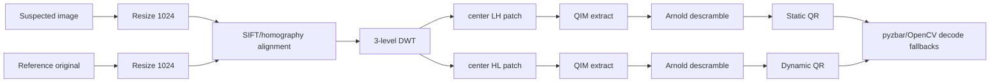

Signature รองรับ `dynamic_hash=None` เพื่อ backward compatibility แต่ extraction ไม่ใช้ค่าดังกล่าว QR decode คืน arbitrary UTF-8 string แล้ว service เป็นผู้ validate รูปแบบ

## 12. QUERY Audit Flow

```mermaid
sequenceDiagram
  participant F as Frontend
  participant A as Evidence list API
  participant D as PostgreSQL
  F->>A: GET /api/evidences
  A->>A: auth + scope filtering
  A->>D: query visible evidence
  A->>D: create QUERY AccessLog
  A->>D: commit
  A-->>F: filtered evidence list
  Note over A,D: QUERY is DB-only; no recordAccess
```

QUERY ไม่ปรากฏใน V3 Chain of Custody เพราะ contract action รองรับเฉพาะ VIEW/DOWNLOAD

## 13. Intentional VIEW Healthy Flow

```mermaid
sequenceDiagram
  actor U as User
  participant F as Frontend hook
  participant A as View API
  participant D as PostgreSQL
  participant B as Blockchain
  U->>F: ตั้งใจเปิด Evidence
  F->>F: create/persist request_id in sessionStorage
  F->>A: POST /evidences/{id}/view-session
  A->>A: authorize + liveness preflight
  A->>D: AccessLog VIEW PENDING; commit
  A->>B: submit_access(action=VIEW)
  B-->>A: deterministic tx_hash
  A->>D: BlockchainTransaction pending; link log; commit
  A->>B: confirm_access(tx_hash)
  B-->>A: receipt/event
  A->>D: transaction CONFIRMED + AccessLog SUCCESS; commit
  A-->>F: CONFIRMED
  F->>F: navigate to evidence page
```

VIEW ถูกบันทึกก่อน navigation เพื่อแยก intentional access ออกจากการโหลดรูป preview โดยตรง

## 14. VIEW State Machine

```mermaid
stateDiagram-v2
  [*] --> WAITING_FOR_BLOCKCHAIN: existing durable session not safe to submit yet
  [*] --> PENDING_BLOCKCHAIN_CONFIRMATION: tx hash persisted and receipt pending
  [*] --> CONFIRMED: receipt/session confirmed in first request
  [*] --> [*]: new preflight failure; no durable state
  WAITING_FOR_BLOCKCHAIN --> PENDING_BLOCKCHAIN_CONFIRMATION: submitted tx hash persisted
  WAITING_FOR_BLOCKCHAIN --> CONFIRMED: existing session found on-chain
  PENDING_BLOCKCHAIN_CONFIRMATION --> CONFIRMED: receipt/session event found
  PENDING_BLOCKCHAIN_CONFIRMATION --> PENDING_BLOCKCHAIN_CONFIRMATION: same request polls
  WAITING_FOR_BLOCKCHAIN --> [*]: definitive pre-submit failure
  CONFIRMED --> [*]
```

Public states ที่ Frontend ใช้มีสามค่าเท่านั้น `WAITING_FOR_BLOCKCHAIN`, `PENDING_BLOCKCHAIN_CONFIRMATION`, `CONFIRMED` ส่วน DB `AccessLog.result` มี `PENDING`, `SUCCESS`, `FAILED` เป็นต้น

### Unified VIEW State Mapping

Public/API state ไม่ได้เท่ากับ DB state โดยตรง และ `SUBMITTING` เป็นสถานะ local ของ Frontend ไม่ใช่ค่า API ตารางนี้อ้างอิง `EvidenceViewPreparationService`, route `view-session`, models และ Frontend polling ปัจจุบัน

| Phase | Public/API และ HTTP | `AccessLog.result` | `BlockchainTransaction.status` | `tx_hash` | Receipt/Event | UI behavior | เปิด Evidence? | Recovery rule |
|---|---|---|---|---|---|---|---:|---|
| A. คำขอใหม่ก่อน durable state | ไม่มี success state; preflight fail เป็น controlled `503` | ไม่มี row | ไม่มี row | ไม่มี | ไม่มี | `SUBMITTING` แล้วแสดง unavailable error | NO | รอ network พร้อมแล้วเริ่ม intent ใหม่; preflight ห้ามสร้าง log/tx |
| B. AccessLog durable แต่ยังไม่ broadcast | internal ใน request แรก; retry อาจได้ `WAITING_FOR_BLOCKCHAIN` / `202` | `PENDING` | ไม่มี row | ไม่มี | ไม่มี | รอและ poll ด้วย `request_id` เดิม | NO | ตรวจ session เดิมและ liveness ก่อน submit ด้วย AccessLog เดิม |
| C. Broadcast แล้ว รอ confirmation | `PENDING_BLOCKCHAIN_CONFIRMATION` / `202` | `PENDING` | `pending_confirmation` | มี | ยังไม่มี valid receipt/event ที่ยืนยันแล้ว | แสดง pending และ poll request เดิม | NO | ตรวจ tx, receipt และ session เดิม; ห้ามสร้าง duplicate |
| D. ไม่ทราบผลการ submission | `PENDING_BLOCKCHAIN_CONFIRMATION` / `202` | `PENDING` | `submission_unknown` | มี deterministic hash | ไม่ทราบ | แสดง pending และ poll request เดิม | NO | query tx/session จาก hash ที่เก็บไว้; ห้าม blind resubmit |
| E. Dropped transaction candidate | `PENDING_BLOCKCHAIN_CONFIRMATION` / `202` | `PENDING` | `pending_confirmation` ของ logical row เดิม | มี old hash แต่ RPC หาไม่พบ | ไม่มี receipt และไม่มี session หลังพ้น recovery delay | ยัง pending และไม่ navigate | NO | เมื่อ network healthy ให้ lock/recheck แล้ว replacement แบบ guarded โดยใช้ AccessLog, session ref และ logical tx row เดิม |
| F. Confirmed | `CONFIRMED` / `200` | `SUCCESS` | `confirmed` | มี | receipt status `1` และ event/session/action ถูก valid | ล้าง request ที่จำไว้แล้ว navigate | YES | ไม่ submit ซ้ำ; retry อ่านผล confirmed เดิม |
| G. Definitive pre-submit failure | ไม่มี success state; controlled `503` | `FAILED` ถ้ามี durable AccessLog แล้ว | ไม่มี row สำหรับ initial build/sign/nonce/client submission failure | ไม่มี | ไม่มี | แสดง error | NO | ไม่ทำเป็น success และไม่ auto-retry write |
| H. Reverted/definitive confirmation failure | ไม่มี success state; controlled `503` | `FAILED` | `reverted` หรือ `failed` | มี | receipt status `0` เมื่อ reverted หรือเกิด definitive validation failure | แสดง error | NO | ไม่เปิด Evidence และไม่ blind retry |

`tx_hash` หมายถึงมี identity ของ transaction ที่ส่ง ไม่ได้แปลว่า transaction confirmed แล้ว ส่วน receipt/confirmation timeout หมายถึงผลยังไม่ทราบ ไม่ใช่ definitive failure ระบบจึงต้องรักษา logical VIEW เดิม ได้แก่ `request_id`, AccessLog identity และ `access_session_ref` ตลอดการ polling, reconciliation และ guarded replacement ดูวิธีปฏิบัติที่ [Operations and Recovery](06-OPERATIONS-AND-RECOVERY.md) และการทดสอบจริงที่ [Real QBFT Chaos Acceptance Procedure](07-TESTING-AND-ACCEPTANCE.md#real-qbft-chaos-acceptance-procedure)

## 15. VIEW Idempotency

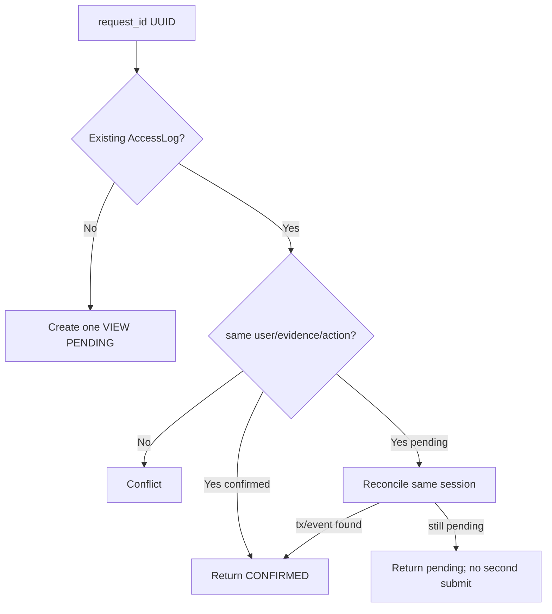

Partial unique index ป้องกัน VIEW PENDING ซ้ำต่อ `(user_id, evidence_id)` และ row locking/recheck ป้องกัน concurrent retry `request_id` ถูก scope ด้วย user/action/evidence ใน Frontend เพื่อไม่แชร์ข้ามบัญชี

## 16. Multiple Users VIEW

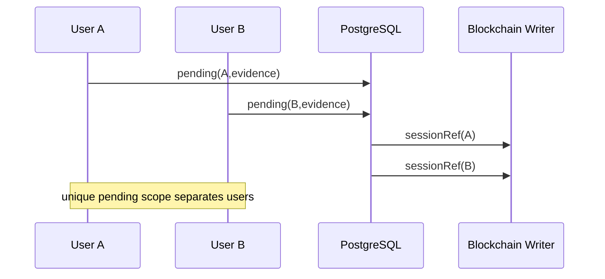

Writer client serialize nonce selection/submission ด้วย lock แต่ application sessions ของคนละผู้ใช้เป็นคนละ `access_session_ref`

## 17. VIEW Preflight Failure

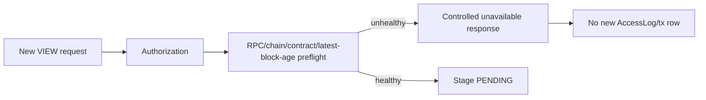

Preflight ลดการสร้าง pending ที่รู้ล่วงหน้าว่า network ใช้ไม่ได้ แต่ไม่รับประกันว่า transaction หลังจากนั้นจะ confirm เพราะสถานะอาจเปลี่ยนได้

## 18. VIEW Receipt Timeout

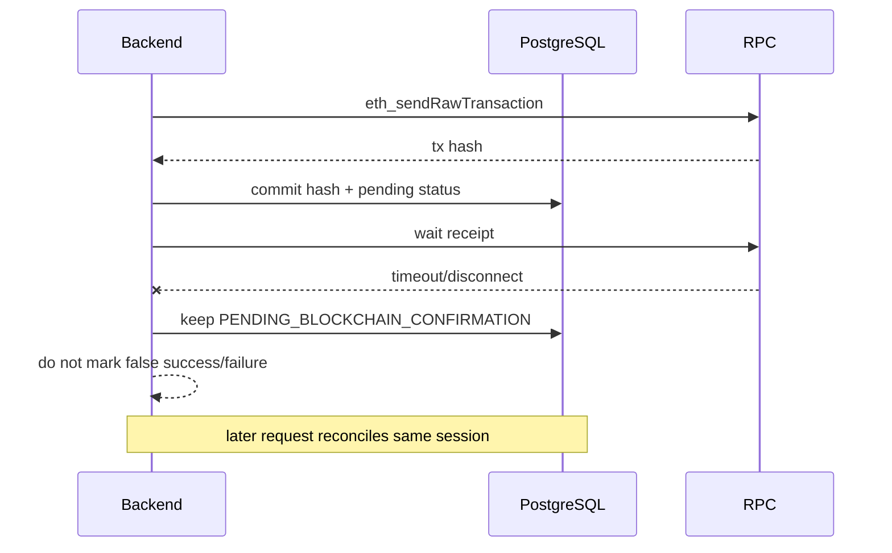

Timeout หมายถึงไม่ทราบผลในเวลาที่กำหนด ไม่ได้แปลว่า transaction fail

## 19. Submission Unknown

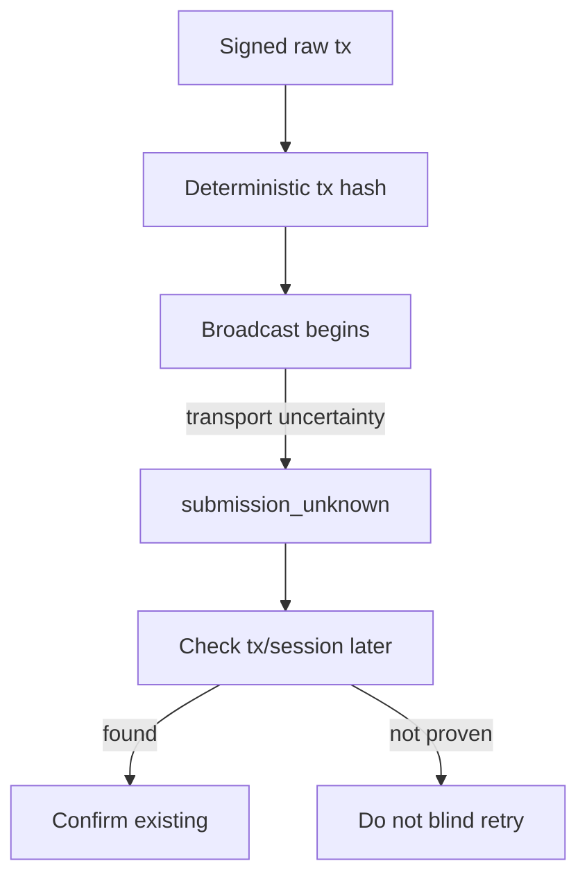

สถานะนี้ต่างจาก definitive failure ก่อน broadcast การ retry อัตโนมัติอาจสร้างผลซ้ำหาก transaction แรกเข้าสู่ node แล้ว

## 20. RPC Restart, txpool และ Nonce Gap

```mermaid
sequenceDiagram
  participant W as Writer
  participant R as RPC txpool
  participant C as Chain
  W->>R: nonce N transaction
  R-->>W: accepted, not mined
  Note over R: RPC restarts; volatile txpool loses nonce N
  W->>R: stale/local nonce N+1 would queue
  R-->>W: future nonce cannot execute
  W->>R: current implementation queries pending nonce fresh
  R-->>W: N
  W->>R: recovery submits same session at N
  R->>C: N then later nonces mine
```

Block production อาจยังเพิ่มเพราะ validators ปกติ แต่ writer transaction ติดจาก nonce gap Client ปัจจุบันไม่ cache nonce increment ข้าม submissions และ query `pending` nonce ใหม่ภายใต้ lock

## 21. Dropped VIEW Transaction Recovery

```mermaid
flowchart TD
  P[Pending transaction row] --> AGE{Recovery delay elapsed?}
  AGE -->|No| WAIT[Keep pending]
  AGE -->|Yes| TX{Old tx still exists?}
  TX -->|Yes| REC[Confirm/reconcile]
  TX -->|No| CHAIN{Chain healthy and session absent?}
  CHAIN -->|No| WAIT
  CHAIN -->|Yes| LOCK[Lock row and recheck]
  LOCK --> REPLACE[Submit replacement with same access_session_ref]
  REPLACE --> UPDATE[Update same BlockchainTransaction row/hash]
```

Recovery ทำเฉพาะ `pending_confirmation`, ไม่ auto-resubmit `submission_unknown`, ไม่สร้าง AccessLog/session ใหม่ และตรวจ chain state ซ้ำก่อน write

## 22. Secure Preview

```mermaid
sequenceDiagram
  participant P as Evidence page
  participant A as Preview route
  participant D as DB
  participant F as Filesystem
  P->>A: GET /api/evidence-files/{file_id}
  A->>D: load WATERMARKED file + evidence/case
  A->>A: current user + case authorization
  A->>F: return WATERMARKED bytes
  Note over A,D: no AccessLog and no recordAccess
```

Route ไม่ยอมคืน ORIGINAL และใช้ generic 404 สำหรับข้อมูลที่ไม่มีสิทธิ์ Intentional VIEW ถูกบันทึกโดย flow ก่อน navigation ไม่ใช่จาก image GET

## 23. DOWNLOAD Integrity Precondition

```mermaid
flowchart TD
  REQ[POST download] --> AUTH[Auth + case authorization]
  AUTH --> FILES[Require ORIGINAL and WATERMARKED metadata/files]
  FILES --> HASH[Streaming SHA-256 current ORIGINAL]
  HASH --> READ[getEvidence from V3]
  READ --> CMP{current == chain AND DB == chain?}
  CMP -->|No| BLOCK[409 EVIDENCE_INTEGRITY_MISMATCH]
  BLOCK --> ZERO[0 personalization, 0 AccessLog, 0 recordAccess, 0 tx row]
  CMP -->|Yes| CUSTODY[Begin download custody write]
```

ทั้ง current file mismatch และ DB metadata mismatch ทำให้ fail closed เพื่อไม่สร้าง derivative ใหม่จากสถานะหลักฐานที่ไม่สอดคล้อง

## 24. DOWNLOAD Success

```mermaid
sequenceDiagram
  actor U as User
  participant A as Download API
  participant I as Integrity Service
  participant D as PostgreSQL
  participant W as Personalized Watermark
  participant B as Blockchain
  participant F as Temp File
  U->>A: POST /evidences/{id}/download
  A->>I: verify current ORIGINAL + DB hash vs V3
  I-->>A: VERIFIED
  A->>D: stage DOWNLOAD AccessLog
  A->>A: derive access_session_ref(log UUID)
  A->>W: embed(original, static evidence ID, dynamic session ref)
  W->>F: temporary personalized image
  A->>B: recordAccess(..., DOWNLOAD, occurredAt)
  B-->>A: confirmed tx/block
  A->>D: stage confirmed ACCESS tx + link log
  A->>D: commit
  A-->>U: stream file + safe metadata headers
  A->>F: delete temp after response
```

Personalized copy สร้างจาก ORIGINAL ไม่ใช่ WATERMARKED ซ้ำ การ hash ของ temp personalized file เป็น derivative metadata ไม่ใช่ original evidence hash

> [!NOTE]
> DOWNLOAD ปัจจุบันรอ Blockchain receipt ใน orchestration ที่ยังถือ DB transaction ของรายการนี้ ต่างจาก VIEW ที่ persist pending lifecycle แยกก่อนรอ นี่เป็นข้อจำกัดด้าน latency/availability ที่ต้องทราบ ไม่ควรแก้เพียงเพิ่ม timeout โดยไม่ออกแบบ reconciliation

## 25. DOWNLOAD Failure

```mermaid
flowchart LR
  FAIL[Personalize/chain/DB exception] --> RB[DB rollback]
  RB --> DEL[Best-effort delete temp personalized file]
  DEL --> RESP[Preserve controlled 503/original HTTP error]
  RESP --> NR[No automatic write retry]
```

หาก chain confirm แต่ DB commit ล้ม จะมี on-chain event ที่ DB ยังไม่ link ต้องใช้ ref/tx เพื่อ reconcile ไม่ส่ง download ซ้ำแบบ blind

## 26. Canonical Verify

```mermaid
sequenceDiagram
  actor AD as Admin
  participant V as Verify API
  participant W as WatermarkService
  participant D as PostgreSQL/Filesystem
  participant B as V3 read client
  AD->>V: POST /api/watermark/verify image
  V->>W: identify/extract
  W->>W: Static -> match SHA256(Evidence UUID)
  W->>W: Dynamic 64 hex without 0x -> canonical
  W->>B: getEvidence(evidence_ref)
  B-->>W: blockchain evidenceHash
  W->>D: DB original hash + live ORIGINAL SHA-256
  W-->>V: separate watermark/file/database integrity states
  V-->>AD: read-only result
```

Canonical Dynamic ต้องเทียบ Blockchain hash เป็นหลัก ไม่ใช่ DB อย่างเดียว

| Comparison | ความหมาย |
|---|---|
| Dynamic == Blockchain | Canonical Watermark claim ถูกต้อง |
| Current Original == Blockchain | bytes ปัจจุบันยังสมบูรณ์ |
| DB original hash == Blockchain | application metadata ยังสอดคล้อง |

## 27. Personalized Verify

```mermaid
sequenceDiagram
  actor AD as Admin
  participant V as Verify API
  participant W as WatermarkService
  participant L as LeakAttributionService
  participant B as V3
  participant D as PostgreSQL/Filesystem
  AD->>V: unknown personalized image
  V->>W: extract without known dynamic
  W->>W: Dynamic matches 0x + 64 hex
  W->>B: getEvidence + live original integrity
  W->>L: resolve_by_access_session_ref
  L->>B: getAccessBySession + event/history
  B-->>L: evidenceRef/officerRef/action/times/tx
  L->>L: require DOWNLOAD and same evidenceRef
  L->>D: optional DB/user/tx enrichment
  W-->>V: integrity layer + session traceability layer
```

Dynamic ใน mode นี้คือ `access_session_ref` จึงห้ามเทียบตรงกับ `evidenceHash` Session ที่ถูกต้องยังแสดงเป็น historical chain evidence ได้แม้ current Original/DB hash ถูกแก้ภายหลัง แต่ต้องแสดง integrity mismatch แยกชัดเจน

## 28. Verify Classification and Fail Closed

```mermaid
flowchart TD
  D[Decoded Dynamic] --> C{Format}
  C -->|64 hex no 0x| CAN[Canonical]
  C -->|0x + 64 hex| PER[Personalized]
  C -->|empty/malformed| UN[Unresolved]
  PER --> RES[Resolve chain session]
  RES --> SAME{evidenceRef matches Static?}
  SAME -->|No| CLOSED[dynamic_ok false; hide cross-evidence attribution]
  SAME -->|Yes| ACT{action DOWNLOAD?}
  ACT -->|No| UN
  ACT -->|Yes| SAFE[Expose safe matched-session attribution]
```

หาก cross-evidence mismatch response ต้องไม่เปิดเผย user, access log, tx, block หรือ attribution timestamps ของหลักฐานอื่น Blockchain read unavailable คง 503 semantics และ Verify ไม่สร้าง AccessLog/transaction

## 29. Chain of Custody

```mermaid
sequenceDiagram
  actor AD as Admin
  participant API as CoC API
  participant BC as Blockchain Service
  participant DB as PostgreSQL
  AD->>API: GET /evidences/{id}/chain-of-custody
  API->>BC: scan from deployment block in chunks of 1000
  BC-->>API: registration + V3 access events
  API->>DB: batch transaction/access/user enrichment
  API->>API: compare hashes/refs/action/time/tx metadata
  API->>API: order by block, tx index, log index
  API-->>AD: chain-first timeline + mismatch details
```

CoC ใช้ Blockchain order ไม่ใช้ DB timestamp เป็นลำดับหลัก หาก AccessLog/user/transaction row ถูกลบ event ยังอยู่และสามารถแสดง ref ได้ `QUERY` ไม่อยู่ใน chain timeline

CoC ปัจจุบันเปรียบเทียบ DB original hash กับ Blockchain evidenceHash แต่ไม่ live rehash file ทุกครั้งเพื่อไม่เพิ่ม I/O หน้า timeline; Download และ Verify เป็น flow ที่ทำ live rehash

## 30. Chain/DB Comparison

```mermaid
flowchart LR
  CE[Chain Event] --> KEY[sessionRef]
  KEY --> AL[AccessLog]
  AL --> BT[BlockchainTransaction]
  CE --> CMP{Compare}
  AL --> CMP
  BT --> CMP
  CMP --> OK[VERIFIED]
  CMP --> MM[Mismatch fields]
  CE --> ACTOR[officerRef]
  ACTOR --> USER[Current DB user enrichment]
```

Blockchain เป็น canonical สำหรับ action, evidenceRef, sessionRef, tx/block และ recorded order ส่วน DB user profile เป็นข้อมูลปัจจุบัน ไม่ใช่ PII ที่ถูก commit บน chain

## 31. Legacy CoC Branch

```mermaid
flowchart TD
  TX[DB BlockchainTransaction] --> ADR{contract address == current V3?}
  ADR -->|Yes| V3[V3 canonical verification]
  ADR -->|No/legacy| LP[LEGACY_PARTIAL_VERIFICATION]
  LP --> SHOW[Show limited DB context; do not pretend V3 proof]
```

Runtime write/read contract เป็น V3-only แต่ DB row จาก deployment เก่าอาจยังปรากฏแบบ partial เพื่อไม่ปลอมความแน่นอน

## 32. Blockchain Explorer

```mermaid
flowchart LR
  ADMIN[Admin UI] --> API[/api/blockchain]
  API --> O[overview]
  API --> BL[block/{number}]
  API --> TX[transaction/{hash}]
  API --> EI[evidence/{uuid}]
  API --> ER[evidence-ref/{ref}]
  API --> AS[access-session/{ref}]
  O & BL & TX & EI & ER & AS --> RPC[Read-only V3/RPC]
  API -.optional enrichment.-> DB[(PostgreSQL)]
```

ทุก route เป็น Admin-only และ read-only Unknown resource map เป็น 404, RPC failure เป็น 503 โดยไม่เผย raw secret/RPC internals

## 33. Access Log and BlockchainTransaction Relationship

```mermaid
erDiagram
  EVIDENCE_ITEMS ||--o{ EVIDENCE_FILES : has
  EVIDENCE_ITEMS ||--o{ ACCESS_LOGS : referenced_by
  EVIDENCE_ITEMS ||--o{ BLOCKCHAIN_TRANSACTIONS : registered_or_accessed
  USERS ||--o{ ACCESS_LOGS : performs
  ACCESS_LOGS o|--o| BLOCKCHAIN_TRANSACTIONS : tx_internal_id
  CASES ||--o{ EVIDENCE_ITEMS : contains
```

`AccessLog` เก็บ local audit lifecycle, `BlockchainTransaction` เก็บ tx hash/block/contract/action/status และ link กันด้วย `tx_internal_id` สำหรับ VIEW/DOWNLOAD ที่บันทึกบน chain

## 34. Authorization Boundary

```mermaid
flowchart TD
  TOKEN[Bearer token] --> USER[Active current user]
  USER --> ROLE{Admin?}
  ROLE -->|Yes| ALL[All cases + admin forensic APIs]
  ROLE -->|No| SCOPE[Self + transitive subordinates]
  SCOPE --> CASE{creator/assignee in scope?}
  CASE -->|Yes| ACCESS[Evidence access]
  CASE -->|No| GENERIC[Generic 404]
```

CoC, Verify, Explorer และ Access Logs administration ใช้ Admin dependency Backend enforce permission ไม่พึ่ง Frontend hiding

## 35. Monitoring Data Path

```mermaid
flowchart LR
  N[5 Besu nodes /metrics:9545] -->|scrape 15s| P[Prometheus]
  P -->|PromQL| G[Grafana dashboard refresh 10s]
  G --> OP[Operator]
  API[Backend] -->|JSON-RPC directly| R[RPC Node]
  OP -.diagnosis.-> API
```

Grafana ไม่ได้อนุมัติหรือ block application writes Backend ใช้ RPC liveness preflight ของตนเอง รายละเอียด panel และข้อจำกัดอยู่ใน [Grafana Monitoring Guide](10-GRAFANA-MONITORING-GUIDE.md)

## 36. Full Evidence Lifecycle

```mermaid
flowchart TD
  UP[UPLOAD] --> REG[recordEvidence original hash]
  REG --> CAN[Canonical WATERMARKED]
  CAN --> VIEW[Intentional VIEW session]
  VIEW --> VTX[recordAccess VIEW]
  CAN --> DL[DOWNLOAD integrity precheck]
  DL --> COPY[Personalized copy]
  COPY --> DTX[recordAccess DOWNLOAD]
  COPY --> LEAK[Unknown copy later verified]
  LEAK --> ATTR[Resolve access session]
  REG & VTX & DTX --> COC[Chain of Custody]
  REG & VTX & DTX --> EXP[Explorer]
```

## Failure Semantics Summary

| Layer | Failure | Public behavior | Persisted state | Retry rule |
|---|---|---|---|---|
| Upload pre-chain | file/watermark error | upload error | rollback; tracked files removed | user may start new upload |
| Upload chain write | rejected/unavailable | 503 | rollback; files removed | no automatic retry |
| Upload DB commit after chain | DB error | failure | chain may already contain registration | reconcile; do not blind retry |
| New VIEW preflight | stale/RPC/contract error | unavailable | no new log/tx | retry same intent after recovery |
| VIEW receipt timeout | unknown yet | pending | AccessLog + tx hash durable | poll same request |
| VIEW submission unknown | transport uncertainty | pending/unknown | deterministic hash if available | inspect, never blind retry |
| Dropped VIEW tx | RPC restart/txpool loss | pending | same session/row | guarded replacement after checks |
| Download integrity mismatch | file/DB != chain | 409 | no download custody write | repair/investigate first |
| Download chain failure | write unavailable | 503 | rollback; temp deleted | no automatic retry |
| Verify blockchain read | unavailable | 503 | none | retry read later |
| CoC/Explorer read | unavailable | 503 | none | retry read later |

## Security Invariants

1. Private keys อยู่ Backend/runtime secret เท่านั้น
2. PII ไม่ขึ้น Blockchain
3. `evidenceHash` หมายถึง SHA-256 ของ ORIGINAL bytes เท่านั้น
4. Canonical Dynamic = original hash; Personalized Dynamic = `access_session_ref`
5. Static identity semantics ไม่เปลี่ยน
6. Verify/Explorer/CoC เป็น read-only
7. VIEW/DOWNLOAD ต้องใช้ action ถูกต้อง และ session refs ไม่ซ้ำ
8. Event scan เริ่มจาก deployment block และแบ่งช่วง ไม่ scan block 0 แบบกว้าง
9. Timeout/transport uncertainty ไม่ถูกแปลเป็น false failure หรือ blind retry
10. Monitoring ไม่ใช่ proof ของ transaction หรือ Chain of Custody

## Known Architectural Limits

- ไม่มี distributed transaction ระหว่าง Blockchain, PostgreSQL และ filesystem
- Upload และ Download บางช่วงยังรอ chain receipt ภายใต้ request orchestration; VIEW มี durable pending/reconciliation ที่สมบูรณ์กว่า
- Backend dependency manifest ยังไม่ครอบคลุม Watermark runtime package ทั้งหมด
- App import มี DB connection/seed side effect
- CoC ไม่ live hash ORIGINAL เพื่อเลี่ยง repeated file I/O
- Grafana ไม่มี writer nonce, per-transaction receipt หรือ DB pending panels ใน dashboard ปัจจุบัน
- Local development contract/address/history อาจต่างจาก reference manifest

อ่านการกู้คืนที่ [Operations and Recovery](06-OPERATIONS-AND-RECOVERY.md), การทดสอบที่ [Testing and Acceptance](07-TESTING-AND-ACCEPTANCE.md) และการวินิจฉัยที่ [Troubleshooting](09-TROUBLESHOOTING.md)
