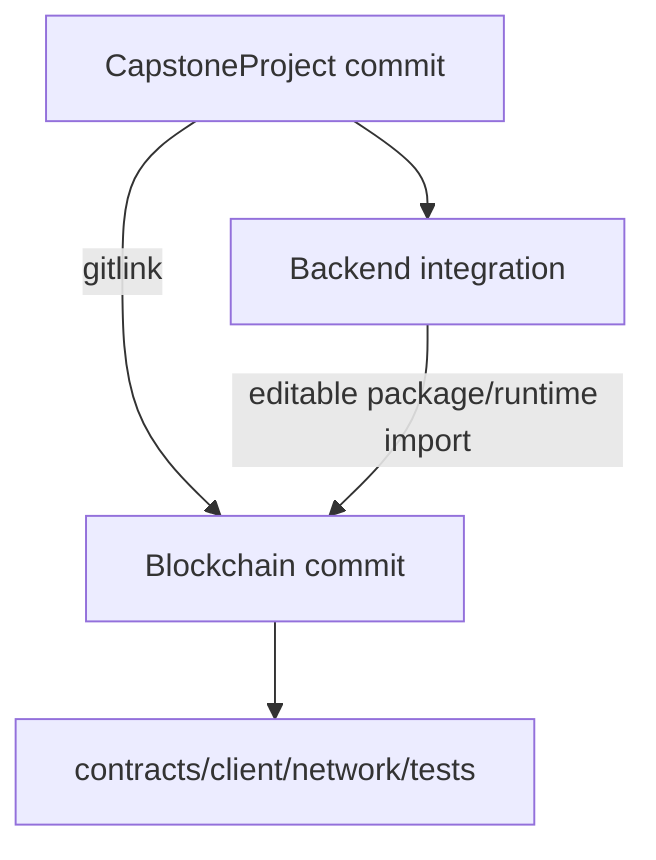
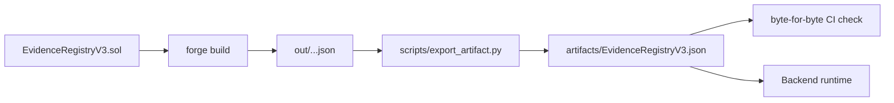

# Blockchain File Guide

> **วัตถุประสงค์:** อธิบายโครงสร้างไฟล์, source of truth, ownership และความปลอดภัยในการแก้ Blockchain repository
> **Last Verified Date:** 2026-09-12
> **Parent Revision:** `133aa9b3716c735748c96ac4ad9fba047fddc35f` (base revision; submodule/docs update pending commit)
> **Blockchain Revision:** `3a92ec3f2096d812c588d8bf8eea209e60a27717`
> **Smart Contract Version:** `EvidenceRegistryV3` (V3-only runtime)
> **Network Technology:** Hyperledger Besu 26.7.0, QBFT, private EVM, Chain ID `20260720`
> **Intended Audience:** Blockchain Developer, Backend Developer, Operator, AI

## Repository Boundary

`blockchain/` เป็น Git submodule ที่ชี้ไปยัง [`Unsull/Blockchain`](https://github.com/Unsull/Blockchain) ตาม `.gitmodules` และ `origin` จริง โดยมี Git history คนละชุดกับ Parent repository การแก้ source ภายในต้อง commit/push ที่ submodule ก่อน แล้วจึง update parent pointer

## Top-level Map

| Path | หน้าที่ | ประเภท | Source of truth | Safe to edit? |
|---|---|---|---|---|
| `contracts/EvidenceRegistryV3.sol` | V3 contract behavior และ storage | Tracked source | **Yes สำหรับ contract** | เฉพาะงาน contract ที่มี review/redeploy plan |
| `script/*.s.sol` | Foundry deployment/role scripts | Tracked source | Yes | แก้ได้พร้อม Foundry tests |
| `blockchain_client/` | Python client, signer, nonce, events, refs | Tracked source | **Yes สำหรับ Python API** | แก้ได้พร้อม Python tests |
| `artifacts/EvidenceRegistryV3.json` | committed runtime ABI/bytecode | Tracked generated artifact | Exported build is authoritative | ห้าม hand-edit; regenerate/export |
| `out/`, `cache/` | local Foundry build outputs | Generated/ignored | No | ลบแล้ว build ใหม่ได้ |
| `test/` | Foundry unit/fuzz/invariant tests | Tracked tests | Behavioral evidence | แก้ตาม contract behavior |
| `tests/` | Python client/benchmark/proof tests | Tracked tests | Behavioral evidence | แก้ตาม client behavior |
| `network/besu/docker-compose.yml` | runtime topology, ports, volumes | Tracked config | **Yes สำหรับ local topology** | ระวัง state/ports |
| `network/besu/config/` | Besu node config templates | Tracked config | Yes | ต้องสอดคล้อง compose/genesis |
| `network/besu/genesis/` | QBFT genesis source/input | Tracked config | Chain identity input | เปลี่ยนแล้วเป็น chain ใหม่ |
| `network/besu/generated/` | generated identities/genesis/static peers | Secret/generated | Current local chain | ห้าม commit keys; อย่า regenerate โดยไม่ตั้งใจ |
| `network/besu/nodes/` | per-node static configuration | Mixed | Compose + generated output | แก้ด้วยความระวัง |
| `network/besu/monitoring/` | Prometheus/Grafana config | Tracked config | Monitoring source | แก้ได้โดยไม่เปลี่ยน consensus ถ้า scoped |
| `network/besu/deployments/<chain>/` | deployment manifest | Tracked public record | Deployment reference | update จาก deploy script ไม่ hand-edit |
| `deployments/` | deployment material ระดับ repo | Tracked/public ตามไฟล์ | Script output | ตรวจจุดใช้งานก่อนแก้ |
| `network/besu/data/` หรือ named volumes | chain database | Runtime state | Actual local chain | ห้ามลบถ้าต้องรักษาประวัติ |
| `lib/` | Foundry upstream dependencies/submodules | Vendor submodules | Upstream | ไม่แก้เป็น project source |
| `.github/workflows/` | CI Solidity/Python/Besu/artifact validation | Tracked automation | CI policy | แก้พร้อม local validation |
| `foundry.toml` | Solidity compiler/build config | Tracked config | Build source | ระวัง bytecode/compatibility |
| `pyproject.toml` | Python package/dependencies/tests | Tracked config | Package source | แก้เมื่อ dependency/API เปลี่ยน |
| `.env.example` | variable names/template | Tracked documentation config | Public template | แก้ได้โดยไม่มี secret |
| `.env` | local secrets/runtime values | Ignored secret | Local runtime | แก้ local เท่านั้น ห้าม commit |

## Smart Contract

### EvidenceRegistryV3

สัญญาใช้ Solidity 0.8.24, OpenZeppelin `AccessControl` และ `Pausable`

| API | ความหมาย |
|---|---|
| `recordEvidence(evidenceRef, evidenceHash, uploaderRef)` | ลงทะเบียนหลักฐานครั้งเดียว; ห้าม ref ซ้ำ/ศูนย์ |
| `recordAccess(evidenceRef, officerRef, accessSessionRef, action, occurredAt)` | บันทึก `VIEW=0` หรือ `DOWNLOAD=1`; session ต้องไม่ซ้ำ |
| `getEvidence(evidenceRef)` | อ่าน EvidenceRecord |
| `getAccessBySession(accessSessionRef)` | อ่าน AccessRecord แบบ O(1) |
| `evidenceExists(evidenceRef)` | ตรวจ registration |
| `accessSessionExists(accessSessionRef)` | ตรวจ session |
| `pause()/unpause()` | หยุด/เปิด writes ตาม role |

Roles:

- `DEFAULT_ADMIN_ROLE`: grant/revoke roles
- `WRITER_ROLE = keccak256("WRITER_ROLE")`: เขียน evidence/access
- `PAUSER_ROLE = keccak256("PAUSER_ROLE")`: pause/unpause

On-chain data เป็น refs/hash/address/timestamp เท่านั้น ไม่มี username, email, badge หรือ path ไฟล์

## Reference Derivation

| Value | Algorithm | Use |
|---|---|---|
| `evidence_ref` | `0x + SHA256(str(evidence_uuid).encode())` | identity บน chain; ค่า hex ตรงกับ Static Watermark payload หลัง decode |
| `actor_ref` | `0x + SHA256(b"DEVA:USER:v1:" + user_uuid.bytes)` | opaque uploader/officer identity |
| `access_session_ref` | `0x + SHA256(b"DEVA:ACCESS:v1:" + access_log_uuid.bytes)` | idempotent access identity และ Personalized Dynamic Watermark |
| `evidence_hash` | SHA-256 ของ bytes ใน ORIGINAL file | immutable integrity anchor |

ผลลัพธ์ refs เป็น lowercase `0x` + 64 hex, non-zero bytes32

## Python Client

| File/area | หน้าที่ |
|---|---|
| `blockchain_client/client.py` | read/write contract, health, receipt/event validation |
| `blockchain_client/config.py` | `BlockchainClientSettings`; ไม่อ่าน environment เอง |
| `blockchain_client/signer.py` | local private-key signer สำหรับ write client |
| `blockchain_client/nonce.py` หรือ nonce module | query pending nonce ใหม่ในทุก submission ภายใต้ writer lock |
| reference helpers | derive evidence/actor/access refs |
| event/proof modules | map events, proofs และ transaction verification |

Backend เป็นผู้โหลด environment แล้วสร้าง settings/client แบบ lazy การ import module จึงไม่ควรติดต่อ RPC

### Write lifecycle

1. ตรวจ RPC, chain ID และ contract bytecode
2. lock writer
3. query `eth_getTransactionCount(writer, "pending")`
4. build/sign raw transaction
5. derive deterministic tx hash จาก signed bytes
6. broadcast raw transaction
7. wait receipt และ confirmations ตาม settings
8. ตรวจ status/event

หาก transport ตัดหลังเริ่ม broadcast client ใช้ `TransactionSubmissionUncertainError` พร้อม tx hash ที่คำนวณได้ และห้าม blind retry เพราะ transaction เดิมอาจอยู่ใน txpool/chain แล้ว

## Artifact Lifecycle

Runtime Backend ใช้ [`artifacts/EvidenceRegistryV3.json`](../../blockchain/artifacts/EvidenceRegistryV3.json) ไม่ใช้ `tests/fixtures` หรือ `out/` ค่า default นี้ทำให้ fresh checkout ไม่ต้อง `forge build` เพื่ออ่าน ABI ตอน Backend start

ห้ามแก้ artifact ด้วยมือ CI เปรียบเทียบ artifact ที่ export กับ Foundry build แบบ byte-for-byte

Revision `3a92ec3` ปรับ CI ให้แสดง diagnostics และเก็บ artifact เมื่อ comparison ล้ม, regenerate committed artifact จาก build และ normalize path metadata ใน `foundry.lock` โดย dependency revisions เดิม ส่วน Python client/test เปลี่ยนเฉพาะ type/import cleanup ไม่มี Solidity, ABI semantics, network topology หรือ runtime client behavior เปลี่ยน

## Network Files

| Path | หน้าที่ |
|---|---|
| `network/besu/docker-compose.yml` | 4 validators, 1 RPC, Prometheus, Grafana, volumes/network |
| `network/besu/docker-compose.monitoring.yml` | optional override ที่ expose Prometheus 9090 และ Grafana 3000; main compose มี Grafana 3001 อยู่แล้ว |
| `network/besu/scripts/generate-network.sh` | generate QBFT identities/genesis/static peers |
| `network/besu/scripts/start-network.sh` | load env, compose up, wait RPC/peers/blocks และ health check |
| `network/besu/scripts/stop-network.sh` | compose stop โดยรักษา volumes |
| `network/besu/scripts/deploy-registry.sh` | build/deploy V3/grant role/write manifest |
| `network/besu/scripts/health-check.py` | read-only chain/network checks |
| `network/besu/scripts/validate-generated-network.py` | validate generated topology |
| `network/besu/monitoring/prometheus.yml` | scrape targets/interval |
| `network/besu/monitoring/alert-rules.yml` | current Prometheus alert rules |
| `network/besu/monitoring/grafana/` | datasource, dashboard provisioning และ JSON |

## Data Classification

| Data | ที่เก็บ | Git | Backup requirement |
|---|---|---:|---|
| Solidity/Python/config source | tracked files | Yes | Git remote |
| Runtime artifact | `artifacts/` | Yes | Git + CI validation |
| Deployment address/block/tx | deployment manifest | Yes, public | Git |
| Private keys/passwords | `.env`/secret channel | **No** | encrypted secret backup |
| Validator/RPC private identity | generated local paths/volumes | **No** | encrypted operational backup |
| Blockchain state | validator/RPC named volumes | No | coordinated volume backup |
| Prometheus time-series | `prometheus-data` | No | optional operational backup |
| Grafana data | `grafana-data` | No | backup if local custom state matters |

## Change Matrix

| ต้องการเปลี่ยน | ไฟล์หลัก | ต้องทำเพิ่ม |
|---|---|---|
| Contract behavior/storage | contract + Foundry tests + artifact | review, deploy ใหม่, manifest/env/backend compatibility |
| Client write/recovery | Python client + tests | editable install/restart Backend; no contract deploy if ABI unchanged |
| Backend environment default | Parent integration config | Backend tests; อย่าแก้ submoduleโดยไม่จำเป็น |
| Topology/QBFT genesis | compose/genesis/generator | ถือเป็น chain ใหม่; preserve/backup old state |
| Dashboard only | dashboard JSON/provisioning | restart/recreate Grafana serviceโดยรักษา volume |
| Prometheus targets/rules | prometheus config | reload/recreate monitoring; no chain redeploy |
| Runtime contract address | local `.env` | restart Backend; ไม่ commit secret file |

## ก่อนแก้ไฟล์ใด

1. ตรวจว่าอยู่ Parent หรือ submodule ด้วย `git rev-parse --show-toplevel`
2. ตรวจ branch/HEAD/status ทั้งสอง repository
3. อ่าน tests ที่กำหนด contract/API เดิม
4. แยก source, generated output, runtime state และ secret
5. ประเมินว่าต้อง deploy chain ใหม่หรือเพียง restart process
6. commit submodule ก่อน update parent pointer

ดู operation ที่ [Operations and Recovery](06-OPERATIONS-AND-RECOVERY.md) และ acceptance ที่ [Testing and Acceptance](07-TESTING-AND-ACCEPTANCE.md)
