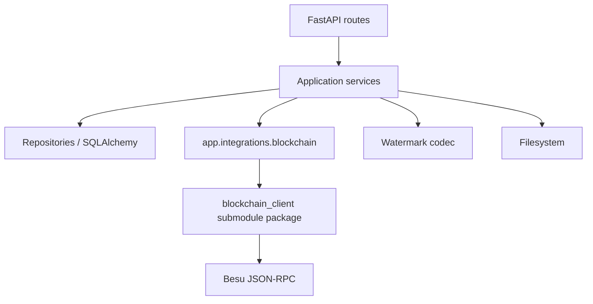
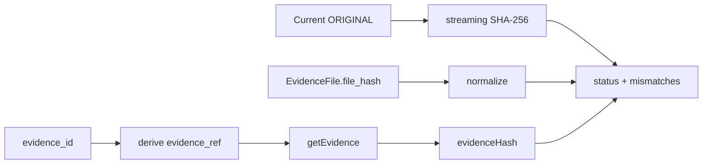

# Backend Integration

> **วัตถุประสงค์:** อธิบาย Backend changes, public APIs, transaction boundaries และ extension points ของ Blockchain Integration
> **Last Verified Date:** 2026-09-12
> **Parent Revision:** `133aa9b3716c735748c96ac4ad9fba047fddc35f` (base revision; submodule/docs update pending commit)
> **Blockchain Revision:** `3a92ec3f2096d812c588d8bf8eea209e60a27717`
> **Smart Contract Version:** `EvidenceRegistryV3` (V3-only runtime)
> **Network Technology:** Hyperledger Besu 26.7.0, QBFT, private EVM, Chain ID `20260720`
> **Intended Audience:** Backend Developer, Reviewer, AI

## Scope และ Baseline

เอกสารนี้สร้างจาก `git diff 0de174a7831fa15981aeecea93cdccb05dbc1e80..HEAD -- backend/` Baseline คือ parent merge commit ก่อนเพิ่ม Blockchain submodule ใน commit ถัดไป จึงใช้แยก integration work ออกจากระบบเดิมได้ แต่ diff ยังรวมงาน compatibility/UI-support ที่พัฒนาต่อบน branch เดียวกัน ต้องอ่าน source ปัจจุบันเป็นหลัก

## Layer Map



## Blockchain-owned Integration Package

### `config.py`

`BlockchainSettings` เป็น immutable dataclass โหลด environment เมื่อ service/provider ถูกสร้าง ไม่ print secret และ validate required fields เฉพาะเมื่อ enabled ค่า writer key optional ตอน config load เพื่อให้ read-only health/Explorer/Verify ทำงานได้

Defaults สำคัญ:

- enabled false
- RPC `http://127.0.0.1:8545`
- chain ID `20260720`
- artifact `blockchain/artifacts/EvidenceRegistryV3.json`
- deployment block `12`
- confirmations `0`
- request/confirmation/poll timeouts `30/120/1` seconds
- QBFT block period `5` seconds
- max block age default derive เป็น 6 เท่าของ block period หรือ 30 วินาที

### `provider.py`

`get_blockchain_client()` เป็น cached lazy provider สร้าง `BlockchainClientSettings` และเปิด proof-of-authority middleware Artifact path ถูก resolve จาก project root การ import module ไม่แตะ RPC และ provider ไม่ log key

### `service.py`

Public integration-facing methods ปัจจุบัน:

| Method | Read/Write | หน้าที่ |
|---|---|---|
| `health_check()` | Read | disabled/connected/chain/latest block/contract code |
| `record_evidence(evidence_id, evidence_hash, uploader_user_id)` | Write | derive refs, validate bytes32 hash, submit+confirm registration |
| `record_access(evidence_id, officer_user_id, access_log_id, action, occurred_at)` | Write | convenience synchronous access write |
| `submit_access(...)` | Write broadcast | แยก broadcast จาก receipt wait สำหรับ durable VIEW |
| `confirm_access(submission)` | Read/confirm | wait/validate receipt และ event |
| `check_write_liveness()` | Read | RPC/chain/contract/latest-block-age preflight |
| `transaction_exists(tx_hash)` | Read | ตรวจ tx โดยไม่ wait receipt |
| `get_chain_of_custody(...)` | Read | registration/access history จาก deployment block |
| `get_evidence_history_by_ref(...)` | Read | history เมื่อมี opaque ref |
| `get_access_event_by_session(...)` | Read | bounded event lookup |
| `get_network_overview()` | Read | Explorer overview |
| `get_block(number)` | Read | compact block/tx summary |
| `get_transaction(hash)` | Read | receipt + decoded registry events |
| `get_access_by_session(ref)` | Read | V3 mapping lookup |
| `get_evidence(ref)` | Read | V3 mapping lookup |

Disabled mode คืน health status โดยไม่สร้าง client; writes fail ชัดเจน Reads/writes ไม่คืน private key

### `transaction_repository.py`

ทำหน้าที่ stage/update `BlockchainTransaction` โดยไม่ควร commit แทน application service รองรับ REGISTER, ACCESS, submitted/pending, confirmed, replacement และ failed lifecycle

## Models และ Migrations

### Models ที่เกี่ยวข้อง

| Model | Integration fields/meaning |
|---|---|
| `EvidenceItem` | flags `is_watermarked`, `is_blockchain_verified`; relation files/transactions/access logs |
| `EvidenceFile` | ORIGINAL/WATERMARKED path, hash, size |
| `BlockchainTransaction` | action, tx hash, block, contract, status และ `gas_used` จริงจาก mined receipt; ค่า gas เป็น `NULL` ก่อน confirmation |
| `AccessLog` | action/result/request identity, evidence/case/user, `tx_internal_id`, timestamps/client metadata |
| `User` | profile และ supervisor tree; actor ref derive จาก UUID ไม่เก็บ key |

### Migration graph ปัจจุบัน

```text
fa1497c19db3 -> 02677bad017f
                         \
                          c3f7a1d9e2b4 --\
49fbe6f441d7 -> 14f1bea4590d ----------- c3f7a1d9e2b4
                       \
                        4eac92bd79a8 -> b7e2c1a90f34 -> d2f4a6b8c1e3 --\
                         c3f7a1d9e2b4 ------------------------------- e8b4c2d7a901
                                                                       |
                                                                       v
                                                                 a6c8e1f4b2d9 -> c7d9e2a4f6b1
```

`a6c8e1f4b2d9` เพิ่ม enum `PENDING` และ partial unique index `uq_access_logs_pending_view` สำหรับ VIEW lifecycle ส่วน `c7d9e2a4f6b1` ลบ `blockchain_transactions.input_data_hash` ที่ไม่มี canonical semantics Head ปัจจุบันคือ `c7d9e2a4f6b1` App startup ไม่รัน Alembic อัตโนมัติ

> [!WARNING]
> `backend/reset_db.py` มี destructive schema reset และอ้าง API startup เก่าบางส่วน ไม่ใช่คำสั่งมาตรฐานสำหรับ integration database ห้ามใช้กับฐานข้อมูลทีม

## Evidence Upload

Files:

- `app/services/evidence_service.py`
- `app/repositories/evidence_files_repository.py`
- `app/routes/evidence_items.py`
- `app/schemas/evidence.py`

Integration changes:

1. repository file create เปลี่ยนจาก commit เป็น flush
2. service track filesystem paths และ rollback/cleanup เมื่อ orchestration fail
3. hash ORIGINAL ด้วย streaming SHA-256
4. embed canonical watermark ด้วย UUID + original hash
5. `record_evidence()` ก่อน final DB commit
6. stage REGISTER transaction จาก receipt เดียวกัน
7. upload response มี `evidence_ref`, original hash, tx hash, block และ contract
8. route map write failure เป็น controlled 503

ไม่มี Blockchain read-back หลัง upload และไม่มี fabricated tx/block

## Original Evidence Integrity

`OriginalEvidenceIntegrityService` รวม logic ที่ใช้ Download/Verify:



Status:

- `VERIFIED`
- `ORIGINAL_FILE_MISMATCH`
- `DATABASE_HASH_MISMATCH`
- `ORIGINAL_AND_DATABASE_HASH_MISMATCH`
- `MISSING_ON_CHAIN`

Hash utility อ่านทีละ 1 MiB จึงเหมาะกับไฟล์ใหญ่กว่าการอ่านทั้งหมดเข้าหน่วยความจำ ไม่มี indefinite cache เพื่อให้เห็น file tampering ปัจจุบัน

## VIEW Lifecycle

`EvidenceViewPreparationService` เป็น application state machine สำหรับ intentional VIEW:

- authorize ก่อน stage
- preflight เฉพาะ session ใหม่
- persist PENDING AccessLog ก่อน RPC write
- split `submit_access()` และ `confirm_access()`
- persist tx hash ก่อนรอ receipt
- same request idempotent
- session event สามารถยืนยันได้แม้ receipt lookup มีปัญหา
- guarded replacement เมื่อ tx หายหลัง recovery delay
- row lock/recheck ป้องกัน concurrent replacement
- `submission_unknown` ไม่ blind retry

Exception types แยก not found, conflict, blockchain write และ reconciliation unavailable เพื่อให้ route map status อย่างควบคุม

## Download Lifecycle

`EvidenceAccessService.prepare_download()`:

1. lock evidence row และ authorize evidence/case
2. require ORIGINAL/WATERMARKED metadata และ physical files
3. ตรวจ current WATERMARKED SHA-256 กับ hash ใน DB
4. live ORIGINAL/DB/Blockchain integrity check ก่อน side effect
5. stage DOWNLOAD AccessLog
6. derive `access_session_ref` จาก AccessLog UUID
7. สร้าง temporary personalized copy จาก WATERMARKED state ล่าสุด โดยแทน Dynamic เดิม
8. `record_access(... DOWNLOAD ...)`
9. stage confirmed ACCESS transaction และ link log
10. แทน stored WATERMARKED แบบ atomic, update hash/size และคง backup จน commit
11. commit แล้ว route stream file และลบ temp/backup ตาม lifecycle

Original/DB/Blockchain integrity mismatch เป็น HTTP 409 พร้อม code `EVIDENCE_INTEGRITY_MISMATCH`; stored WATERMARKED mismatch ใช้ `WATERMARKED_FILE_INTEGRITY_MISMATCH`; RPC/write failure เป็น 503; ไม่ retry write อัตโนมัติ หาก orchestration ล้มก่อน commit จะ restore stored WATERMARKED จาก backup

## Watermark Verification

Files:

- `app/services/watermark_service.py`
- `app/services/personalized_watermark_service.py`
- `app/services/leak_attribution_service.py`
- `app/routes/watermark.py`
- `app/schemas/watermark.py`
- `app/watermark/*`

Classification:

| Dynamic decoded value | Mode | Resolution |
|---|---|---|
| `^[0-9a-fA-F]{64}$` | canonical | compare with V3 evidenceHash; live file/DB checks |
| `^0x[0-9a-fA-F]{64}$` | personalized | resolve chain access session; require DOWNLOAD/same evidence |
| อื่น/empty | unresolved | no attribution |

Static identification iterate candidate evidence และเทียบ decoded `SHA-256(str(UUID))` Verification เป็น Admin-only read-only Cross-evidence session mismatch fail closed ก่อน DB/user enrichment

## Leak Attribution

`LeakAttributionService` ใช้ chain first:

1. validate canonical session ref
2. `getAccessBySession()`
3. require exists/action DOWNLOAD
4. อ่าน matching event/history เพื่อ tx/block/order
5. verify evidenceRef กับ Static evidence ก่อนเปิดเผย attribution
6. optional map `AccessLog`, `BlockchainTransaction`, current user profile
7. report field-level mismatches แทนการซ่อน immutable session

ภาษาที่ UI/API ควรใช้คือไฟล์ตรงกับสำเนาจาก download session ไม่กล่าวหาว่าบุคคลเป็นผู้รั่วไหล

## Chain of Custody

`ChainOfCustodyService` อ่าน chain registration/access history ก่อน แล้ว batch load DB metadata เพื่อหลีกเลี่ยง N+1 comparison เรียง event ด้วย block number, transaction index และ log index หาก index ไม่มีจึงใช้ deterministic fallback

Checks ครอบคลุม:

- original DB hash vs chain evidenceHash
- uploader ref
- registration tx hash/block/contract
- access session/evidence/officer/action/time
- access tx hash/block/status
- current actor profile จาก DB

V3 chain event ยังแสดงได้แม้ local row ถูกลบ Legacy contract row ใช้ partial verification ไม่ปะปนกับ V3 proof

Endpoint รองรับ `limit` 1-200 และ `offset` ตั้งแต่ 0 เพื่อส่งหน้าล่าสุดก่อน โดยยังคำนวณ verification จาก full history และคืน `access_history_total`, `access_history_limit`, `access_history_offset` พร้อมรายการในหน้าเรียงตาม Blockchain order เดิม

`GET /api/evidences/{evidence_ref}` รับได้ทั้ง Evidence UUID และ evidence number เป็น direct read ภายใต้ authorization ไม่บันทึก intentional VIEW; VIEW lifecycle ยังเป็นเจ้าของ audit side effect

## Explorer

`BlockchainExplorerService` และ `/api/blockchain/*` ให้ Admin อ่าน overview/block/transaction/evidence/evidence-ref/access-session Decoding จำกัด event ของ contract address ปัจจุบัน DB enrichment เป็น optional และไม่เปลี่ยนข้อมูล chain

## Auth และ Privacy

- ทุก evidence operation ใช้ current active user
- Admin bypass case hierarchy; non-admin เห็น case ที่ตนเองหรือ subordinate สร้าง/ได้รับมอบหมาย
- unauthorized resource ตอบ generic 404 เพื่อลด enumeration
- CoC/Verify/Explorer/central Access Logs เป็น Admin-only
- on-chain refs เป็น deterministic pseudonymous identifiers ไม่ใช่ PII แต่ยังควรจัดเป็นข้อมูล forensic ที่ต้องควบคุม
- private key ไม่อยู่ใน response/log/model

## Error Mapping

| Internal error | API intent |
|---|---|
| malformed input/ref/hash | 4xx validation |
| inaccessible/missing evidence | generic 404 |
| VIEW request identity conflict | conflict response |
| original integrity mismatch | 409 safe detail |
| blockchain unavailable/read failure | 503 safe detail |
| uncertain/pending VIEW | 2xx state response ให้ client poll |
| unknown Explorer resource | 404 |

ห้ามส่ง raw RPC exception, password, token หรือ signer value ไป Frontend

## Files Added or Changed Since Baseline

### Integration-owned additions

- `app/integrations/blockchain/{config,provider,service,transaction_repository}.py`
- `app/services/{evidence_view,evidence_access,original_evidence_integrity,personalized_watermark,leak_attribution,chain_of_custody,blockchain_explorer,access_log}_service.py`
- `app/routes/{blockchain,access_logs}.py` และ route extensions
- `app/schemas/{blockchain_explorer,chain_of_custody,integrity,access_log}.py`
- `app/repositories/access_log_repository.py`
- focused tests 19 modules, 233 test methods ณ baseline ล่าสุด

### Existing team files modified for orchestration

- evidence service/route/schema/repository
- watermark service/route/schema/codec entry point
- dashboard/access logging
- auth deps/case authorization
- startup/database/environment
- models/enums/migrations

การแก้ต่อควรเคารพ ownership boundary และเพิ่ม abstraction เฉพาะเมื่อ reuse จริง เช่น integrity service

## Extension Checklist

ก่อนเพิ่ม Blockchain feature:

1. ระบุว่าเป็น read หรือ write
2. ใช้ public package API และ integration provider เดิม
3. derive ref ผ่าน helper ไม่เขียน algorithm ซ้ำ
4. วาง DB/filesystem/chain failure boundary ชัดเจน
5. สำหรับ write แยก definitive failure, pending และ submission uncertainty
6. ไม่ถือว่า tx hash = confirmed success
7. ไม่ expose PII/secrets
8. scan จาก deployment block แบบ bounded
9. เพิ่ม unit tests ด้วย mocked client ก่อน real transaction
10. ทำ real E2E แบบ controlled, synthetic, cardinality จำกัด และไม่ retry write
