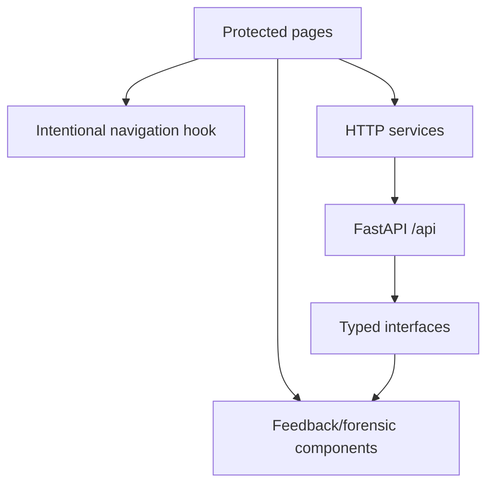
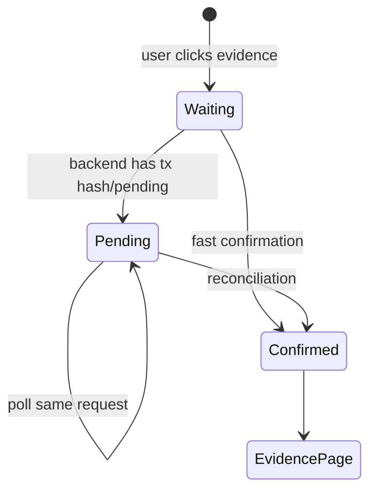
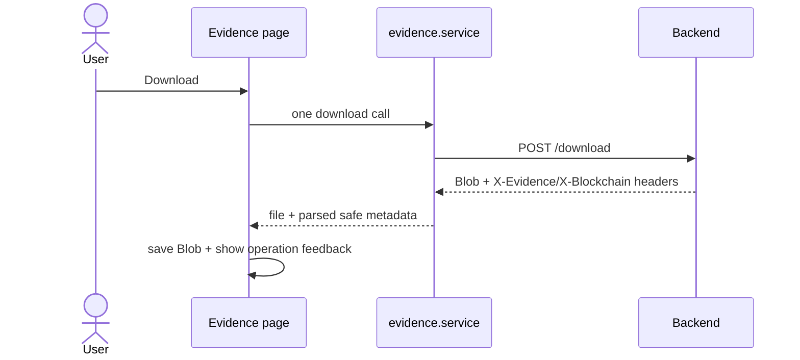

# Frontend Integration

> **วัตถุประสงค์:** อธิบาย Frontend behavior, API contracts, state/polling และ forensic presentation ที่เพิ่มจาก Blockchain integration
> **Last Verified Date:** 2026-09-10
> **Parent Revision:** `de54028e4cf704068ac7dcabfe4c7767be2336f5`
> **Blockchain Revision:** `1fdfe5a839105c0fec6c9ada98d04b82d8f04d06`
> **Smart Contract Version:** `EvidenceRegistryV3` (V3-only runtime)
> **Network Technology:** Hyperledger Besu 26.7.0, QBFT, private EVM, Chain ID `20260720`
> **Intended Audience:** Frontend Developer, UX Reviewer, AI

## Scope และ Baseline

เอกสารนี้อ้าง `git diff 0de174a7831fa15981aeecea93cdccb05dbc1e80..HEAD -- frontend/` และตรวจ source ปัจจุบัน Frontend ใช้ Next.js 16.2.6, React 19.2.4, TypeScript, Lucide และ `qrcode.react`

## Integration Surface

Frontend ไม่ derive signer, ไม่ถือ private key, ไม่เรียก Besu RPC และไม่ตัดสิน integrity จากข้อมูลที่สร้างเอง

## Intentional VIEW

`useIntentionalEvidenceNavigation` เป็น entry point เมื่อผู้ใช้ตั้งใจเปิดหลักฐานจาก list/card:

1. สร้าง UUID request id
2. เก็บใน `sessionStorage` ด้วย key ที่ scope user + action + evidence
3. POST view-session
4. แสดง progress ตาม state จริง
5. poll ด้วย request id เดิม
6. navigate เมื่อ Backend คืน `CONFIRMED` เท่านั้น
7. ล้าง stale identity เมื่อ success/logout/user switch ตาม utility

หลังประมาณ 30 วินาที UI เปลี่ยนข้อความให้สอดคล้องกับ delayed confirmation แต่ไม่สร้าง request ใหม่หรือ transaction ใหม่

## Preview

`EvidencePreviewImage` เรียก authenticated preview route สำหรับ WATERMARKED file และจัดการ loading/error การโหลด `` ไม่สร้าง AccessLog/Blockchain event Intentional VIEW ถูกสร้างก่อนเข้าสู่หน้า

## Upload Result

Upload page ส่ง multipart เพียงครั้งเดียวและแสดง metadata ที่ Backend คืนจาก `recordEvidence` transaction เดียว:

- Evidence Number
- Evidence ID
- Original File SHA-256
- Evidence Ref
- Transaction Hash
- Block Number
- Contract Address เมื่อมี

ข้อความต้องสื่อเพียงว่า “บันทึกธุรกรรมลง Blockchain สำเร็จแล้ว” ไม่กล่าวว่าได้ read-back verification เพราะ flow ไม่มี `getEvidence()` เพิ่ม ค่า tx/block ห้าม fabricate และ Admin เปิด Explorer จาก tx hash จริงได้

## Download

`evidence.service.ts` ส่ง POST download ครั้งเดียวแล้วอ่าน Blob พร้อม response headers เพื่อคืน `EvidenceDownloadResult` ใน request เดียว ไม่มี metadata request ที่สอง

UI แยก error categories ด้วย `evidenceDownloadError.ts` เช่น integrity mismatch กับ Blockchain unavailable โดยไม่แสดง raw RPC details หากสำเร็จ Browser ดาวน์โหลด personalized file ที่ Dynamic Watermark เป็น `access_session_ref`

## Watermark Verify UI

Admin page `/verify` ส่งภาพ suspected ไป Backend แล้ว render mode ตาม response:

### Canonical

- Static evidence identity
- ค่าแฮชจาก Dynamic Watermark
- Blockchain evidence hash
- current Original file hash
- DB original hash
- watermark/file/database integrity statuses แยกกัน

### Personalized

- matched download session จาก Blockchain
- evidence original integrity แยกจาก session traceability
- user/badge/email เป็น PostgreSQL enrichment
- mismatch comparison table ระหว่าง chain และ DB
- technical refs อยู่ใน details เพื่อลดภาระการอ่าน

### Unresolved

แสดงผลควบคุมว่าไม่สามารถระบุ/ตรวจได้ ไม่สร้าง attribution จาก malformed value

Frontend ใช้ศัพท์ forensic ที่ไม่กล่าวหาบุคคล เช่น “พบรายการดาวน์โหลดที่ตรงกับไฟล์นี้” ไม่ใช้ “ผู้รั่วไหล” หรือ “ผู้กระทำผิด”

## Chain of Custody Panel

`ChainOfCustodyPanel` แสดง registration และ V3 access events ตาม Blockchain order ใช้เวลา Asia/Bangkok เพื่ออ่านง่าย พร้อมระบุ source ของเวลา Actor resolution แสดง Badge/Username/Email จาก PostgreSQL เฉพาะเมื่อ map ได้ และไม่ใช้ current DB-linked user เป็น primary truth แทน on-chain `officer_ref`

ลำดับ presentation:

1. สถานะ verification สรุป
2. registration metadata
3. chronological access timeline
4. field-level mismatch table
5. technical refs/tx/block ใน details

Legacy row ถูกติดป้าย partial ไม่แสดงเหมือน V3 fully verified

## Blockchain Explorer UI

Admin page `/blockchain` รองรับค้นหา:

- block number
- transaction hash
- Evidence UUID
- `evidence_ref`
- `access_session_ref`

`blockchainExplorer.ts` parse input รูปแบบก่อนเลือก endpoint และ presentation แสดง decoded V3 events, related evidence และ optional DB profiles หาก DB row หายยังคงแสดง chain refs

## Access Logs

Admin logs page รองรับ filter case/evidence/user/action/result/date/anomaly/query exclusion และ pagination ข้อมูลนี้มาจาก PostgreSQL ไม่ใช่ direct chain history จึงต้องใช้ร่วมกับ CoC/Explorer เมื่อสืบสวน

## Components Added

| Component/utility | หน้าที่ |
|---|---|
| `IntentionalEvidenceProgress` | VIEW waiting/pending UI |
| `OperationProgress` | reusable long operation status |
| `OperationToast` | success/error feedback |
| `CopySuccessFeedback` | feedback ตอน copy technical values |
| `EvidencePreviewImage` | authenticated WATERMARKED preview |
| `ChainOfCustodyPanel` | chain-first forensic timeline |
| `EvidenceHashComparison` | แสดง hash sources/status |
| `WatermarkQrPresentation` | อธิบาย/แสดง QR payload อย่างปลอดภัย |
| `verificationPresentation.ts` | derive labels/states จาก API result |
| `forensics.ts` | timestamp/mismatch/actor formatting |
| `viewRequestIdentity.ts` | persistent idempotency key |
| `evidenceOperationFeedback.ts` | operation text/severity |
| `evidenceDownloadError.ts` | safe download error classification |

## Interfaces และ API Contracts

| Interface | Endpoint/meaning |
|---|---|
| `EvidenceUploadApiResponse` | upload result รวม real Blockchain metadata |
| `EvidenceViewSessionResponse` | state/request/log/ref/tx/block สำหรับ polling |
| `EvidenceDownloadResult` | Blob + safe response metadata |
| `WatermarkVerifyApiResponse` | extraction, integrity และ attribution |
| `ChainOfCustodyResponse` | registration/access/mismatch chain-first |
| Explorer interfaces | overview/block/tx/evidence/session reads |
| `AccessLogPage` | paginated DB audit list |

เมื่อ Backend เพิ่ม field ควรทำ optional หากต้องรักษา backward compatibility และห้ามทำ default ปลอมที่ทำให้ UI ดูเหมือน chain confirm

## Role and Route Visibility

Frontend protected layout/Sidebar ซ่อน Admin-only features ตาม role แต่การป้องกันจริงอยู่ Backend:

| Feature | UI audience | Backend enforcement |
|---|---|---|
| Evidence list/view/download | authorized user hierarchy | current user + case authorization |
| Upload | authorized flow | current user/case checks |
| Verify | Admin | `get_admin_user` |
| Chain of Custody | Admin | `get_admin_user` |
| Blockchain Explorer | Admin | `get_admin_user` |
| Central Access Logs | Admin | `get_admin_user` |

## Frontend Test Inventory

| Test file | Tests | Focus |
|---|---:|---|
| `blockchainExplorer.test.mjs` | 9 | input parsing, chain/DB presentation |
| `evidenceDownloadError.test.mjs` | 8 | error categories/safe messages |
| `evidenceIntegrityPresentation.test.mjs` | 3 | original/DB/blockchain integrity |
| `evidenceOperationFeedback.test.mjs` | 10 | operation wording/metadata |
| `forensics.test.mjs` | 11 | timestamps, identity, mismatch formatting |
| `operationProgress.test.mjs` | 7 | progress state |
| `verificationPresentation.test.mjs` | 6 | canonical/personalized/unresolved UI model |
| `viewRequestIdentity.test.mjs` | 2 | stable/scoped request identity |
| `watermarkQrPresentation.test.mjs` | 7 | QR/payload presentation |

รวม baseline 63 tests

## Development Rules

1. ใช้ typed API response เป็น source ไม่สร้าง tx hash/block/confirmation ใน browser
2. 1 user action ต้องไม่ยิง write ซ้ำเพื่อเก็บ metadata
3. Poll VIEW ด้วย request id เดิม
4. อย่า navigate ก่อน `CONFIRMED`
5. อย่าใช้ Grafana state เป็น application success
6. แยก chain immutable fields จาก DB profile fields ใน forensic UI
7. ไม่แสดง user/session ของ evidence อื่นเมื่อ mismatch
8. ไม่ใส่ private key, DB password หรือ Bearer token ใน client/log
9. ใช้ safe error mapping ไม่แสดง raw RPC exception
10. หาก dev server 3000 ถูกใช้ ให้หยุด process เดิม; port 3001 สงวนให้ Grafana และไม่อยู่ใน Backend CORS ปัจจุบัน

## Files Added or Changed Since Baseline

เพิ่ม Admin Blockchain page, CoC/hash/watermark presentation, operation feedback, intentional navigation hook, interfaces/services/utils และ test modules ข้างต้น พร้อมแก้ evidence upload/detail/list/cases/dashboard/logs/verify/protected layout/sidebar/session/client

การเปลี่ยน package ที่เกี่ยวข้องคือ `qrcode.react` สำหรับการแสดง QR ใน UI ณ checkpoint ปัจจุบัน package/lock เป็นส่วนหนึ่งของ codebase แต่ documentation task นี้ไม่แก้ dependencies

ดู flow ฝั่ง server ที่ [Backend Integration](04-BACKEND-INTEGRATION.md) และ acceptance ที่ [Testing and Acceptance](07-TESTING-AND-ACCEPTANCE.md)
