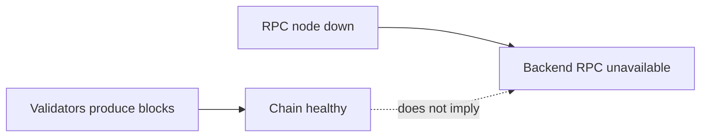

# Operations and Recovery

> **วัตถุประสงค์:** Runbook สำหรับดูแล Besu QBFT, Backend writer, pending access และข้อมูลโดยไม่ทำลาย chain state
> **Last Verified Date:** 2026-09-10
> **Parent Revision:** `de54028e4cf704068ac7dcabfe4c7767be2336f5`
> **Blockchain Revision:** `1fdfe5a839105c0fec6c9ada98d04b82d8f04d06`
> **Smart Contract Version:** `EvidenceRegistryV3` (V3-only runtime)
> **Network Technology:** Hyperledger Besu 26.7.0, QBFT, private EVM, Chain ID `20260720`
> **Intended Audience:** Operator, Developer, Incident Responder, AI

## Operating Principles

1. ตรวจ target directory/project ก่อนทุก Docker command
2. ตรวจ `DB_NAME`, chain ID, contract address และ deployment block ก่อน operation ที่เปลี่ยน state
3. แยก container health, consensus health, RPC health, writer health และ application consistency
4. Timeout หรือ connection reset หลัง broadcast ไม่เท่ากับ transaction failure
5. ห้าม blind retry Blockchain write
6. Preserve volumes, keys, genesis และ manifest ระหว่าง troubleshooting
7. ใช้ synthetic evidence กับ controlled write tests เท่านั้น
8. ไม่แสดง private key/password/token ใน command output หรือ report

## Safe Status Checks

รันจาก `blockchain/`:

```powershell
docker compose --project-directory network/besu config --quiet
docker compose --project-directory network/besu ps
python network/besu/scripts/health-check.py --rpc-url http://127.0.0.1:8545 --expected-chain-id 20260720
python network/besu/scripts/validate-generated-network.py --root network/besu --expected-validators 4
python scripts/verify_deployment.py --manifest network/besu/deployments/20260720/EvidenceRegistryV3.json
```

RPC read-only:

```powershell
$rpc = 'http://127.0.0.1:8545'
$chain = '{"jsonrpc":"2.0","method":"eth_chainId","params":[],"id":1}'
$block = '{"jsonrpc":"2.0","method":"eth_blockNumber","params":[],"id":2}'
Invoke-RestMethod -Uri $rpc -Method Post -ContentType 'application/json' -Body $chain
Invoke-RestMethod -Uri $rpc -Method Post -ContentType 'application/json' -Body $block
Start-Sleep -Seconds 7
Invoke-RestMethod -Uri $rpc -Method Post -ContentType 'application/json' -Body $block
```

ค่าที่สองควรมากกว่าค่าแรกใน network ปกติ

## Start, Stop and Restart

```powershell
cd blockchain
bash network/besu/scripts/start-network.sh
bash network/besu/scripts/stop-network.sh
docker compose --project-directory network/besu start
docker compose --project-directory network/besu restart rpc-node
docker compose --project-directory network/besu logs --tail 200 rpc-node
```

| Command | Container | Named volume | Chain state | ใช้เมื่อ |
|---|---|---|---|---|
| `stop` | คงอยู่ | คงอยู่ | คงอยู่ | หยุดชั่วคราว |
| `start` | ใช้ของเดิม | คงอยู่ | คงอยู่ | เริ่มต่อ |
| `restart <service>` | restart ตัวเดียว | คงอยู่ | disk state คงอยู่; txpool อาจหาย | process/node issue |
| `down` | ลบ container/network | คงอยู่ | คงอยู่ใน volume | recreate containers อย่างระวัง |
| `down -v` | ลบ container/network | **ลบ** | **สูญหาย** | ห้ามใช้กับ chain ที่ต้องรักษา |

## Service Topology Check

Expected runtime services:

- `validator-1` ถึง `validator-4`: UP
- `rpc-node`: UP และ host mapping `127.0.0.1:8545->8545`
- `prometheus`: UP, internal-only port 9090 ใน main compose
- `grafana`: UP และ `127.0.0.1:3001->3000`

`docker compose ps` ไม่ยืนยัน consensus ให้ดู block progression และ [Grafana Monitoring Guide](10-GRAFANA-MONITORING-GUIDE.md) เพิ่ม

## QBFT Failure and Recovery Matrix

| Validators online | Consensus expectation | Application impact | Operator action |
|---:|---|---|---|
| 4/4 | ปกติ | writes/read latest ปกติ | monitor |
| 3/4 | degraded แต่มี quorum | block ยังเดิน, redundancy ลด | หา validator ที่ลงและ start/review logs |
| 2/4 | ไม่มี quorum | block production stalls; writes ไม่ confirm | restore อย่างน้อย 1 validator |
| 1/4 หรือ 0/4 | stopped | chain stalled | restore nodes, ตรวจ genesis/static peers/volumes |

หลัง node กลับมา อย่าตรวจแค่ container UP ให้รอ block height เพิ่มและเปรียบเทียบ height ทุก node

## RPC Node Failure

Validators อาจยังผลิต block ขณะ RPC ลง แต่ Backend ไม่สามารถ read/write ผ่าน configured endpoint



Recovery:

1. `docker compose ... ps`
2. อ่าน `rpc-node` logs
3. `restart rpc-node` เฉพาะเมื่อจำเป็น
4. ตรวจ chain ID, peers, sync และ block age
5. ตรวจ pending writer transactions เพราะ txpool ของ RPC เป็น volatile
6. ปล่อย application reconciliation ทำงานด้วย request/session เดิม

## Writer Transaction States

| State | สิ่งที่รู้ | สิ่งที่ห้ามทำ |
|---|---|---|
| before signing/build definitive failure | ยังไม่ broadcast | แก้ config แล้ว retry invocation ได้ตาม policy |
| tx hash persisted, pending confirmation | broadcast มีหลักฐาน | ห้ามสร้าง session ใหม่; poll/reconcile |
| `submission_unknown` | signed tx hash รู้ แต่ transport ไม่ยืนยัน | ห้าม auto-resubmit |
| confirmed | receipt/event valid | ห้ามส่งซ้ำ |
| old tx absent after delay + chain healthy + session absent | dropped candidate | replacement ได้ผ่าน guarded recovery เท่านั้น |

## Nonce Diagnosis

Writer account transaction `N+1` mine ไม่ได้จนกว่า nonce `N` จะสำเร็จหรือถูกแทนที่ RPC restart อาจลบ pending tx ใน memory โดย chain ยังสร้าง empty blocks

```powershell
# ใส่เฉพาะ public writer address ห้ามใส่ private key
$writerAddress = '<WRITER_ADDRESS>'
$latestBody = '{"jsonrpc":"2.0","method":"eth_getTransactionCount","params":["' + $writerAddress + '","latest"],"id":3}'
$pendingBody = '{"jsonrpc":"2.0","method":"eth_getTransactionCount","params":["' + $writerAddress + '","pending"],"id":4}'
Invoke-RestMethod -Uri 'http://127.0.0.1:8545' -Method Post -ContentType 'application/json' -Body $latestBody
Invoke-RestMethod -Uri 'http://127.0.0.1:8545' -Method Post -ContentType 'application/json' -Body $pendingBody
```

แปลง hex เป็น integer ก่อนเปรียบเทียบ หาก pending > latest แปลว่ามี queued/pending nonce แต่ไม่บอกว่า transaction ไหน confirm

## VIEW Reconciliation Runbook

1. ให้ผู้ใช้ retry action เดิมจาก UI ซึ่ง reuse `request_id`
2. Backend load AccessLog เดิมและ transaction row
3. หาก receipt หรือ session event พบ ให้ mark confirmed
4. หาก tx ยังอยู่ ให้คง pending
5. หาก tx หาย ให้รอ recovery delay, ตรวจ chain healthy และ session absent
6. lock row, recheck แล้วจึง replacement ด้วย session เดิม
7. UI navigate เมื่อ state confirmed

อย่าลบ AccessLog pending, แก้ UUID หรือยิง endpoint ด้วย request id ใหม่เพื่อเร่ง recovery

## Upload Inconsistency Recovery

กรณี chain registration confirm แต่ final PostgreSQL commit ล้ม:

1. ห้าม upload ซ้ำทันที เพราะ `evidenceRef` เดิม duplicate บน chain
2. เก็บ evidence UUID/ref, deterministic tx hash หรือ server log ที่ไม่เป็น secret
3. ใช้ Explorer/RPC `getEvidence` เพื่อตรวจ registration
4. ตรวจ DB transaction row/evidence row แบบ read-only
5. วาง reconciliation เฉพาะข้อมูลที่พิสูจน์ได้จาก chain/ไฟล์
6. อย่าลบหรือ rewrite Blockchain history

Current code ไม่มี generic automated registration reconciliation จึงต้อง review incident ก่อนแก้ DB

## Download Inconsistency Recovery

### Integrity mismatch ก่อน write

- ไม่เกิด personalized file สำเร็จ
- ไม่เกิด DOWNLOAD AccessLog/BlockchainTransaction/recordAccess
- เปรียบ current Original hash, DB hash และ chain evidenceHash
- restore file/metadata จาก backup ที่เชื่อถือได้หรือเปิด incident

### Chain confirm แต่ DB commit ล้ม

- chain session อาจมีอยู่
- temp file ถูก cleanup เมื่อ exception
- ห้าม retry download แบบ blind
- query `getAccessBySession(access_session_ref)` และ transaction receipt ก่อนตัดสินใจ
- reconciliation ต้อง reuse immutable session ไม่สร้าง log identity ใหม่โดยไม่มีเหตุผล

## Database Operations

ตรวจ target ก่อน:

```powershell
cd backend
$env:DB_NAME
.\.venv\Scripts\python.exe -m alembic current
.\.venv\Scripts\python.exe -m alembic heads
.\.venv\Scripts\python.exe -m alembic check
```

Head ที่ source ปัจจุบัน: `a6c8e1f4b2d9`

ห้ามใช้ `stamp head` เพื่อข้าม missing revision จนกว่าจะตรวจ schema equivalence ห้ามใช้ `reset_db.py`, `DROP DATABASE`, `DROP SCHEMA`, broad `TRUNCATE` หรือ unconditional `DELETE` กับ DB ทีม

## Backup Boundaries

| สิ่งที่ backup | เหตุผล | ข้อควรระวัง |
|---|---|---|
| PostgreSQL | app metadata, users, access/tx linkage | encrypt; จำกัด PII access |
| validator/RPC volumes | chain state | ทำ coordinated consistent backup |
| generated node identities | รักษา node identity | secret material, encrypt |
| local `.env` secrets | restore signer/config | encrypted backup; test restore without printing |
| deployment manifests | public deployment anchor | Git tracked |
| evidence storage | original/watermarked bytes | hash/chain anchor validation after restore |
| Prometheus/Grafana volumes | operational history/custom state | แยกจาก chain backup |

## Monitoring Recovery

- Grafana down: Blockchain/Application ยังทำงานได้ แต่ dashboard unavailable
- Prometheus down: metrics ใหม่หยุด; Grafana No Data/stale ไม่เท่ากับ chain down
- Besu metrics endpoint down: panel เฉพาะ node อาจ No Data
- หลัง recovery ตรวจ scrape status, nodes, validators, RPC, block progression แล้วตรวจ tx/receipt/nonce/DB แยก

## Incident Evidence Checklist

เก็บโดยไม่เผย secret:

- เวลาที่เกิดพร้อม timezone
- parent/submodule revision
- compose service status
- chain ID และ block numbers ก่อน/หลัง
- public contract/writer address
- transaction hash, receipt status/block
- evidence/session refs เฉพาะ incident ที่ได้รับอนุญาต
- DB row status/count โดยไม่ dump PII
- Backend error class/code
- relevant node logs ที่ redact headers/tokens
- Grafana/Prometheus time range

## Dangerous Actions

ห้ามใช้เป็น first response:

```text
docker compose down -v
docker system prune --volumes
docker volume prune
generate-network.sh --force
reset_db.py
alembic stamp head
redeploy V3
blind retry recordEvidence/recordAccess
```

คำสั่งเหล่านี้อาจลบ state, เปลี่ยน chain identity, ปิดบัง migration mismatch หรือสร้าง duplicate forensic record

## Operator Acceptance After Recovery

- [ ] Validators 4/4 หรืออย่างน้อย quorum พร้อมแผนคืน node ที่เหลือ
- [ ] RPC UP, chain ID ถูกต้อง, contract code มีอยู่
- [ ] Block height เพิ่มจริงสองจุดเวลา
- [ ] Peer/sync signals ปกติ
- [ ] Writer latest/pending nonce ไม่มี gap ที่อธิบายไม่ได้
- [ ] Existing pending VIEW reconcile ด้วย session เดิม
- [ ] ไม่มี blind duplicate transaction
- [ ] DB transaction/access statuses สอดคล้องกับ receipt/event
- [ ] Evidence file hashes ยังเทียบกับ Blockchain anchor ได้
- [ ] Volumes/keys/genesis ไม่ถูก reset
