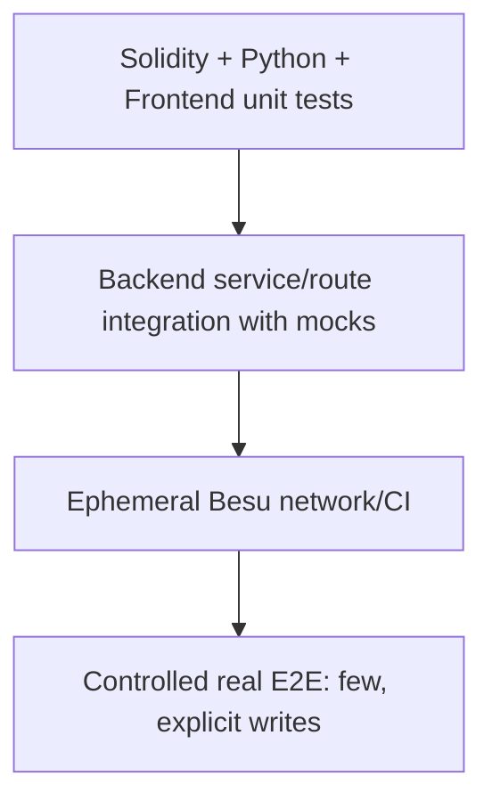

# Testing and Acceptance

> **วัตถุประสงค์:** กำหนด test layers, คำสั่ง, cardinality และ acceptance criteria ของ Blockchain Integration
> **Last Verified Date:** 2026-09-10
> **Parent Revision:** `de54028e4cf704068ac7dcabfe4c7767be2336f5`
> **Blockchain Revision:** `1fdfe5a839105c0fec6c9ada98d04b82d8f04d06`
> **Smart Contract Version:** `EvidenceRegistryV3` (V3-only runtime)
> **Network Technology:** Hyperledger Besu 26.7.0, QBFT, private EVM, Chain ID `20260720`
> **Intended Audience:** Developer, QA, Reviewer, AI

## Test Pyramid



Unit tests ต้องไม่ต้องมี Besu จริง Controlled E2E ต้องกำหนดจำนวน transaction ล่วงหน้าและไม่ retry write อัตโนมัติ

## Baseline ล่าสุด

| Layer | Reported/verified baseline | Tool |
|---|---:|---|
| Backend | 220 passed | `unittest discover` |
| Blockchain Python | 185 passed | pytest |
| Frontend | 63 passed | Node test runner |
| Foundry | 19 passed | forge test |

ผลนี้ผูกกับ revisions ใน header หาก HEAD เปลี่ยนต้องรันใหม่ก่อนอ้างว่า current

## Backend Tests

รันจาก `backend/` ด้วย interpreter ของ venv โดยตรงบน Windows:

```powershell
.\.venv\Scripts\python.exe -m unittest discover -s tests -p "test_*.py" -v
.\.venv\Scripts\python.exe -m compileall app tests
```

Focused inventory:

| Module | Tests | Contract ที่คุ้มครอง |
|---|---:|---|
| `test_blockchain_integration.py` | 28 | config/provider/refs/V3 reads-writes/scans/health |
| `test_evidence_upload_transaction.py` | 11 | flush/final commit/files cleanup/registration metadata |
| `test_evidence_view_preparation.py` | 29 | PENDING/idempotency/reconciliation/recovery/nonce incidents |
| `test_evidence_download_access.py` | 12 | integrity gate, one download write, rollback |
| `test_personalized_evidence_download.py` | 10 | personalized codec/temp file/session metadata |
| `test_original_evidence_integrity.py` | 7 | current/DB/chain hash states |
| `test_watermark_verification_modes.py` | 16 | canonical/personalized/unresolved/503/fail closed |
| `test_personalized_watermark_extraction.py` | 6 | extract unknown session ref without hint |
| `test_leak_attribution_service.py` | 18 | chain-first attribution/mismatches/privacy |
| `test_chain_of_custody_api.py` | 23 | chain ordering, tamper/deletion/legacy/auth |
| `test_blockchain_explorer.py` | 17 | read endpoints, enrichment, errors/auth |
| `test_access_log_business_core.py` | 7 | QUERY DB-only/filter/preview behavior |
| `test_evidence_preview_authorization.py` | 10 | WATERMARKED-only/auth/no audit side effect |
| `test_case_authorization.py` | 14 | hierarchy/admin/generic not-found |
| migrations/model/startup/dashboard | 12 | schema compatibility, head safety, route behavior |

รวม 220 test methods

### Test isolation

Watermark tests ที่ stub modules ต้อง patch แบบ scoped และ restore `sys.modules` หลัง test มิฉะนั้น full discovery อาจโหลด fake `WatermarkEvaluator` ไปกระทบ module อื่น Targeted pass อย่างเดียวจึงไม่พอ ต้องรัน full discovery และสลับลำดับ modules ที่มี stubs ในช่วงพัฒนา

## Blockchain Python Tests

จาก `blockchain/`:

```powershell
.\.venv\Scripts\python.exe -m pytest tests -q
```

Coverage สำคัญ:

- settings validation และ no implicit env
- signer/reference/hash validation
- V3 record/read/events/action/timestamps
- receipt confirmations และ failure status
- nonce manager ใช้ pending nonce ใหม่ทุก submission
- deterministic tx hash/submission uncertainty
- bounded event readers
- runtime artifact ABI
- proof/benchmark CLI โดยไม่ปะปน production writes

## Foundry Tests

```powershell
cd blockchain
forge fmt --check
forge build
forge test -vvv
```

Test groups:

- core V3 recordEvidence/recordAccess/read/existence
- AccessControl/Pausable
- invalid zero/duplicate/nonexistent evidence/session
- VIEW/DOWNLOAD action and timestamps
- fuzz properties
- invariant properties

Artifact validation ต้อง export committed runtime artifact แล้วเปรียบเทียบกับ Foundry output ตาม CI ห้าม hand-edit JSON

## Frontend Tests

```powershell
cd frontend
node --test tests/*.test.mjs
npx tsc --noEmit
npx eslint "src/app/(protected)/(admin)/blockchain/page.tsx" "src/app/(protected)/(admin)/verify/page.tsx" "src/app/(protected)/evidence/[id]/page.tsx" "src/app/(protected)/evidence/upload/page.tsx" "src/components/evidence/*.tsx" "src/hooks/useIntentionalEvidenceNavigation.ts" "src/utils/*.ts"
```

Test files 9 modules รวม 63 tests ครอบคลุม Explorer, Download errors, integrity, operation feedback, forensic formatting, progress, Verify, request identity และ QR presentation

`MODULE_TYPELESS_PACKAGE_JSON`, LF/CRLF warning หรือ existing unrelated `` warning อาจพบได้ แต่ต้องแยก warning จาก test/type error และไม่แก้ package เพียงเพื่อซ่อน warning โดยไม่มี scope

## Network Validation

```powershell
cd blockchain
docker compose --project-directory network/besu config --quiet
python network/besu/scripts/validate-generated-network.py --root network/besu --expected-validators 4
python network/besu/scripts/health-check.py --rpc-url http://127.0.0.1:8545 --expected-chain-id 20260720
python scripts/verify_deployment.py --manifest network/besu/deployments/20260720/EvidenceRegistryV3.json
```

Network validation ต้องแยก container status, RPC health และ block progression ออกจากกัน ดู monitoring acceptance เพิ่มที่ [Grafana Monitoring Guide](10-GRAFANA-MONITORING-GUIDE.md)

## Controlled Real E2E Rules

ก่อน real write:

- worktree/revisions/submodule ถูกต้อง
- isolated DB หรือ target DB ได้รับอนุญาต
- Alembic current/head ถูกต้อง
- Besu health, chain ID, contract code, writer-present boolean ผ่าน
- ใช้ synthetic UUID/bytes เท่านั้น
- ระบุ transaction cardinality ชัดเจน
- ไม่ print key/token/password
- หาก write submission เริ่มแล้วและเกิด error ให้หยุด ไม่ retry

### Upload acceptance

Expected 1 HTTP upload = 1 `recordEvidence`

- ORIGINAL/WATERMARKED rows และ files ถูกต้อง
- original DB hash = hash bytes = chain evidenceHash
- registration tx/block/address จาก receipt เดียวกัน
- canonical Static/Dynamic semantics ถูกต้อง
- ไม่มี read-back write เพิ่ม
- failure cleanup ไม่ลบ pre-existing file

### VIEW acceptance

Expected intentional click = 1 AccessLog/session = at most 1 effective on-chain record

- pending persisted before receipt wait
- same request retry ไม่ submit ครั้งที่สอง
- receipt timeout recover ได้
- concurrent retry ไม่ duplicate
- RPC restart/dropped tx replacement reuse session/row
- different users independent
- navigation after confirmed only

### Download acceptance

Expected 1 HTTP download = at most 1 `recordAccess(DOWNLOAD)`

- live ORIGINAL and DB hash match Blockchain before write
- personalized Dynamic = derived session ref
- returned file hash matches generated bytes/metadata
- AccessLog + BlockchainTransaction + event link กัน
- temp file deleted after response
- mismatch creates 0 custody writes

### Verify acceptance

- canonical uses Blockchain evidenceHash as anchor
- personalized validates chain DOWNLOAD session and same evidence
- current/DB hash mismatch shown separately
- cross-evidence mismatch leaks no attribution
- malformed unresolved
- read failure 503
- 0 AccessLog and 0 Blockchain writes

### Chain of Custody acceptance

- registration/access rebuilt from chain
- order = block/transaction/log indices
- deleted/tampered DB row ไม่เปลี่ยน canonical event
- DB profiles identified as enrichment
- QUERY excluded
- legacy clearly partial
- Admin-only/read-only

## Real QBFT Chaos Acceptance Procedure

Runbook นี้ใช้เฉพาะ local/staging ที่มี synthetic users และ synthetic evidence เท่านั้น ห้ามใช้ production หรือหลักฐานจริง แต่ละ scenario ต้องกำหนดผู้รับผิดชอบหนึ่งคน, บันทึก baseline ก่อนเริ่ม และกด VIEW ตามจำนวนที่ระบุเท่านั้น ดู state mapping ที่ [Architecture and Flows](02-ARCHITECTURE-AND-FLOWS.md#unified-view-state-mapping), recovery policy ที่ [Operations and Recovery](06-OPERATIONS-AND-RECOVERY.md), การวิเคราะห์เหตุขัดข้องที่ [Troubleshooting](09-TROUBLESHOOTING.md) และ metrics ที่ [Grafana Monitoring Guide](10-GRAFANA-MONITORING-GUIDE.md)

### 1. Preconditions

จาก Parent repository ตรวจว่า worktree ทั้งสอง repository สะอาดและบันทึก revision ที่ทดสอบ:

```powershell
cd C:\Users\kiadt\Documents\GitHub\CapstoneProject
git status --short
git branch --show-current
git rev-parse HEAD
git submodule status
git -C blockchain status --short
git -C blockchain rev-parse HEAD
```

จาก `backend/` ตั้ง `DB_NAME` ให้เป็นฐาน local/staging ที่ได้รับอนุญาต ห้ามใช้ production แล้วตรวจ schema โดยไม่รัน migration:

```powershell
cd C:\Users\kiadt\Documents\GitHub\CapstoneProject\backend
$env:DB_NAME = "<APPROVED_CHAOS_TEST_DATABASE>"
Write-Output "Effective DB_NAME: $env:DB_NAME"
.\.venv\Scripts\python.exe -m alembic current
.\.venv\Scripts\python.exe -m alembic heads
```

`current` และ `heads` ต้องตรงกันที่ `a6c8e1f4b2d9` สำหรับ source revision ใน header นี้ จากนั้นตรวจ FastAPI, Blockchain health และ writer โดยแสดงเพียง boolean ห้าม print key:

```powershell
.\.venv\Scripts\python.exe -c "from app.main import app; print('FastAPI app import OK')"
.\.venv\Scripts\python.exe -c "from app.integrations.blockchain import BlockchainIntegrationService; print(BlockchainIntegrationService().health_check())"

$writerCheck = @'
import json
import os
from pathlib import Path

from eth_account import Account
from web3 import Web3

from app.environment import load_backend_environment

load_backend_environment()
key = os.getenv("BLOCKCHAIN_WRITER_PRIVATE_KEY")
manifest = json.loads(
    (Path.cwd().parent / "blockchain/network/besu/deployments/20260720/EvidenceRegistryV3.json")
    .read_text(encoding="utf-8")
)
artifact = json.loads(
    (Path.cwd().parent / "blockchain/artifacts/EvidenceRegistryV3.json")
    .read_text(encoding="utf-8")
)
w3 = Web3(Web3.HTTPProvider(manifest["rpc_url"]))
signer = Account.from_key(key).address if key else None
contract = w3.eth.contract(
    address=Web3.to_checksum_address(manifest["contract_address"]),
    abi=artifact["abi"],
)
role = contract.functions.WRITER_ROLE().call()
print({
    "writer_present": bool(key),
    "writer_matches_manifest": bool(signer) and signer.lower() == manifest["writer_address"].lower(),
    "writer_role_valid": bool(signer) and contract.functions.hasRole(role, signer).call(),
})
'@
$writerCheck | .\.venv\Scripts\python.exe -
```

ผลต้องเป็น `enabled=true`, `connected=true`, chain ID `20260720`, contract deployed และ writer booleans ทั้งสามเป็น `true` โดยไม่มี secret ใน output ตรวจ network จาก submodule:

```powershell
cd C:\Users\kiadt\Documents\GitHub\CapstoneProject\blockchain
docker compose --project-directory network/besu ps
..\backend\.venv\Scripts\python.exe network/besu/scripts/health-check.py `
  --rpc-url http://127.0.0.1:8545 `
  --expected-chain-id 20260720
..\backend\.venv\Scripts\python.exe scripts/verify_deployment.py `
  --manifest network/besu/deployments/20260720/EvidenceRegistryV3.json
```

ก่อนเริ่มต้องครบทุกข้อ:

- Validators 4/4 และ RPC Node เป็น `UP`; health check เห็น block height เพิ่ม
- Contract address/chain ID ตรง manifest และ writer มี `WRITER_ROLE`
- Backend ใช้ DB ทดสอบที่อนุมัติและ schema current/head ตรงกัน
- มี synthetic evidence ที่ record บน V3 แล้ว และ test users มีสิทธิ์เปิดรายการนั้น
- ไม่มี pending test record สำคัญค้างอยู่ และ backup/state ที่ต้องรักษาถูกบันทึกแล้ว
- ห้ามใช้ `docker compose down -v`, ลบ volume, reset chain, stamp DB หรือแก้ nonce ด้วยมือ

### 2. Baseline Counts

ก่อนและหลังทุก scenario กำหนด test identity เดียวกันใน PowerShell process นั้น แล้วเก็บ snapshot เพื่อพิสูจน์ cardinality ห้ามแสดง token, password, key หรือข้อมูลบุคคลจริง ควรแยก Backend snapshot terminal ซึ่งคง working directory ที่ `backend/` ออกจาก Blockchain operator terminal ซึ่งคง working directory ที่ `blockchain/`:

```powershell
cd C:\Users\kiadt\Documents\GitHub\CapstoneProject\backend
$env:CHAOS_EVIDENCE_ID = "<SYNTHETIC_EVIDENCE_UUID>"
$env:CHAOS_USER_ID = "<SYNTHETIC_USER_UUID>"

$dbSnapshot = @'
import json
import os
from uuid import UUID

from sqlalchemy import text

from app.database import SessionLocal

params = {
    "evidence_id": UUID(os.environ["CHAOS_EVIDENCE_ID"]),
    "user_id": UUID(os.environ["CHAOS_USER_ID"]),
}
query = text("""
SELECT
  (SELECT count(*) FROM access_logs
   WHERE evidence_id=:evidence_id AND user_id=:user_id AND action='VIEW') AS view_logs,
  (SELECT count(*) FROM access_logs
   WHERE evidence_id=:evidence_id AND user_id=:user_id
     AND action='VIEW' AND result='PENDING') AS pending_view_logs,
  (SELECT count(*) FROM access_logs
   WHERE evidence_id=:evidence_id AND user_id=:user_id
     AND action='VIEW' AND result='SUCCESS') AS successful_view_logs,
  (SELECT count(*) FROM blockchain_transactions bt
   JOIN access_logs al ON al.tx_internal_id=bt.tx_internal_id
   WHERE al.evidence_id=:evidence_id AND al.user_id=:user_id
     AND al.action='VIEW') AS view_transactions
""")
db = SessionLocal()
try:
    print(json.dumps(dict(db.execute(query, params).mappings().one())))
finally:
    db.rollback()
    db.close()
'@
$dbSnapshot | .\.venv\Scripts\python.exe -
```

เมื่อต้องเฝ้า state ของ logical VIEW ล่าสุด ให้ใช้ query read-only นี้ ซึ่งแสดงเฉพาะ synthetic IDs และ transaction metadata ไม่แสดง user profile:

```powershell
$viewStateSnapshot = @'
import json
import os
from uuid import UUID

from sqlalchemy import text

from app.database import SessionLocal

db = SessionLocal()
try:
    rows = db.execute(
        text("""
        SELECT al.log_id, al.result, al.tx_internal_id,
               bt.status AS transaction_status, bt.tx_hash, bt.block_number
        FROM access_logs al
        LEFT JOIN blockchain_transactions bt
          ON bt.tx_internal_id=al.tx_internal_id
        WHERE al.evidence_id=:evidence_id
          AND al.user_id=:user_id
          AND al.action='VIEW'
        ORDER BY al.accessed_at DESC
        LIMIT 5
        """),
        {
            "evidence_id": UUID(os.environ["CHAOS_EVIDENCE_ID"]),
            "user_id": UUID(os.environ["CHAOS_USER_ID"]),
        },
    ).mappings().all()
    print(json.dumps([dict(row) for row in rows], default=str))
finally:
    db.rollback()
    db.close()
'@
$viewStateSnapshot | .\.venv\Scripts\python.exe -
```

เก็บจำนวน effective VIEW events ของ evidence จาก bounded reader เดิมของ integration layer:

```powershell
$chainSnapshot = @'
import json
import os

from app.integrations.blockchain import BlockchainIntegrationService

result = BlockchainIntegrationService().get_chain_of_custody(os.environ["CHAOS_EVIDENCE_ID"])
views = [event for event in result["access_history"] if int(event["action"]) == 0]
print(json.dumps({
    "view_events": len(views),
    "unique_view_sessions": len({event["access_session_ref"] for event in views}),
    "latest_view_block": max((event["block_number"] for event in views), default=None),
}))
'@
$chainSnapshot | .\.venv\Scripts\python.exe -
```

เก็บ current block และ nonce จาก public writer address ใน manifest การเทียบ `latest` กับ `pending` ใช้วินิจฉัย nonce gap แต่ไม่ใช่คำสั่งแก้ nonce:

```powershell
cd C:\Users\kiadt\Documents\GitHub\CapstoneProject\blockchain
$manifest = Get-Content -LiteralPath "network/besu/deployments/20260720/EvidenceRegistryV3.json" -Raw | ConvertFrom-Json
$env:CHAOS_WRITER_ADDRESS = $manifest.writer_address
$rpc = "http://127.0.0.1:8545"

$blockBody = @{jsonrpc="2.0"; method="eth_blockNumber"; params=@(); id=1} | ConvertTo-Json -Compress
$block = (Invoke-RestMethod -Uri $rpc -Method Post -ContentType "application/json" -Body $blockBody).result

$latestBody = @{jsonrpc="2.0"; method="eth_getTransactionCount"; params=@($env:CHAOS_WRITER_ADDRESS,"latest"); id=2} | ConvertTo-Json -Compress
$pendingBody = @{jsonrpc="2.0"; method="eth_getTransactionCount"; params=@($env:CHAOS_WRITER_ADDRESS,"pending"); id=3} | ConvertTo-Json -Compress
$latest = (Invoke-RestMethod -Uri $rpc -Method Post -ContentType "application/json" -Body $latestBody).result
$pending = (Invoke-RestMethod -Uri $rpc -Method Post -ContentType "application/json" -Body $pendingBody).result
[pscustomobject]@{
    Block = [Convert]::ToInt64($block.Substring(2), 16)
    WriterLatestNonce = [Convert]::ToInt64($latest.Substring(2), 16)
    WriterPendingNonce = [Convert]::ToInt64($pending.Substring(2), 16)
}

function Get-RpcBlockNumber {
    $body = @{jsonrpc="2.0"; method="eth_blockNumber"; params=@(); id=4} | ConvertTo-Json -Compress
    $hex = (Invoke-RestMethod -Uri $rpc -Method Post -ContentType "application/json" -Body $body).result
    [Convert]::ToInt64($hex.Substring(2), 16)
}

$firstBlock = Get-RpcBlockNumber
Start-Sleep -Seconds 15
$secondBlock = Get-RpcBlockNumber
[pscustomobject]@{FirstBlock=$firstBlock; SecondBlock=$secondBlock; Advanced=($secondBlock -gt $firstBlock)}
```

ใช้ snapshot ชุดเดิมหลัง scenario แล้วคำนวณ delta ห้ามนับจากหน้าจอเพียงอย่างเดียว Pass ปกติคือ AccessLog +1, logical BlockchainTransaction +1 และ effective on-chain VIEW +1 เว้นแต่ scenario preflight rejection ซึ่งทุก delta ต้องเป็น 0

### 3. Scenario 1: 4/4 Normal

1. ยืนยัน `docker compose ... ps`, health check และ block samples ว่า Validators 4/4, RPC UP และกำลังผลิต block
2. เก็บ baseline ของ synthetic evidence/user
3. จาก UI กดเปิด evidence หนึ่งครั้ง และตรวจ Network ว่ามี `POST /api/evidences/{id}/view-session` logical request เดียว
4. รอ response `CONFIRMED` แล้วให้ UI navigate
5. เก็บ snapshots หลังจบ

Expected: Evidence เปิด, AccessLog เพิ่ม 1 และเป็น `SUCCESS`, logical BlockchainTransaction เพิ่ม 1 และเป็น `confirmed` พร้อม `tx_hash`/`block_number`, effective VIEW event และ unique session เพิ่มอย่างละ 1 ไม่มี duplicate

### 4. Scenario 2: 3/4 Degraded

```powershell
cd C:\Users\kiadt\Documents\GitHub\CapstoneProject\blockchain
docker compose --project-directory network/besu stop validator-4
docker compose --project-directory network/besu ps
..\backend\.venv\Scripts\python.exe network/besu/scripts/health-check.py `
  --rpc-url http://127.0.0.1:8545 `
  --expected-chain-id 20260720
```

1. รอให้ Grafana แสดง Validators Online = 3 และตรวจตรงว่า block height เพิ่มหลาย sample
2. เก็บ baseline แล้วกด VIEW synthetic evidence หนึ่งครั้ง
3. ต้องได้ `CONFIRMED`, Evidence เปิด และ deltas เท่ากับ Scenario 1
4. คืน validator เดิมและรอ sync/height กลับมาทันกัน

```powershell
docker compose --project-directory network/besu start validator-4
```

### 5. Scenario 3: 2/4 Stalled Before VIEW

เริ่มจากสภาพ 3/4 โดยหยุด `validator-4` แล้วหยุดอีกหนึ่งตัว:

```powershell
docker compose --project-directory network/besu stop validator-3
docker compose --project-directory network/besu ps
```

1. อ่าน `eth_blockNumber` อย่างน้อยสองครั้งห่างกันเกิน block period และรอ Grafana แสดง Validators Online = 2 / STALLED ต้องยืนยันว่า height คงที่ ไม่ตัดสินจาก container state อย่างเดียว
2. เก็บ baseline แล้วกด VIEW ใหม่หนึ่งครั้ง ห้ามกดซ้ำ
3. คาดว่า API เป็น controlled `503` (`BLOCKCHAIN_STALLED` หรือ controlled unavailable), UI แสดง error และ Evidence ไม่เปิด
4. เก็บ snapshot อีกครั้ง

Pass เมื่อ AccessLog, BlockchainTransaction และ VIEW event deltas เป็น 0, ไม่มี tx hash และไม่มี access session ใหม่ นี่คือ preflight rejection ก่อน durable state

### 6. Scenario 4: Consensus Recovery

```powershell
docker compose --project-directory network/besu start validator-3
docker compose --project-directory network/besu ps
..\backend\.venv\Scripts\python.exe network/besu/scripts/health-check.py `
  --rpc-url http://127.0.0.1:8545 `
  --expected-chain-id 20260720
```

1. รอ 3/4 quorum, RPC fresh, peer/sync acceptable และ height เพิ่มหลาย sample; Grafana ต้องกลับเป็น PRODUCING
2. โดยไม่ restart Backend ให้เก็บ baseline แล้วกด VIEW synthetic evidence ใหม่หนึ่งครั้ง
3. คาดว่าได้ `CONFIRMED` และ cardinality +1/+1/+1 ตามปกติ
4. Start `validator-4` แล้วรอให้กลับ 4/4

Pass เมื่อ health state ที่เคย stale ไม่ขวางคำขอใหม่หลัง chain ฟื้น และไม่มีการ reset process/state

### 7. Scenario 5: Post-broadcast Stall

เป้าหมายคือพิสูจน์ durable PENDING หลังมี tx hash แต่ก่อน confirmation ปัจจุบัน source ไม่มี production chaos hook สำหรับหยุดหลัง broadcast แบบ deterministic จึงใช้สอง terminal และถือว่ารอบที่ tx confirmed ก่อนหยุด quorum เป็น **inconclusive** ไม่ใช่ failure ห้ามแก้ production code หรือกดซ้ำเพื่อบังคับผล

1. เริ่มที่ 3/4 โดยหยุด `validator-4`; ยืนยันว่า chain ยังผลิต block
2. Terminal A เก็บ baseline แล้วกด VIEW เพียงหนึ่งครั้ง
3. Terminal B เปิดที่ `backend/`, ตั้ง `CHAOS_EVIDENCE_ID`/`CHAOS_USER_ID` และสร้าง `$viewStateSnapshot` ตามหัวข้อ Baseline Counts ใน process นี้ แล้วรัน `$viewStateSnapshot | .\.venv\Scripts\python.exe -` จนเห็น AccessLog `PENDING`, logical transaction `pending_confirmation` และมี `tx_hash`
4. ทันทีที่ checkpoint นี้ปรากฏ ให้หยุด `validator-3` เพื่อเหลือ 2/4 ก่อน receipt
5. ยืนยัน height หยุด, UI อยู่ `PENDING_BLOCKCHAIN_CONFIRMATION`, Evidence ไม่เปิด และ identity ที่ UI poll คือ `request_id` เดิม
6. Start `validator-3`, รอ health/height ฟื้น แล้วปล่อย UI poll/reconcile request เดิม
7. เก็บ snapshots หลัง confirmation แล้วคืน `validator-4`

Expected: ช่วง stall มี AccessLog `PENDING`, tx `pending_confirmation`, persisted tx hash และยังไม่มี confirmed event หลัง recovery แถวเดิมเปลี่ยนเป็น `SUCCESS`, tx เดิมเป็น `confirmed`, session/event มีหนึ่งรายการ และ Evidence เปิด ห้ามเกิด request/session/log ซ้ำ

### 8. Scenario 6: RPC Restart and Txpool Loss

กรณีนี้ทดสอบ incident ที่ volatile RPC txpool สูญ transaction โดยไม่สร้าง permanent nonce gap ใช้ synthetic evidence/request ใหม่ที่ได้รับอนุมัติหนึ่งรายการ และห้าม retry write อัตโนมัติ:

1. เริ่ม 3/4 และทำขั้นตอน Scenario 5 จน DB มี `pending_confirmation`/old tx hash แล้วทำให้เหลือ 2/4
2. บันทึก AccessLog ID, `access_session_ref`, logical `tx_internal_id`, old tx hash, writer latest/pending nonce และ block
3. Restart เฉพาะ RPC Node โดยรักษา volume:

```powershell
cd C:\Users\kiadt\Documents\GitHub\CapstoneProject\blockchain
docker compose --project-directory network/besu restart rpc-node
docker compose --project-directory network/besu ps
```

4. รอ RPC กลับมา แล้วตรวจ old hash โดยไม่ส่ง transaction:

```powershell
$env:CHAOS_OLD_TX_HASH = "<PERSISTED_OLD_TX_HASH>"
$rpc = "http://127.0.0.1:8545"
$txBody = @{jsonrpc="2.0"; method="eth_getTransactionByHash"; params=@($env:CHAOS_OLD_TX_HASH); id=5} | ConvertTo-Json -Compress
$receiptBody = @{jsonrpc="2.0"; method="eth_getTransactionReceipt"; params=@($env:CHAOS_OLD_TX_HASH); id=6} | ConvertTo-Json -Compress
$tx = (Invoke-RestMethod -Uri $rpc -Method Post -ContentType "application/json" -Body $txBody).result
$receipt = (Invoke-RestMethod -Uri $rpc -Method Post -ContentType "application/json" -Body $receiptBody).result
[pscustomobject]@{TransactionKnown=($null -ne $tx); ReceiptKnown=($null -ne $receipt)}
```

5. ถ้ายังพบ transaction หรือ receipt ให้จัดเป็น pending/confirmed reconciliation ปกติ ไม่ถือว่าเป็น dropped candidate
6. หาก old transaction และ receipt หายจริง ให้ start `validator-3`, รอ 3/4 healthy/producing และรอพ้น recovery delay จาก `BLOCKCHAIN_CONFIRMATION_TIMEOUT_SECONDS` ซึ่ง default ปัจจุบันคือ 120 วินาที
7. ให้ UI poll **request_id เดิม** Recovery ต้องตรวจ old tx, receipt, on-chain session, liveness และ lock/recheck ก่อน guarded replacement
8. เก็บ DB/chain/nonce snapshots แล้วคืน validators 4/4

Expected เมื่อพิสูจน์ dropped candidate ได้: ใช้ AccessLog ID, request identity, `access_session_ref` และ logical BlockchainTransaction row เดิม; เปลี่ยน tx hash ใน row เดิม; มี effective V3 VIEW session เพียงหนึ่ง; DB จบ `SUCCESS`; latest/pending nonce ไม่มี gap ค้างและ transaction nonce สูงกว่าสามารถเดินต่อ ห้ามใช้ new request ID, new AccessLog, manual nonce edit, blind raw transaction resubmit, chain reset หรือ volume deletion

ถ้า transaction confirmed ก่อน stall/restart หรือ RPC ยังรู้จัก old transaction ให้บันทึกว่า scenario inconclusive/not-dropped และหยุด ห้ามสร้าง write เพิ่มเพื่อให้ได้ผลตามคาดโดยไม่มี test case/cardinality approval ใหม่

### 9. Scenario 7: Multi-user Same Evidence

1. ยืนยัน chain 4/4 healthy และกำหนด synthetic User A/User B ที่มีสิทธิ์ต่อ Evidence X เดียวกัน
2. เก็บ baseline แยกตาม user
3. ให้ User A เปิด Evidence X หนึ่งครั้งและ User B เปิด Evidence X หนึ่งครั้ง โดยแต่ละ browser session ใช้บัญชีของตน
4. รอทั้งสอง logical requests จบแล้วเก็บ snapshot แยก user และรวม chain events

Expected: request UUID, AccessLog และ `access_session_ref` แยกกัน; แต่ละ user มี +1 logical VIEW; รวมมี effective events +2; pending ของ User A ไม่ block User B เพราะ pending uniqueness scope ต่อ `(user_id, evidence_id)`

### 10. Scenario 8: Same-user Idempotency

1. ใช้ user/evidence ใหม่ที่ไม่มี pending VIEW และเก็บ baseline
2. กดเปิดหนึ่งครั้ง แล้วปล่อย Frontend poll response `202` ด้วย request ที่บันทึกใน `sessionStorage`
3. ระหว่าง pending ให้ทดสอบ fast double click เท่าที่ UI guard อนุญาต โดยห้ามสร้าง manual request ID ใหม่
4. ตรวจ Network ว่าการ poll ทุกครั้งส่ง `request_id` เดิม และรอ `CONFIRMED`

Expected: AccessLog +1, logical BlockchainTransaction +1, unique `access_session_ref` +1 และ effective VIEW event +1 เท่านั้น Frontend `inProgress` guard, persisted request identity, partial unique index และ row locking ต้องไม่สร้าง duplicate

### 11. Post-test Recovery

```powershell
cd C:\Users\kiadt\Documents\GitHub\CapstoneProject\blockchain
docker compose --project-directory network/besu start validator-1 validator-2 validator-3 validator-4
docker compose --project-directory network/besu ps
..\backend\.venv\Scripts\python.exe network/besu/scripts/health-check.py `
  --rpc-url http://127.0.0.1:8545 `
  --expected-chain-id 20260720
```

จากนั้นตรวจ Grafana, block height หลาย sample, RPC freshness/sync/peers, writer latest/pending nonce, pending test rows และ receipt/event ของทุก test session ต้องไม่มี unexplained nonce gap, duplicate session หรือ pending ที่ขาด owner ห้ามลบ volume หรือ reset Grafana/Prometheus เพื่อทำให้ dashboard ดูปกติ

### 12. Acceptance Table

| Scenario | Expected DB | Expected Blockchain | Expected UI | Pass criteria |
|---|---|---|---|---|
| 4/4 normal | AccessLog +1 `SUCCESS`; tx +1 `confirmed` | VIEW event/session +1 | navigate | IDs/hash/block เชื่อมกันและไม่มี duplicate |
| 3/4 degraded | เหมือน normal | ยัง confirm และ event +1 | navigate | quorum 3/4 ใช้งานได้ |
| 2/4 preflight | ไม่มี delta | ไม่มี tx/event/session ใหม่ | controlled error | Evidence ไม่เปิดและไม่มี durable side effect |
| Consensus recovery | new VIEW จบ `SUCCESS` | height/event เดินหลัง 3/4 | navigate โดยไม่ restart Backend | health ฟื้นอัตโนมัติ |
| Post-broadcast stall | row เดิม `PENDING` แล้ว `SUCCESS` | tx/session เดิม confirm หลังฟื้น | pending แล้ว navigate | persisted hash และ identity เดิม ไม่มี duplicate |
| RPC restart/txpool loss | AccessLog/logical tx row เดิม | guarded replacement ให้ effective event เดียว | pending แล้ว navigate | ไม่มี permanent nonce gap หรือ blind resubmit |
| Multi-user | แต่ละ user +1 row | independent sessions รวม +2 | ทั้งสองเปิดได้ | User A ไม่ block User B |
| Same-user idempotency | +1 logical log/tx | +1 unique session/event | poll request เดิมแล้ว navigate | double click/poll ไม่เพิ่ม cardinality |

### 13. Final Chaos Checklist

- [ ] 4/4 normal VIEW สำเร็จ
- [ ] 3/4 degraded VIEW สำเร็จและ block ยังเพิ่ม
- [ ] 2/4 preflight ขวาง VIEW ใหม่
- [ ] 2/4 preflight สร้าง AccessLog, BlockchainTransaction และ VIEW event เท่ากับ 0
- [ ] กลับ 3/4 แล้วใช้งานได้โดยไม่ restart Backend
- [ ] post-broadcast pending เก็บ AccessLog, tx hash และ request identity อย่างปลอดภัย
- [ ] pending session reconcile เป็น SUCCESS โดยไม่มี duplicate
- [ ] RPC restart/txpool loss ใช้ logical row/session เดิม
- [ ] writer nonce ไม่มี gap ค้างโดยไม่แก้ nonce ด้วยมือ
- [ ] different users independent
- [ ] same-user retry/double click idempotent
- [ ] DB status, receipt และ event ตรงกันหลัง recovery
- [ ] ทุก scenario มี before/after cardinality snapshots
- [ ] chain ไม่ถูก reset และไม่มี volume ถูกลบ
- [ ] ไม่มี secret, token, password หรือ PII ใน test report

## Tamper Matrix

| Scenario | Download | Canonical Verify | Personalized Verify | CoC |
|---|---|---|---|---|
| all intact | allow | fully verified | session + integrity verified | verified |
| current Original changed | block before write | original mismatch | session remains, original mismatch | metadata-only check may not detect live bytes |
| DB original hash changed | block before write | DB mismatch; watermark may remain valid | session remains, DB mismatch | DB/chain mismatch |
| canonical Dynamic changed | n/a | watermark hash mismatch | n/a | unaffected |
| AccessLog user/time/action changed | no retroactive effect | n/a | chain session remains; mismatch shown | chain-first mismatch |
| AccessLog deleted | no retroactive effect | n/a | chain session may remain with limited enrichment | chain event remains |
| session evidenceRef mismatch | n/a | n/a | fail closed/no cross-evidence metadata | event belongs to actual chain evidence |
| VIEW session used as personalized | n/a | n/a | reject as download attribution | shown as VIEW in CoC |

## Migration Acceptance

```powershell
cd backend
.\.venv\Scripts\python.exe -m alembic current
.\.venv\Scripts\python.exe -m alembic heads
.\.venv\Scripts\python.exe -m alembic check
```

Expected current/head `a6c8e1f4b2d9` และ no new upgrade operations ใน DB ที่ models ตรง source ห้ามรัน migration อัตโนมัติบน DB ทีมจาก test task

## Static Validation

จาก Parent root:

```powershell
git diff --check
git status --short
git submodule status
```

ตรวจ secrets ด้วย project CI/scripts ที่มีอยู่โดยไม่เปิด `.env` จริงในการรายงาน ตรวจ relative Markdown links เมื่อมี checker; อย่างน้อย parse links แล้วตรวจ local targets

## Acceptance Gate Before Commit

- [ ] change scope ถูกต้อง ไม่มี unrelated files
- [ ] focused tests ผ่าน
- [ ] full suite ของ layer ที่แก้ผ่าน
- [ ] Backend compile/Frontend typecheck ผ่าน
- [ ] `git diff --check` ผ่าน
- [ ] Alembic head ไม่เปลี่ยนถ้าไม่มี migration requirement
- [ ] submodule pointer เปลี่ยนเฉพาะเมื่อมี Blockchain commit ที่ remote เข้าถึงได้
- [ ] no secrets/generated identities/volumes
- [ ] write cardinality tests ผ่าน
- [ ] recovery/failure path tests ผ่าน
- [ ] documentation อัปเดตเมื่อ architecture/invariant เปลี่ยน
