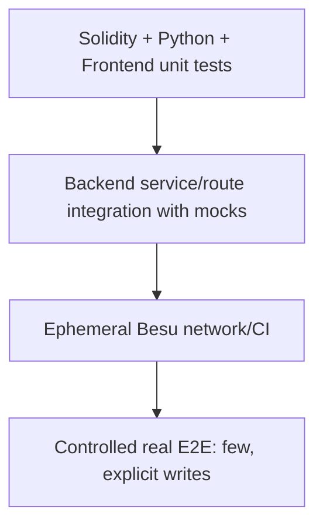

# Testing and Acceptance

> **วัตถุประสงค์:** กำหนด test layers, คำสั่ง, cardinality และ acceptance criteria ของ Blockchain Integration
> **Last Verified Date:** 2026-09-10
> **Parent Revision:** `de54028e4cf704068ac7dcabfe4c7767be2336f5`
> **Blockchain Revision:** `1fdfe5a839105c0fec6c9ada98d04b82d8f04d06`
> **Smart Contract Version:** `EvidenceRegistryV3` (V3-only runtime)
> **Network Technology:** Hyperledger Besu 26.7.0, QBFT, private EVM, Chain ID `20260720`
> **Intended Audience:** Developer, QA, Reviewer, AI

## Test Pyramid



Unit tests ต้องไม่ต้องมี Besu จริง Controlled E2E ต้องกำหนดจำนวน transaction ล่วงหน้าและไม่ retry write อัตโนมัติ

## Baseline ล่าสุด

| Layer | Reported/verified baseline | Tool |
|---|---:|---|
| Backend | 220 passed | `unittest discover` |
| Blockchain Python | 185 passed | pytest |
| Frontend | 63 passed | Node test runner |
| Foundry | 19 passed | forge test |

ผลนี้ผูกกับ revisions ใน header หาก HEAD เปลี่ยนต้องรันใหม่ก่อนอ้างว่า current

## Backend Tests

รันจาก `backend/` ด้วย interpreter ของ venv โดยตรงบน Windows:

```powershell
.\.venv\Scripts\python.exe -m unittest discover -s tests -p "test_*.py" -v
.\.venv\Scripts\python.exe -m compileall app tests
```

Focused inventory:

| Module | Tests | Contract ที่คุ้มครอง |
|---|---:|---|
| `test_blockchain_integration.py` | 28 | config/provider/refs/V3 reads-writes/scans/health |
| `test_evidence_upload_transaction.py` | 11 | flush/final commit/files cleanup/registration metadata |
| `test_evidence_view_preparation.py` | 29 | PENDING/idempotency/reconciliation/recovery/nonce incidents |
| `test_evidence_download_access.py` | 12 | integrity gate, one download write, rollback |
| `test_personalized_evidence_download.py` | 10 | personalized codec/temp file/session metadata |
| `test_original_evidence_integrity.py` | 7 | current/DB/chain hash states |
| `test_watermark_verification_modes.py` | 16 | canonical/personalized/unresolved/503/fail closed |
| `test_personalized_watermark_extraction.py` | 6 | extract unknown session ref without hint |
| `test_leak_attribution_service.py` | 18 | chain-first attribution/mismatches/privacy |
| `test_chain_of_custody_api.py` | 23 | chain ordering, tamper/deletion/legacy/auth |
| `test_blockchain_explorer.py` | 17 | read endpoints, enrichment, errors/auth |
| `test_access_log_business_core.py` | 7 | QUERY DB-only/filter/preview behavior |
| `test_evidence_preview_authorization.py` | 10 | WATERMARKED-only/auth/no audit side effect |
| `test_case_authorization.py` | 14 | hierarchy/admin/generic not-found |
| migrations/model/startup/dashboard | 12 | schema compatibility, head safety, route behavior |

รวม 220 test methods

### Test isolation

Watermark tests ที่ stub modules ต้อง patch แบบ scoped และ restore `sys.modules` หลัง test มิฉะนั้น full discovery อาจโหลด fake `WatermarkEvaluator` ไปกระทบ module อื่น Targeted pass อย่างเดียวจึงไม่พอ ต้องรัน full discovery และสลับลำดับ modules ที่มี stubs ในช่วงพัฒนา

## Blockchain Python Tests

จาก `blockchain/`:

```powershell
.\.venv\Scripts\python.exe -m pytest tests -q
```

Coverage สำคัญ:

- settings validation และ no implicit env
- signer/reference/hash validation
- V3 record/read/events/action/timestamps
- receipt confirmations และ failure status
- nonce manager ใช้ pending nonce ใหม่ทุก submission
- deterministic tx hash/submission uncertainty
- bounded event readers
- runtime artifact ABI
- proof/benchmark CLI โดยไม่ปะปน production writes

## Foundry Tests

```powershell
cd blockchain
forge fmt --check
forge build
forge test -vvv
```

Test groups:

- core V3 recordEvidence/recordAccess/read/existence
- AccessControl/Pausable
- invalid zero/duplicate/nonexistent evidence/session
- VIEW/DOWNLOAD action and timestamps
- fuzz properties
- invariant properties

Artifact validation ต้อง export committed runtime artifact แล้วเปรียบเทียบกับ Foundry output ตาม CI ห้าม hand-edit JSON

## Frontend Tests

```powershell
cd frontend
node --test tests/*.test.mjs
npx tsc --noEmit
npx eslint "src/app/(protected)/(admin)/blockchain/page.tsx" "src/app/(protected)/(admin)/verify/page.tsx" "src/app/(protected)/evidence/[id]/page.tsx" "src/app/(protected)/evidence/upload/page.tsx" "src/components/evidence/*.tsx" "src/hooks/useIntentionalEvidenceNavigation.ts" "src/utils/*.ts"
```

Test files 9 modules รวม 63 tests ครอบคลุม Explorer, Download errors, integrity, operation feedback, forensic formatting, progress, Verify, request identity และ QR presentation

`MODULE_TYPELESS_PACKAGE_JSON`, LF/CRLF warning หรือ existing unrelated `` warning อาจพบได้ แต่ต้องแยก warning จาก test/type error และไม่แก้ package เพียงเพื่อซ่อน warning โดยไม่มี scope

## Network Validation

```powershell
cd blockchain
docker compose --project-directory network/besu config --quiet
python network/besu/scripts/validate-generated-network.py --root network/besu --expected-validators 4
python network/besu/scripts/health-check.py --rpc-url http://127.0.0.1:8545 --expected-chain-id 20260720
python scripts/verify_deployment.py --manifest network/besu/deployments/20260720/EvidenceRegistryV3.json
```

Network validation ต้องแยก container status, RPC health และ block progression ออกจากกัน

## Controlled Real E2E Rules

ก่อน real write:

- worktree/revisions/submodule ถูกต้อง
- isolated DB หรือ target DB ได้รับอนุญาต
- Alembic current/head ถูกต้อง
- Besu health, chain ID, contract code, writer-present boolean ผ่าน
- ใช้ synthetic UUID/bytes เท่านั้น
- ระบุ transaction cardinality ชัดเจน
- ไม่ print key/token/password
- หาก write submission เริ่มแล้วและเกิด error ให้หยุด ไม่ retry

### Upload acceptance

Expected 1 HTTP upload = 1 `recordEvidence`

- ORIGINAL/WATERMARKED rows และ files ถูกต้อง
- original DB hash = hash bytes = chain evidenceHash
- registration tx/block/address จาก receipt เดียวกัน
- canonical Static/Dynamic semantics ถูกต้อง
- ไม่มี read-back write เพิ่ม
- failure cleanup ไม่ลบ pre-existing file

### VIEW acceptance

Expected intentional click = 1 AccessLog/session = at most 1 effective on-chain record

- pending persisted before receipt wait
- same request retry ไม่ submit ครั้งที่สอง
- receipt timeout recover ได้
- concurrent retry ไม่ duplicate
- RPC restart/dropped tx replacement reuse session/row
- different users independent
- navigation after confirmed only

### Download acceptance

Expected 1 HTTP download = at most 1 `recordAccess(DOWNLOAD)`

- live ORIGINAL and DB hash match Blockchain before write
- personalized Dynamic = derived session ref
- returned file hash matches generated bytes/metadata
- AccessLog + BlockchainTransaction + event link กัน
- temp file deleted after response
- mismatch creates 0 custody writes

### Verify acceptance

- canonical uses Blockchain evidenceHash as anchor
- personalized validates chain DOWNLOAD session and same evidence
- current/DB hash mismatch shown separately
- cross-evidence mismatch leaks no attribution
- malformed unresolved
- read failure 503
- 0 AccessLog and 0 Blockchain writes

### Chain of Custody acceptance

- registration/access rebuilt from chain
- order = block/transaction/log indices
- deleted/tampered DB row ไม่เปลี่ยน canonical event
- DB profiles identified as enrichment
- QUERY excluded
- legacy clearly partial
- Admin-only/read-only

## Tamper Matrix

| Scenario | Download | Canonical Verify | Personalized Verify | CoC |
|---|---|---|---|---|
| all intact | allow | fully verified | session + integrity verified | verified |
| current Original changed | block before write | original mismatch | session remains, original mismatch | metadata-only check may not detect live bytes |
| DB original hash changed | block before write | DB mismatch; watermark may remain valid | session remains, DB mismatch | DB/chain mismatch |
| canonical Dynamic changed | n/a | watermark hash mismatch | n/a | unaffected |
| AccessLog user/time/action changed | no retroactive effect | n/a | chain session remains; mismatch shown | chain-first mismatch |
| AccessLog deleted | no retroactive effect | n/a | chain session may remain with limited enrichment | chain event remains |
| session evidenceRef mismatch | n/a | n/a | fail closed/no cross-evidence metadata | event belongs to actual chain evidence |
| VIEW session used as personalized | n/a | n/a | reject as download attribution | shown as VIEW in CoC |

## Migration Acceptance

```powershell
cd backend
.\.venv\Scripts\python.exe -m alembic current
.\.venv\Scripts\python.exe -m alembic heads
.\.venv\Scripts\python.exe -m alembic check
```

Expected current/head `a6c8e1f4b2d9` และ no new upgrade operations ใน DB ที่ models ตรง source ห้ามรัน migration อัตโนมัติบน DB ทีมจาก test task

## Static Validation

จาก Parent root:

```powershell
git diff --check
git status --short
git submodule status
```

ตรวจ secrets ด้วย project CI/scripts ที่มีอยู่โดยไม่เปิด `.env` จริงในการรายงาน ตรวจ relative Markdown links เมื่อมี checker; อย่างน้อย parse links แล้วตรวจ local targets

## Acceptance Gate Before Commit

- [ ] change scope ถูกต้อง ไม่มี unrelated files
- [ ] focused tests ผ่าน
- [ ] full suite ของ layer ที่แก้ผ่าน
- [ ] Backend compile/Frontend typecheck ผ่าน
- [ ] `git diff --check` ผ่าน
- [ ] Alembic head ไม่เปลี่ยนถ้าไม่มี migration requirement
- [ ] submodule pointer เปลี่ยนเฉพาะเมื่อมี Blockchain commit ที่ remote เข้าถึงได้
- [ ] no secrets/generated identities/volumes
- [ ] write cardinality tests ผ่าน
- [ ] recovery/failure path tests ผ่าน
- [ ] documentation อัปเดตเมื่อ architecture/invariant เปลี่ยน
