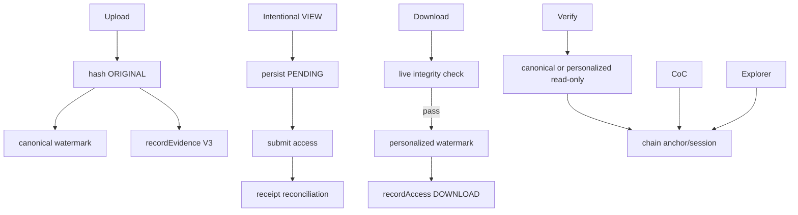

# AI Handoff

> **วัตถุประสงค์:** ให้ AI เข้าใจสถานะระบบ, boundaries และ invariants ปัจจุบันโดยไม่ต้องใช้ chat history
> **Last Verified Date:** 2026-09-12
> **Parent Revision:** `133aa9b3716c735748c96ac4ad9fba047fddc35f` (base revision; submodule/docs update pending commit)
> **Blockchain Revision:** `3a92ec3f2096d812c588d8bf8eea209e60a27717`
> **Smart Contract Version:** `EvidenceRegistryV3` (V3-only runtime)
> **Network Technology:** Hyperledger Besu 26.7.0, QBFT, private EVM, Chain ID `20260720`
> **Intended Audience:** AI Coding Agent, Developer supervising AI

## Read This First

นี่คือ context snapshot ไม่ใช่สิทธิ์ให้แก้ทุก layer ก่อนทำงาน AI ต้องตรวจ `git status`, branch, HEAD, submodule pointer/status, relevant source/tests และคำสั่งที่ user อนุญาตใหม่ทุกครั้ง

## Current System

- Parent branch ณ verification: `update-blockchain-submodule`
- Parent revision: `133aa9b3716c735748c96ac4ad9fba047fddc35f` (base revision; submodule/docs update pending commit)
- Blockchain submodule revision: `3a92ec3f2096d812c588d8bf8eea209e60a27717` (detached submodule checkout)
- Integration baseline: `0de174a7831fa15981aeecea93cdccb05dbc1e80`
- Runtime contract: `EvidenceRegistryV3` only
- Network: Besu 26.7.0, QBFT, 4 validators + 1 RPC
- Reference Chain ID: `20260720`
- Reference deployment: contract `0xf9e0Ca8d6cFa419bd79276775F441816c2cb2403`, block `12`
- Current Alembic head: `a6c8e1f4b2d9`
- Validation snapshot: Backend 230 passed; Blockchain Python 185 and Foundry 19 passed in current-revision CI; Frontend 63 passed and 1 failed of 64

Reference deployment เป็นตัวอย่าง local environment ไม่ใช่ universal constant ทุกเครื่อง

## Source of Truth Order

1. current source
2. tests
3. models/migrations
4. config
5. Git history
6. deployment manifest
7. docs/README

หากเอกสารนี้ขัด source ให้หยุดและรายงาน documentation drift

## Non-negotiable Invariants

### Contract and references

- ห้ามย้อนกลับไป V2
- `evidence_ref = 0x + SHA256(str(Evidence UUID))`
- `actor_ref = 0x + SHA256("DEVA:USER:v1:" + UUID bytes)`
- `access_session_ref = 0x + SHA256("DEVA:ACCESS:v1:" + AccessLog UUID bytes)`
- use public helpers, never reimplement ad hoc
- only V3 access actions: VIEW=0, DOWNLOAD=1

### Hash and watermark

- `evidenceHash` = SHA-256 ORIGINAL file bytes
- Blockchain evidenceHash is immutable integrity anchor
- canonical Static = SHA-256(Evidence UUID) in QR
- canonical Dynamic = original hash, 64 hex without `0x`
- personalized Static = same evidence identity
- personalized Dynamic = access_session_ref, lowercase `0x` + 64 hex
- do not put original hash into personalized Dynamic
- extraction does not require known Dynamic in advance

### Writes

- upload: one HTTP upload = one recordEvidence
- intentional VIEW: one request/session identity, durable pending, reconcile instead of duplicate
- download: one HTTP request = at most one recordAccess DOWNLOAD
- timeout != failure
- tx hash != confirmation
- submission uncertainty must not blind retry
- writer pending nonce must be queried fresh; nonce selection/submission serialized

### Privacy and authorization

- no private keys/passwords/tokens in output, log, DB or Git
- no PII on Blockchain
- user name/email/badge comes from PostgreSQL enrichment only
- Admin-only: Verify, CoC, Explorer, central Access Logs
- case authorization enforced server-side
- cross-evidence attribution mismatch fails closed before exposing profile/session data

### Read-only flows

- health, Verify, CoC, Explorer, `getEvidence`, `getAccessBySession` must not create transactions
- preview GET does not create AccessLog or Blockchain write
- QUERY is DB-only

### State and files

- repository create/stage methods should flush, caller owns commit
- filesystem cleanup tracks only files created by current invocation
- Download/Verify live rehash ORIGINAL; CoC currently metadata/chain-oriented
- Download serializes per evidence, verifies stored WATERMARKED bytes, overwrites its Dynamic band and persists that latest WATERMARKED state with rollback backup
- CoC paginates latest-first by request while preserving chain order in each page; verification uses full history
- no distributed atomic transaction exists across DB/files/chain

## Current Flow Summary



## Key Files

### Parent Backend

- `backend/app/integrations/blockchain/`: config/provider/service/transaction repository
- `backend/app/services/evidence_service.py`: upload
- `backend/app/services/evidence_view_service.py`: VIEW state/recovery
- `backend/app/services/evidence_access_service.py`: download
- `backend/app/services/original_evidence_integrity_service.py`: shared hash checks
- `backend/app/services/watermark_service.py`: verify classification
- `backend/app/services/personalized_watermark_service.py`: derivative generation
- `backend/app/services/leak_attribution_service.py`: chain-first session resolution
- `backend/app/services/chain_of_custody_service.py`: chain-first timeline
- `backend/app/services/blockchain_explorer_service.py`: admin reads
- `backend/app/watermark/`: DWT/QIM/QR codec
- `backend/alembic/versions/a6c8e1f4b2d9_add_pending_view_lifecycle.py`: pending uniqueness/head

### Parent Frontend

- `frontend/src/hooks/useIntentionalEvidenceNavigation.ts`
- `frontend/src/app/(protected)/evidence/[id]/page.tsx`
- `frontend/src/app/(protected)/evidence/upload/page.tsx`
- `frontend/src/app/(protected)/(admin)/verify/page.tsx`
- `frontend/src/app/(protected)/(admin)/blockchain/page.tsx`
- `frontend/src/components/evidence/ChainOfCustodyPanel.tsx`
- `frontend/src/services/http/{evidence,watermark,blockchain}.service.ts`
- `frontend/src/utils/{forensics,verificationPresentation,viewRequestIdentity}.ts`

### Blockchain Submodule

- `contracts/EvidenceRegistryV3.sol`
- `blockchain_client/`
- `artifacts/EvidenceRegistryV3.json`
- `network/besu/docker-compose.yml`
- `network/besu/scripts/`
- `network/besu/monitoring/`
- `network/besu/deployments/20260720/EvidenceRegistryV3.json`

## Known Failure Lessons

1. `docker compose up` จาก `blockchain/` โดยไม่ `--project-directory network/besu` หา compose ไม่เจอ
2. PowerShell URL ต้องไม่ paste เป็น Markdown link
3. malformed writer key ทำให้ even health client creation fail หากส่ง signer value ที่ไม่ใช่ 64 hex; read-only check ทำได้โดยไม่ตั้ง key
4. container UP ไม่ยืนยัน block production
5. block production ไม่ยืนยัน writer tx confirmation
6. RPC restart อาจลบ volatile txpool และสร้าง nonce gap
7. Next server port 3001 ชน Grafana และ Backend CORS อนุญาตเฉพาะ 3000
8. Backend import มี DB connection/seed side effect
9. Alembic current แสดง head หลัง upgrade เป็นเรื่องปกติ; จะเห็น old revision เฉพาะก่อน upgradeจริง
10. large event range อาจถูก RPC ปฏิเสธ; integration chunks from deployment block

## Work Protocol for AI

1. อ่านคำขอทั้งหมดและ scope
2. run safety commands; stop on unexpected dirty filesเมื่อ user กำหนด
3. inspect source and all call sites before edit
4. state map/transaction boundary before changing team-owned code
5. update user before edits
6. use small scoped patches; preserve unrelated user changes
7. mock Blockchain for unit tests; no real write unless explicitly authorized
8. if real write starts and fails, stop, no retry
9. run focused then full relevant validation
10. report exact files/results/status, no push unless explicitly requested

## Forbidden Shortcuts

- adding a longer timeout as the only fix for DB + Blockchain consistency
- catch-all exception and return false success
- fabricate tx/block/confirmation in Frontend
- scan events from block 0 in one request
- put user identity/PII on chain
- use DB row ordering as canonical CoC
- mutate migration history or `stamp head` to hide mismatch
- edit artifact by hand
- regenerate node identities/genesis or delete volumes for ordinary failure
- commit `.env`, key material, database dumps or evidence files
- assume monitoring green means application write success

## When Architecture Work Is Required

Escalate/design before coding when:

- changing contract storage/event/ABI or deployment
- changing hash/reference/watermark semantics
- making Download use asynchronous custody write
- introducing transactional outbox/saga/reconciliation for upload/download
- rotating writer/admin roles
- changing QBFT validators/genesis/chain ID
- adding PII or public forensic fields
- changing migration graph for production DB

## Completion Template

รายงานอย่างน้อย:

```text
BRANCH/HEAD = ...
PARENT_WORKTREE = CLEAN/DIRTY
SUBMODULE_REVISION = ...
SUBMODULE_CLEAN = YES/NO
FILES_CHANGED = ...
READS_PERFORMED = ...
WRITES_PERFORMED = ...
BLOCKCHAIN_TRANSACTIONS = 0/<explicit count>
TESTS = ...
ALEMBIC_HEAD = ...
SECRETS_EXPOSED = NO
COMMIT = .../NONE
PUSH = NO
```

เปิด [Architecture and Flows](02-ARCHITECTURE-AND-FLOWS.md) ก่อนเปลี่ยน flow, [Testing](07-TESTING-AND-ACCEPTANCE.md) ก่อน validation และ [Troubleshooting](09-TROUBLESHOOTING.md) เมื่อมี incident
