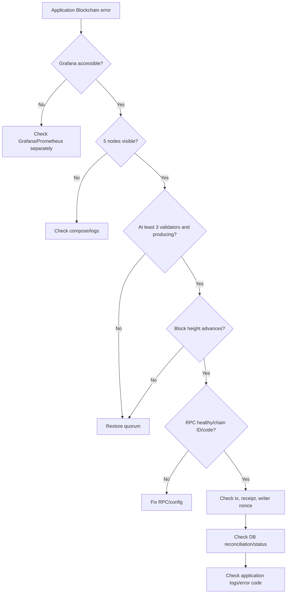

# Troubleshooting

> **วัตถุประสงค์:** วินิจฉัยปัญหา Integration ด้วยอาการ, สาเหตุ, คำสั่งตรวจ, ผลคาดหมาย และวิธีแก้ที่ไม่ทำลายข้อมูล
> **Last Verified Date:** 2026-09-10
> **Parent Revision:** `de54028e4cf704068ac7dcabfe4c7767be2336f5`
> **Blockchain Revision:** `1fdfe5a839105c0fec6c9ada98d04b82d8f04d06`
> **Smart Contract Version:** `EvidenceRegistryV3` (V3-only runtime)
> **Network Technology:** Hyperledger Besu 26.7.0, QBFT, private EVM, Chain ID `20260720`
> **Intended Audience:** Developer, Operator, Support, AI

## Diagnostic Order



ใช้ dashboard ประกอบการวินิจฉัย แต่ตรวจ RPC/transaction/DB ต่อเสมอ

## Quick Symptom Matrix

| Symptom | Likely layer | First check |
|---|---|---|
| Compose “no configuration file” | command working directory | `--project-directory network/besu` |
| RPC connection closed | malformed URL, RPC down, protocol/port | literal URL + compose ps/logs |
| `WinError 10013` port 8000 | port reserved/in use/security policy | `netstat -ano` |
| Next says another dev server | process already holds 3000 | use existing or stop actual PID |
| CORS missing header with 500 | Backend crashed before CORS response or origin wrong | Backend traceback first |
| health fails inside signer | malformed writer env | validate presence/format without printing; read-only without signer |
| RPC max range exceeded | event query too broad | integration bounded/chunked reader |
| VIEW remains pending while blocks rise | tx/nonce/reconciliation | tx receipt, session, latest/pending nonce |
| Download 503 “could not be recorded” | recordAccess/receipt/DB orchestration | backend error + tx existence before retry |
| Download 409 integrity mismatch | Original/DB hash differs chain | three-way hash diagnosis |
| Verify 503 | Blockchain read unavailable | RPC/contract/chain health |
| Alembic missing revision | DB/source history mismatch | current heads/history, no stamp |

## 1. Compose File Not Found

**อาการ**

```text
no configuration file provided: not found
```

**สาเหตุ:** `docker-compose.yml` อยู่ใน `blockchain/network/besu/` แต่ command รันจาก `blockchain/` โดยไม่ระบุ project directory

**ตรวจ/แก้:**

```powershell
cd blockchain
docker compose --project-directory network/besu config --quiet
docker compose --project-directory network/besu up -d
```

**Expected:** config validation ไม่มี error และ services เริ่มโดยใช้ compose ที่ถูกต้อง

**ห้ามทำ:** ย้าย/สร้าง compose ปลอมที่ root หรือใช้ `down -v`

## 2. PowerShell RPC Connection Closed

**อาการ:** `Invoke-RestMethod` แจ้ง connection closed

**สาเหตุที่พบบ่อย:** paste Markdown URL เช่น `"[http://...](http://...)"`, RPC container down, port ไม่ map หรือ Docker Engine มีปัญหา

**ตรวจ:**

```powershell
docker compose --project-directory network/besu ps
$body = '{"jsonrpc":"2.0","method":"eth_chainId","params":[],"id":1}'
Invoke-RestMethod -Uri 'http://127.0.0.1:8545' -Method Post -ContentType 'application/json' -Body $body
docker compose --project-directory network/besu logs --tail 100 rpc-node
```

**Expected:** JSON-RPC result hex ของ chain ID `20260720` (`0x1352ff0` เมื่อแปลงตามค่า) ให้ยืนยันด้วย conversion ไม่พึ่งความจำ

**แก้:** ใช้ literal URL, start/restart RPC เฉพาะเมื่อ logs สนับสนุน แล้วตรวจ block progression

## 3. Backend Port 8000 Forbidden/In Use

**อาการ:** `[WinError 10013]` หรือ bind ไม่ได้

```powershell
netstat -ano | findstr :8000
Get-Process -Id 38044
Stop-Process -Id 38044
```

ใช้ PID จริงจาก `netstat` ตัวอย่าง `38044` ไม่ใช่ค่าคงที่และไม่ใช้ `<PID>` พร้อมเครื่องหมาย bracket หากไม่มี listener อาจเป็น excluded port/security policy ให้ตรวจ Windows network policy แยก

## 4. Next Dev Server Already Running

**อาการ:** port 3000 ถูกใช้, Next เลื่อนไป 3001 และรายงาน server เดิม

**ความหมาย:** process เดิมใน frontend directory ยังทำงาน `3001` ยังชน Grafana และ origin 3001 ไม่อยู่ใน Backend CORS ปัจจุบัน

```powershell
netstat -ano | findstr :3000
Get-Process -Id <actual-number>
Stop-Process -Id <actual-number>
cd frontend
npm run dev
```

หรือใช้ server เดิมที่ `http://localhost:3000` หาก code/current process ถูกต้อง

## 5. CORS Error พร้อม Backend 500

**อาการ:** Browser บอกไม่มี `Access-Control-Allow-Origin` และ request เป็น 500

**สาเหตุ:** CORS message อาจเป็นผลรองเมื่อ Backend exception ทำให้ response ผิดปกติ ไม่ใช่ root cause เสมอ หรือ Frontend origin ไม่ใช่ 3000

**วินิจฉัย:** อ่าน ASGI traceback ใน Backend terminal, ตรวจ response status/detail, ยืนยัน Frontend URL 3000 และเรียก API ด้วย request ที่ auth ถูกต้อง

**แก้:** แก้ exact Backend exception หรือรัน origin ที่อนุญาต อย่าเปิด CORS `*` เพื่อซ่อน 500 โดยไม่เข้าใจผล

## 6. FastAPI Import Missing Dependency

**อาการ:** `ModuleNotFoundError` เช่น `numpy`, `cv2`, `skimage`, `pywt`, `qrcode`, `pyzbar`

**สาเหตุ:** `backend/requirements.txt` ยังไม่ประกาศ Watermark runtime dependencies ครบ

**วินิจฉัย:** ใช้ venv interpreter โดยตรงและ import module ที่ error ระบุ

```powershell
cd backend
.\.venv\Scripts\python.exe -c "from app.main import app; print('FastAPI app import OK')"
```

คำสั่งนี้อาจเชื่อม DB/seed จึงต้องชี้ DB ที่ได้รับอนุญาตก่อน ติดตั้งเฉพาะ confirmed missing package และหยุดเมื่อเจอ blocker ถัดไป สำหรับ `pyzbar` ต้องตรวจ native ZBar load ด้วย

## 7. Writer Private Key Malformed

**อาการ:** `UnicodeEncodeError`, `Non-hexadecimal digit`, `Account.from_key` failure ขณะสร้าง client

**สาเหตุ:** env มี placeholder/ข้อความ Unicode/ความยาวผิดแทน 32-byte hex key

ตรวจโดยไม่ print ค่า:

```powershell
$k = $env:BLOCKCHAIN_WRITER_PRIVATE_KEY
[pscustomobject]@{
  Present = [bool]$k
  LengthValid = $k.Length -in @(64, 66)
  HexFormatValid = $k -match '^(0x)?[0-9a-fA-F]{64}$'
  HasWhitespace = $k -match '\s'
}
```

Read-only health ไม่ต้องใช้ writer key สามารถเอา env ออกจาก process ชั่วคราวและ restore โดยไม่ print key Writer key ต้องมาจาก authorized local network account ที่ได้รับ `WRITER_ROLE` ไม่ใช่สร้างสุ่มแล้วคาดว่าจะเขียนได้

## 8. Health Disabled

**อาการ:** `enabled=false`, `connected=false`

ตรวจ `BLOCKCHAIN_ENABLED` และ process env priority Backend config default false Intentional disabled health ไม่ติดต่อ Besu การเปิด true ต้องมี contract address ที่ validate ได้

## 9. Chain ID Mismatch

**อาการ:** health/preflight หรือ client write ปฏิเสธ chain

**ตรวจ:** RPC `eth_chainId`, `BLOCKCHAIN_CHAIN_ID`, Besu genesis และ deployment manifest ต้องเป็น chain เดียวกัน

**แก้:** ชี้ Backend ไป endpoint/chain ที่ถูกต้อง อย่าแก้ expected ID ให้ผ่านโดยไม่ตรวจว่า contract/address อยู่ chain ไหน

## 10. Contract Not Deployed

**อาการ:** `contract_deployed=false`, empty bytecode หรือ call decode fail

**ตรวจ:** `eth_getCode` ที่ configured address, manifest chain ID/address/block และ ABI V3 artifact

**แก้:** update local Backend address/block ให้ตรง deployment ที่มีอยู่ หากเป็น chain ใหม่จริงจึง deploy V3 ผ่าน reviewed script ห้าม redeploy เพื่อแก้ typo config

## 11. Artifact/ABI Mismatch

**อาการ:** function `evidenceExists`/`accessSessionExists` ไม่พบ, event decode fail

**ตรวจ:** `BLOCKCHAIN_ARTIFACT_PATH=blockchain/artifacts/EvidenceRegistryV3.json`, file มี V3 ABI และ CI artifact test ผ่าน

**แก้:** sync submodule revision/export artifact จาก Foundry build ห้ามชี้ runtime ไป `tests/fixtures` หรือ hand-edit JSON

## 12. RPC Range Limit

**อาการ:** JSON-RPC error `Requested range exceeds maximum RPC range limit`

**สาเหตุ:** direct client query scan ช่วง block ใหญ่เกิน Besu limit

**แก้:** ใช้ Backend integration method ซึ่งเริ่ม `BLOCKCHAIN_DEPLOYMENT_BLOCK` และแบ่งช่วง 1000 blocks หรือ query transaction/block/session แบบ direct bounded lookup อย่า scan block 0 ถึง latest ครั้งเดียว

## 13. VIEW Pending แต่ Chain Producing

**อาการ:** UI pending ขณะที่ Grafana block height เพิ่ม

**สาเหตุ:** receipt timeout, tx dropped จาก RPC restart, writer nonce gap, session event ยังไม่ reconcile หรือ submission unknown

**ตรวจตามลำดับ:**

1. transaction hash ใน DB/UI ถ้ามี
2. `eth_getTransactionByHash` และ receipt
3. `getAccessBySession(access_session_ref)`
4. writer latest/pending nonce
5. Backend status `pending_confirmation` กับ `submission_unknown`
6. recovery delay และ logs

**แก้:** retry UI ด้วย request id เดิมเพื่อ reconcile ปล่อย guarded recovery ทำ replacement เฉพาะเงื่อนไข ห้าม click แบบสร้าง session ใหม่หรือส่ง raw transaction เอง

## 14. Nonce Gap หลัง RPC Restart

**อาการ:** chain ผลิต empty blocks แต่ writer transactions nonce N+1 ขึ้นไปไม่ mine

**สาเหตุ:** tx nonce N อยู่ใน volatile RPC txpool แล้วหายเมื่อ restart Future nonces รอ gap

**แก้ใน current source:** NonceManager query pending nonce สดทุก submission; VIEW recovery ตรวจ old tx/session/chain แล้ว reuse same session/row หากใช้ Backend process เก่าหลังแก้ submodule ต้อง restart process เต็ม

**ห้ามทำ:** ส่ง transaction หลายครั้งเพื่อ “ดัน nonce”, reset chain หรือเพิ่ม timeout อย่างเดียว

## 15. Download 503 Could Not Be Recorded

**ความหมาย:** Download เป็น strict custody flow จึงไม่คืน personalized file เมื่อ recordAccess/DB linkage ไม่สำเร็จ

**ตรวจ:** Backend traceback/error class, RPC health, tx hash existence, receipt/session, writer nonce, DB transaction/access row โดยไม่ retry endpoint ก่อนรู้ว่า broadcast เริ่มหรือไม่

หาก write เริ่มแล้วให้หยุดและตรวจ chain เพราะ retry อาจเกิด duplicate attempt แม้ contract session uniqueness ป้องกันบางรูปแบบ

## 16. Download Integrity 409

**อาการ:** `EVIDENCE_INTEGRITY_MISMATCH`

| Mismatch | ความหมาย |
|---|---|
| current != chain | bytes ของ ORIGINAL ปัจจุบันต่างจาก immutable anchor |
| DB != chain | mutable DB hash ต่างจาก anchor |
| both | ทั้ง storage และ metadata ไม่สอดคล้อง |

Backend block ก่อน personalization/AccessLog/recordAccess/transaction row ตรวจ backup/audit และ restore เฉพาะเมื่อพิสูจน์ source ได้ ห้าม update DB hash ให้ตรงไฟล์ที่ถูกแก้เพื่อทำให้ error หาย

## 17. Verify Unresolved หรือ 503

- unresolved: QR decode empty/malformed หรือรูปแบบ Dynamic ไม่ใช่ canonical/personalized
- 503: required Blockchain read unavailable
- cross-evidence personalized: fail closed, ไม่คืน attribution ของ evidence อื่น
- VIEW action session: ไม่ยอมรับเป็น personalized DOWNLOAD source

Verify เป็น read-only จึงไม่ควรมี AccessLog/BlockchainTransaction ใหม่ ถ้ามีถือเป็น regression

## 18. CoC Missing Local Rows

Chain-first CoC ยังแสดง event/ref เมื่อ AccessLog/user/transaction DB row ถูกลบ นี่ไม่ใช่ chain data loss UI จะระบุ missing/mismatch และ profile อาจไม่มี หาก registration ไม่พบ ให้ตรวจ evidence ref, deployment block, configured contract และ bounded scan

## 19. Alembic Missing Revision

**อาการ:** `Can't locate revision identified by ...`

**สาเหตุ:** DB `alembic_version` ชี้ revision ที่ source checkout ไม่มีหรือ branch history ต่าง

**ตรวจ read-only:** `alembic current`, `heads`, `history --verbose`, migration files, DB schema/table/columns, Git history

**แก้:** เลือก restore missing migration, migrate path หรือ verified stamp เฉพาะเมื่อ schema equivalent จริง หรือใช้ isolated DB หากข้อมูลเดิมต้องรักษา ห้าม `stamp head` เพียงเพื่อข้าม error

## 20. Grafana No Data

Prometheus/Grafana failure ไม่เท่ากับ Blockchain failure ตรวจ Prometheus container/targets/datasource/scrape endpoint แยก แล้วตรวจ RPC block progression ตรง หาก monitoring down chain ยังอาจทำงาน

## 21. Grafana Accessible but App Fails

Grafana “Producing” ไม่ยืนยัน specific writer transaction ตรวจ Backend RPC endpoint, contract, transaction, receipt, event, writer nonce และ DB reconciliation ต่อ

## 22. Secret Exposure Response

หาก key/password/token ถูก print/commit:

1. หยุดแชร์ output
2. revoke/rotate credential ตามบทบาท
3. ลบออกจาก worktree/index อย่างปลอดภัย
4. ประเมิน Git history/remote exposure ก่อน rewrite
5. update authorized roles/env/encrypted backup
6. verify new signer โดยแสดงเฉพาะ address/presence

อย่าถือว่าลบไฟล์ commit ล่าสุดแล้ว secret ที่ push หายจาก history

## Command Safety Reference

### Safe read-oriented

```text
git status/log/diff/submodule status
docker compose ps/logs/config
eth_chainId / eth_blockNumber / eth_getCode / eth_getTransaction* / eth_getLogs bounded
alembic current/heads/history/check
Blockchain health/getEvidence/getAccessBySession/Explorer/CoC
```

### Stateful but normally non-destructive

```text
docker compose stop/start/restart
alembic upgrade head on explicitly authorized target DB
```

### Dangerous or write-producing

```text
recordEvidence / recordAccess
deploy/grant/revoke/pause/unpause
generate --force
down -v / volume prune
DROP/TRUNCATE/reset_db
stamp / migration rewrite
```

ก่อน operation ที่ไม่ใช่ read-only ให้ backup/authorization/cardinality/target ชัดเจนตาม [Operations and Recovery](06-OPERATIONS-AND-RECOVERY.md)
