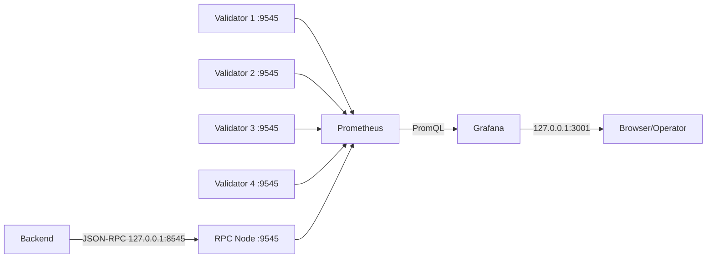
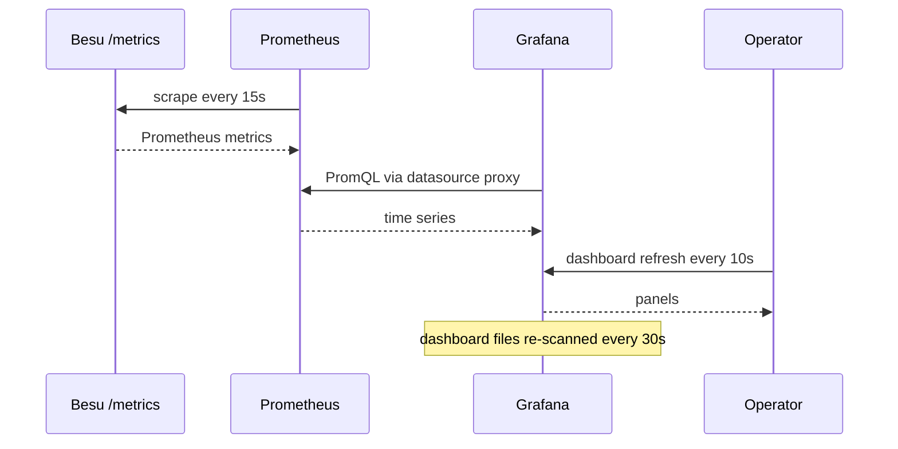
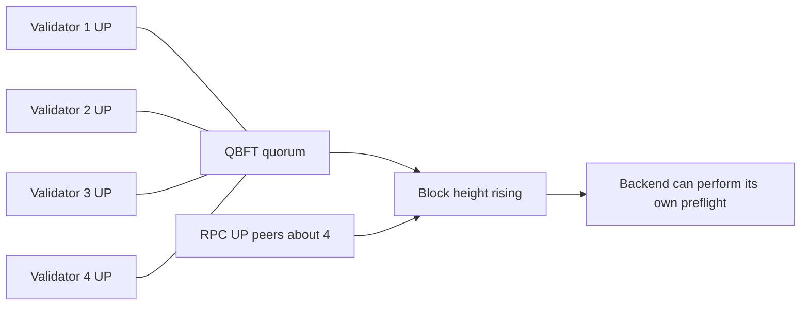
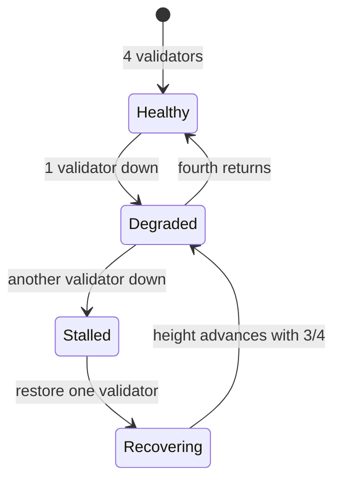
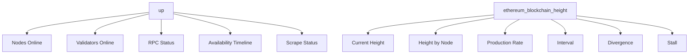
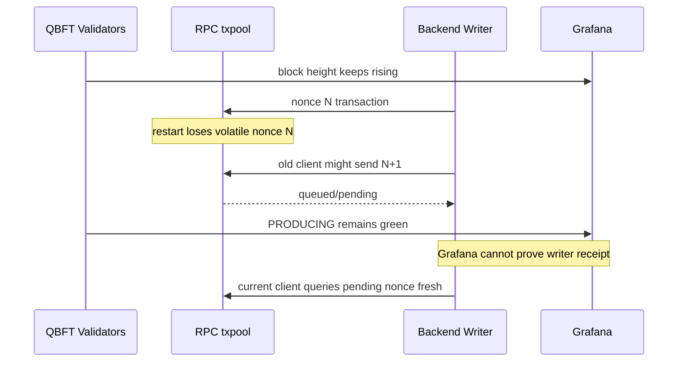
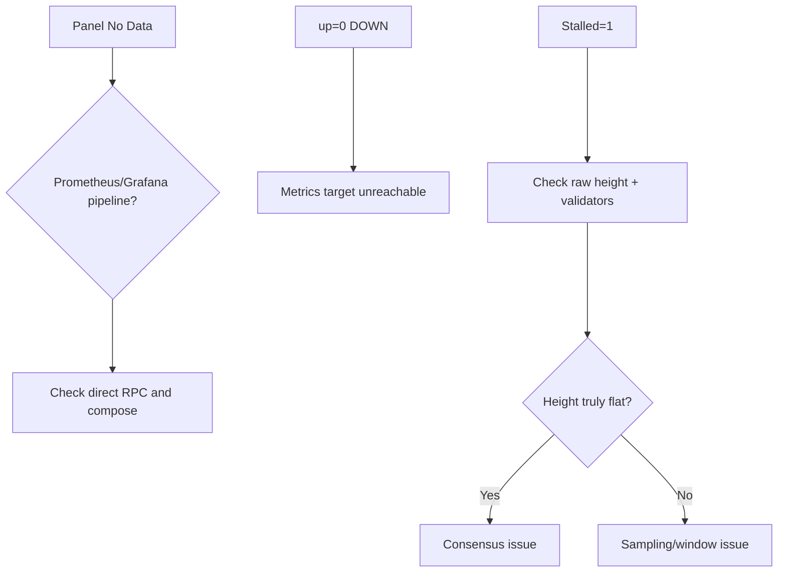
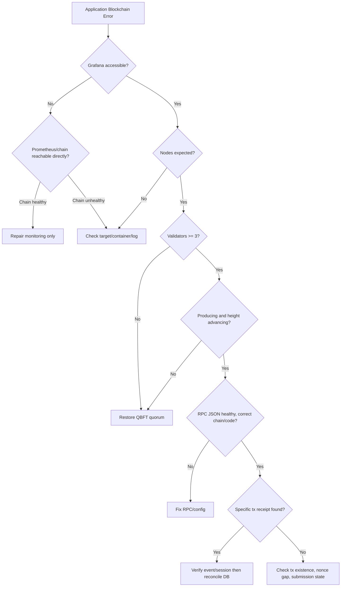
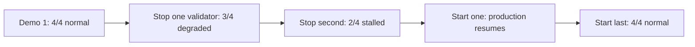
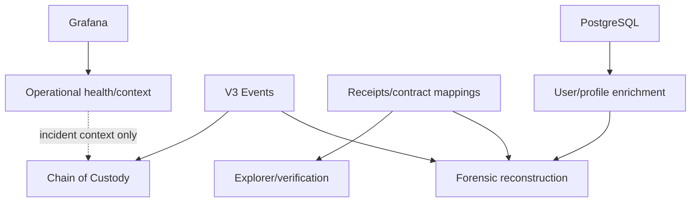

# Grafana Monitoring Guide

> **วัตถุประสงค์:** คู่มืออ่าน Grafana/Prometheus/Besu metrics, แยก consensus health จาก application transaction health และใช้ dashboard วินิจฉัยอย่างปลอดภัย
> **Last Verified Date:** 2026-09-12
> **Parent Revision:** `133aa9b3716c735748c96ac4ad9fba047fddc35f` (base revision; submodule/docs update pending commit)
> **Blockchain Revision:** `3a92ec3f2096d812c588d8bf8eea209e60a27717`
> **Smart Contract Version:** `EvidenceRegistryV3` (V3-only runtime)
> **Network Technology:** Hyperledger Besu 26.7.0, QBFT, private EVM, Chain ID `20260720`
> **Intended Audience:** Operator, Developer, Incident Responder, AI

## 1. ขอบเขตและ Source ที่ตรวจ

คู่มือนี้อ้างอิงไฟล์จริงต่อไปนี้ ณ revision ใน header

- `blockchain/network/besu/docker-compose.yml`
- `blockchain/network/besu/docker-compose.monitoring.yml`
- `blockchain/network/besu/monitoring/prometheus.yml`
- `blockchain/network/besu/monitoring/alert-rules.yml`
- `blockchain/network/besu/monitoring/grafana/provisioning/datasources/prometheus.yml`
- `blockchain/network/besu/monitoring/grafana/provisioning/dashboards/dashboards.yml`
- `blockchain/network/besu/monitoring/grafana/provisioning/dashboards/besu-qbft-overview.json`
- `blockchain/network/besu/nodes/*/config.toml`

Dashboard ปัจจุบันชื่อ **Besu QBFT Private Network Overview**, UID `besu-qbft-overview`, description ระบุว่าใช้กับ integration/staging network

> [!IMPORTANT]
> **Grafana เป็น observability layer ไม่ใช่ application control plane** Backend ไม่ถาม Grafana ก่อนเขียน Blockchain แต่ใช้ JSON-RPC preflight ตรวจ connection, chain ID, contract code และ latest block age โดยตรง

> [!IMPORTANT]
> **Grafana ไม่ใช่ Blockchain Explorer และไม่ใช่ Chain of Custody** การยืนยัน transaction ต้องใช้ receipt, decoded V3 event, contract state และ DB reconciliation

## 2. Monitoring Architecture



Besu ทุก node เปิด metrics ที่ `0.0.0.0:9545` ภายใน Docker network Prometheus scrape path `/metrics`; validators ไม่เปิด JSON-RPC ให้ host RPC Node เท่านั้นที่ map `127.0.0.1:8545`

## 3. Components, Ports and Persistence

| Component | Image/source | Host access | Internal access | Volume |
|---|---|---|---|---|
| Grafana | `grafana/grafana:11.1.0` | `http://localhost:3001` | `grafana:3000` | `grafana-data` |
| Prometheus | `prom/prometheus:v2.53.1` | ไม่ expose ใน main compose | `prometheus:9090` | `prometheus-data` |
| RPC Node | Besu 26.7.0 | `127.0.0.1:8545` | RPC/metrics 8545/9545 | `rpc-node-data` |
| Validators 1-4 | Besu 26.7.0 | ไม่มี host RPC | metrics 9545 | `validator-1-data` ถึง `validator-4-data` |

Grafana provisioning files mount read-only ที่ `/etc/grafana/provisioning`; Grafana state อยู่ `/var/lib/grafana` Prometheus time-series อยู่ `/prometheus` ทั้งสองแยกจาก chain state volumes

Prometheus config ไม่กำหนด retention override จึงใช้ current/default container behavior ห้ามระบุ retention duration ที่ source ไม่ได้ตั้ง

`docker-compose.monitoring.yml` เป็น optional override ที่ expose Prometheus `127.0.0.1:9090` และ Grafana `127.0.0.1:3000`; main compose ปัจจุบัน expose เฉพาะ Grafana ที่ 3001 คู่มือนี้ใช้ main compose และไม่แนะนำ expose Prometheus โดยไม่จำเป็น

## 4. Data and Provisioning Path



ค่าปัจจุบัน:

- Prometheus scrape interval: 15s
- Prometheus evaluation interval: 15s
- Grafana dashboard refresh: 10s
- Dashboard provisioning update interval: 30s
- Default dashboard time range: last 30 minutes (`now-30m` ถึง `now`)
- Timezone: browser

Grafana refresh เร็วกว่าสcrape ไม่ได้แปลว่ามี sample ใหม่ทุก 10 วินาที Alert ที่มี `for: 1m` หรือ `for: 5m` ต้องรอ condition ต่อเนื่องตาม rule evaluation จึงไม่ real-time

## 5. Datasource and Template Variable

Datasource:

| Field | Current value |
|---|---|
| Name | `Prometheus` |
| UID | `prometheus` |
| Type | Prometheus |
| Access | proxy |
| URL | `http://prometheus:9090` |
| Default | true |

Dashboard variable `instance` แสดงเป็น **Node**:

```promql
label_values(up{job="besu"}, instance)
```

รองรับ multiple selection และ All มี regex `.*` Panels ที่ใช้ `$instance` จะเปลี่ยนตามตัวเลือก ส่วน stat ที่ hard-code RPC/validators ไม่เปลี่ยนตาม variable

## 6. Healthy Network



Expected reference pattern: nodes 5, validators 4, RPC UP, RPC peer countประมาณ 4, sync IN SYNC, divergence 0, `Block Production Stalled=PRODUCING`, height เพิ่ม และ interval ใกล้ QBFT block period 5 วินาที คำว่า “ประมาณ” ใช้กับ peer/rate เพราะ sample/startup/network timing เปลี่ยนได้ ไม่ใช่ dashboard threshold

## 7. One Validator Down

```mermaid
flowchart LR
  V1[Validator 1 DOWN] -.x.-> Q[3/4 quorum remains]
  V2[Validator 2 UP] --> Q
  V3[Validator 3 UP] --> Q
  V4[Validator 4 UP] --> Q
  Q --> P[Blocks should continue]
  P --> D[Degraded redundancy]
```

Dashboard: Nodes Online 4 เป็น yellow, Validators Online 3 เป็น yellow, availability มีหนึ่ง DOWN แต่ chain ยังควร produce หาก remaining nodes connected

## 8. Two Validators Down

```mermaid
flowchart LR
  V1[DOWN] -.x.-> Q[2/4 no quorum]
  V2[DOWN] -.x.-> Q
  V3[UP] --> Q
  V4[UP] --> Q
  Q --> S[Block height flat]
  S --> ST[Stalled becomes 1 after one-minute inference window]
```

Validators Online 2 เป็น red ตาม threshold base, block rate ไปศูนย์และ stall panel กลายเป็น STALLED เมื่อ one-minute query มี sample พอ RPC endpointอาจยัง UP จึงห้ามตีความ RPC UP ว่า consensus healthy

## 9. Consensus Recovery



หลัง start validator ให้ตรวจ target UP, peer count, height convergence และ production ต่อเนื่อง ไม่ตัดสินจาก container state เดียว

## 10. Panel Inventory Overview

Dashboard มี 32 panel objects: text 1, row headers 5 และ data panels 26

| ID | Title | Type | Section |
|---:|---|---|---|
| 1 | Dashboard Scope and Limitations | text | Intro |
| 2 | Network Overview | row | Group |
| 3-8 | node/validator/RPC/height/peer/sync stats | stat | Network Overview |
| 9 | Blockchain Activity | row | Group |
| 10-15 | block/txpool/head tx/RPC connections | timeseries | Blockchain Activity |
| 16 | Node Resources | row | Group |
| 17-23 | memory/CPU/threads/fds/GC | timeseries | Node Resources |
| 24 | Consensus and Network Health | row | Group |
| 25-29 | divergence/peers/availability/stall/QBFT threads | mixed | Consensus |
| 30 | Monitoring Health | row | Group |
| 31-32 | scrape table/high-memory state | table/state timeline | Monitoring |

## 11. Panel 1 and Row Panels

### Panel 1: Dashboard Scope and Limitations

- **Type/visualization:** text
- **Datasource/PromQL/metric/unit:** ไม่มี
- **Purpose:** บอกขอบเขตว่า block height ไม่ใช่ evidence/transaction count, peer count ไม่ใช่ quorum, timer threads ไม่ใช่ votes และ Grafana ไม่ใช่ Explorer
- **Normal/caution/abnormal:** ไม่ใช่ health signal
- **Application impact:** ป้องกันการสรุปความหมายเกิน metrics
- **Next check:** ใช้ receipt/event/contract/DB เมื่อตรวจธุรกรรม
- **Limitation:** เป็นข้อความคงที่ ไม่สะท้อน runtime state

### Panels 2, 9, 16, 24, 30

เป็น row headers ชื่อ Network Overview, Blockchain Activity, Node Resources, Consensus and Network Health และ Monitoring Health ไม่มี datasource/query/unit/threshold ทำหน้าที่จัดหมวดเท่านั้น ไม่ควรนำสีหรือการเปิด/ปิด row ไปตีความเป็นสถานะระบบ

## 12. Network Overview Panels

### Panel 3: Besu Nodes Online

- **Type:** stat; **Datasource:** Prometheus UID `prometheus`
- **PromQL:** `sum(up{job="besu"})`
- **Metric/aggregation:** รวม binary scrape status ของ Besu targets ทั้ง 5
- **Unit/visualization:** short, single stat
- **Thresholds จริง:** red base สำหรับต่ำกว่า 4, yellow ตั้งแต่ 4, green ตั้งแต่ 5
- **Normal:** 5; **Caution:** 4; **Abnormal:** 0-3
- **Meaning:** Prometheus reachability ไม่ใช่ process/consensus proof โดยตรง
- **Application impact:** RPC targetหายกระทบ Backend; validator targetหายอาจลด quorum
- **Next checks:** Validators Online, RPC Node Status, target table, block height
- **Limitation:** metrics endpoint DOWN อาจเกิดจาก scrape/network แม้ Besu process ยังทำงาน

### Panel 4: Validators Online

- **Type/Datasource:** stat, Prometheus
- **PromQL:** `sum(up{job="besu",instance=~"validator-[1-4]:9545"})`
- **Metric/unit:** `up`, validators/short
- **Thresholds:** red base 0-2, yellow 3, green 4
- **Normal:** 4; **Caution:** 3; **Abnormal:** 0-2
- **Meaning:** validator metrics endpoints reachable
- **Application impact:** 3/4 ควรยัง produce, 2/4 ไม่มี QBFT quorum
- **Next checks:** availability, height, divergence, peer counts, validator logs
- **Limitation:** UP ไม่พิสูจน์ว่า node vote ใน round ปัจจุบัน

### Panel 5: RPC Node Status

- **Type/Datasource:** stat, Prometheus
- **PromQL:** `up{job="besu",instance="rpc-node:9545"}`
- **Metric/unit:** scrape status, binary state
- **Mapping:** 0 = DOWN/red, 1 = UP/green; threshold red base, green at 1
- **Normal:** UP; **Abnormal:** DOWN; ไม่มี yellow state
- **Meaning:** Prometheus เข้าถึง RPC metrics endpoint
- **Application impact:** DOWN มักสัมพันธ์กับ Backend RPC unavailable แต่ RPC JSON endpoint ต้องตรวจแยก
- **Next checks:** compose ps/logs, direct `eth_chainId`, `eth_blockNumber`
- **Limitation:** metrics UP ไม่พิสูจน์ JSON-RPC function/contract/write success

### Panel 6: Current Block Height

- **Type/Datasource:** stat, Prometheus
- **PromQL:** `max(ethereum_blockchain_height{job="besu"})`
- **Metric/unit:** highest reported chain height, blocks/short
- **Thresholds:** ไม่มีใน JSON
- **Normal:** ค่าเพิ่มเมื่อเทียบเวลา; **Caution/Abnormal:** ไม่มี numeric threshold, flat ต้องเทียบ Block Production Stalled
- **Meaning:** max ข้ามทุก node
- **Application impact:** stalled height ทำให้ writes ไม่ confirmและ preflight block-age fail
- **Next checks:** height by node, rate, stall, validators
- **Limitation:** ไม่ใช่ evidence count, tx count และ max อาจซ่อน node ที่ตามหลัง

### Panel 7: RPC Peer Count

- **Type/Datasource:** stat, Prometheus
- **PromQL:** `ethereum_peer_count{job="besu",instance="rpc-node:9545"}`
- **Metric/unit:** direct P2P peers, peers/short
- **Thresholds:** ไม่มี
- **Normal reference topology:** ประมาณ 4; **Caution:** ต่ำกว่าปกติให้ตรวจ topology; **Abnormal threshold:** ไม่ได้กำหนด
- **Application impact:** RPC isolated อาจเห็น chain stale/read/writeผิดปกติ
- **Next checks:** peer count by node, sync, divergence, static peers/logs
- **Limitation:** peer count ไม่เท่ากับ validator countหรือ quorum

### Panel 8: Synchronization Status

- **Type/Datasource:** stat, Prometheus
- **PromQL:** `besu_synchronizer_in_sync{job="besu",instance="rpc-node:9545"}`
- **Metric/unit:** binary sync state
- **Mapping:** 0 = NOT IN SYNC/yellow, 1 = IN SYNC/green; ไม่มี red threshold
- **Normal:** IN SYNC; **Caution:** NOT IN SYNC
- **Application impact:** stale RPC data/receipt lookup ได้
- **Next checks:** height divergence, peer count, node logs
- **Limitation:** IN SYNC ไม่ยืนยัน contract address, writer nonceหรือ specific tx

## 13. Blockchain Activity Panels

### Panel 10: Block Height by Node

- **Type/Datasource:** timeseries, Prometheus
- **PromQL:** `ethereum_blockchain_height{job="besu",instance=~"$instance"}`
- **Metric/unit:** height per selected node, short
- **Thresholds:** ไม่มี
- **Normal:** เส้นเพิ่มและเกือบซ้อนกัน; **Caution:** lag ชั่วคราว; **Abnormal:** เส้นหนึ่ง flat/divergeต่อเนื่อง แต่ไม่มี configured cutoff
- **Impact:** node lag อาจทำให้ RPC response stale
- **Next:** divergence, sync, peers, logs
- **Limitation:** sample gap อาจดูเหมือน flat; filter Node มีผล

### Panel 11: Block Production Rate

- **Type:** timeseries
- **PromQL:** `rate(ethereum_blockchain_height{job="besu",instance=~"$instance"}[5m])`
- **Metric/unit:** derivative ของ height, blocks/second (`cps`)
- **Normal reference:** ใกล้ 0.2 blocks/s สำหรับ block period 5s; **Caution/Abnormal:** ไม่มี thresholds, ศูนย์ต่อเนื่องต้องเทียบ stall
- **Impact:** rate ศูนย์คือไม่มี progressหรือไม่มี valid samples
- **Next:** raw height, target UP, validators
- **Limitation:** five-minute smoothing ทำให้ recovery/stall transitionล่าช้า

### Panel 12: Estimated Average Block Interval

- **Type:** timeseries
- **PromQL:** `1 / clamp_min(rate(ethereum_blockchain_height{job="besu",instance=~"$instance"}[5m]), 0.000001)`
- **Metric/unit:** reciprocal rate, seconds/block
- **Normal reference:** ใกล้ 5s; **Caution:** สูงขึ้น; **Abnormal:** stall แสดงค่ามากมากเพราะ clamp, ไม่มี thresholds
- **Impact:** intervalผิดปกติสัมพันธ์กับ delayed confirmations
- **Next:** production rate, raw height, quorum
- **Limitation:** derived/smoothed; startup/scrape gaps distort

### Panel 13: Transaction Pool Size

- **Type:** timeseries
- **PromQL:** `besu_transaction_pool_number_of_transactions{job="besu",instance=~"$instance"}`
- **Metric/unit:** current txpool size, transactions/short
- **Normal:** อาจเป็น 0 เมื่อไม่มี traffic; **Caution:** sustained buildupเทียบ baseline; **Abnormal threshold:** ไม่มี
- **Impact:** queued writer txอาจยังไม่ confirm
- **Next:** specific tx/receipt, latest vs pending writer nonce, RPC restart history
- **Limitation:** ไม่บอก tx identity, nonce gap, statusหรือ cumulative total; txpoolต่างกันต่อ node

### Panel 14: Transactions in Chain Head Block

- **Type:** timeseries
- **PromQL:** `besu_blockchain_chain_head_transaction_count{job="besu",instance=~"$instance"}`
- **Metric/unit:** tx count เฉพาะ current head block, transactions/block/short
- **Normal:** 0 หรือมากกว่า 0 ตาม traffic; **Caution/Abnormal:** ไม่มี threshold
- **Impact:** ช่วยดูว่า latest blocks มี tx แต่ไม่ยืนยัน app tx
- **Next:** Explorer/receipt ของ hash ที่ต้องการ
- **Limitation:** ไม่ใช่ cumulative transaction/evidence count และ head เปลี่ยนทุก block

### Panel 15: Active RPC HTTP Connections

- **Type:** timeseries
- **PromQL:** `besu_rpc_active_http_connection_count{job="besu",instance="rpc-node:9545"}`
- **Metric/unit:** active HTTP connections, short
- **Normal/caution/abnormal:** ไม่มี configured thresholds; ใช้เทียบ workload baseline
- **Impact:** connection surge อาจสัมพันธ์กับ Backend/client load แต่ไม่พิสูจน์ error
- **Next:** Backend logs, RPC response latency/errorsที่ dashboardยังไม่มี
- **Limitation:** count ไม่บอก endpoint, user, request successหรือ writer tx

## 14. Node Resource Panels

### Panel 17: Resident Memory by Node

- **Type:** timeseries
- **PromQL:** `process_resident_memory_bytes{job="besu",instance=~"$instance"}`
- **Metric/unit:** process resident memory, IEC bytes
- **Normal:** baseline ของแต่ละ node; **Caution:** approaching actual 1.5GB alert line; **Abnormal:** dashboard panelไม่มี thresholdแต่ alert/state panel uses >1,500,000,000
- **Impact:** memory pressureอาจนำไป restart/OOM
- **Next:** JVM Memory, GC, container/host memory
- **Limitation:** ไม่ใช่ total host memory

### Panel 18: JVM Memory Used

- **Type:** timeseries
- **PromQL:** `jvm_memory_used_bytes{job="besu",instance=~"$instance"}`
- **Metric/unit:** JVM used memory by `area`, bytes; legend instance + area
- **Thresholds:** ไม่มี
- **Normal/caution/abnormal:** ใช้ trend/baseline; ไม่มี numeric stateใน JSON
- **Impact:** growthร่วมกับ GC/RS memoryช่วยวินิจฉัย pressure
- **Next:** resident memory, GC rate/time, logs
- **Limitation:** JVM areasหลาย series; ไม่เท่ากับ container total

### Panel 19: Process CPU Usage

- **Type:** timeseries
- **PromQL:** `rate(process_cpu_seconds_total{job="besu",instance=~"$instance"}[5m])`
- **Metric/unit:** process CPU seconds rate, cores
- **Thresholds:** ไม่มี
- **Normal/caution/abnormal:** compare node baseline; sustained increase needs correlation
- **Impact:** resource contentionอาจเพิ่ม block/RPC latency
- **Next:** block interval, GC, host/container metrics
- **Limitation:** เป็น cores ไม่ใช่ host CPU percent; five-minute smoothing

### Panel 20: JVM Thread Count

- **Type:** timeseries
- **PromQL:** `jvm_threads_current{job="besu",instance=~"$instance"}`
- **Metric/unit:** current JVM threads, short
- **Thresholds:** ไม่มี; ใช้ trend
- **Impact:** sudden sustained changeอาจสัมพันธ์กับ workload/problem แต่ไม่ใช่ proof
- **Next:** logs, CPU, GC, specific executor metrics
- **Limitation:** ไม่แยก thread healthหรือ blocked state

### Panel 21: Open File Descriptors

- **Type:** timeseries
- **PromQL:** `process_open_fds{job="besu",instance=~"$instance"}`
- **Metric/unit:** open descriptors per process, short
- **Thresholds:** ไม่มี; compare trend/system limitนอก dashboard
- **Impact:** descriptor exhaustionอาจทำให้ network/storage errors
- **Next:** container/host limitsและ logs
- **Limitation:** ไม่ใช่ host-wide file usageและ dashboardไม่แสดง maximum

### Panel 22: Garbage Collection Rate

- **Type:** timeseries
- **PromQL:** `rate(jvm_gc_collection_seconds_count{job="besu",instance=~"$instance"}[5m])`
- **Metric/unit:** collections per second by collector/node, `ops`
- **Thresholds:** ไม่มี; bursts อาจปกติ
- **Impact:** high rateร่วมกับ memory/latencyอาจบอก pressure
- **Next:** GC time, JVM/resident memory, block interval
- **Limitation:** countไม่บอก pause severity; five-minute window

### Panel 23: Garbage Collection Time

- **Type:** timeseries
- **PromQL:** `rate(jvm_gc_collection_seconds_sum{job="besu",instance=~"$instance"}[5m])`
- **Metric/unit:** GC seconds per wall-second, unit seconds
- **Thresholds:** ไม่มี; compare baseline
- **Impact:** sustained higher valueอาจลด responsiveness
- **Next:** GC rate, CPU, block/RPC metrics
- **Limitation:** ไม่ใช่ total process pause time

## 15. Consensus and Network Health Panels

### Panel 25: Block Height Divergence

- **Type:** stat
- **PromQL:** `max(ethereum_blockchain_height{job="besu"}) - min(ethereum_blockchain_height{job="besu"})`
- **Metric/unit:** max-min blocks, short
- **Thresholds:** green base 0, yellowตั้งแต่ 1, redตั้งแต่ 2
- **Normal:** 0; **Caution:** 1; **Abnormal:** >=2
- **Impact:** RPC/validator may be lagging
- **Next:** height by node, sync, peers, availability
- **Limitation:** missing targetอาจถูกตัดจาก rangeแทนเพิ่ม divergence จึงดู target statusด้วย

### Panel 26: Peer Count by Node

- **Type:** timeseries
- **PromQL:** `ethereum_peer_count{job="besu",instance=~"$instance"}`
- **Metric/unit:** peers per selected node, short
- **Thresholds:** ไม่มี; expected topologyดูประมาณ 4
- **Impact:** isolated node may lag
- **Next:** static peers, node logs, divergence
- **Limitation:** peersไม่ใช่ validator quorum/participation

### Panel 27: Node Availability Timeline

- **Type:** state timeline
- **PromQL:** `up{job="besu",instance=~"$instance"}`
- **Mapping:** 0 DOWN/red, 1 UP/green
- **Unit:** binary state
- **Normal:** continuous UP; **Abnormal:** DOWN bands; ไม่มี yellow
- **Impact:** correlate outage/restartกับ pending operations
- **Next:** logsและ block/tx timeline
- **Limitation:** monitoring reachability only; scrape cadence limits precision

### Panel 28: Block Production Stalled

- **Type:** stat
- **PromQL:** `increase(ethereum_blockchain_height{job="besu",instance="rpc-node:9545"}[1m]) == bool 0`
- **Mapping:** 0 PRODUCING/green, 1 STALLED/red
- **Unit:** inferred state
- **Normal:** PRODUCING; **Abnormal:** STALLED; ไม่มี yellow
- **Impact:** writes cannot confirm while truly stalled; Backend block-age preflight may reject new writes
- **Next:** validators online, raw height, target status, quorum/logs
- **Limitation:** inference from one-minute RPC-node height, not direct QBFT telemetry; startup/scrape gaps affect result

### Panel 29: QBFT Timer Executor Active Threads

- **Type:** timeseries
- **PromQL:** `besu_executors_bfttimerexecutor_qbft_active_threads_current{job="besu",instance=~"$instance"}`
- **Metric/unit:** internal QBFT timer executor active threads, short
- **Thresholds:** ไม่มี
- **Normal/caution/abnormal:** ไม่มี documented numeric health threshold
- **Impact:** supporting runtime signal only
- **Next:** validators/height/stall/peer/logs
- **Limitation:** ไม่ใช่ quorum, vote, proposer successหรือ consensus health

## 16. Monitoring Health Panels

### Panel 31: Prometheus Target Scrape Status

- **Type:** table, instant query
- **PromQL:** `up{job="besu",instance=~"$instance"}`
- **Mapping:** 0 DOWN/red, 1 UP/green
- **Normal:** ทุก selected target UP; **Abnormal:** target DOWN
- **Impact:** panel dataจาก targetนั้นอาจหาย/เก่า
- **Next:** target endpoint, Docker DNS/network, service logs
- **Limitation:** UP ไม่พิสูจน์ node/consensus/application correctness

### Panel 32: JVM High Memory Alert State

- **Type:** state timeline
- **PromQL:** `process_resident_memory_bytes{job="besu",instance=~"$instance"} > bool 1500000000`
- **Mapping:** 0 NORMAL/green, 1 HIGH/red
- **Threshold:** exact current comparison 1,500,000,000 bytes
- **Normal:** NORMAL; **Abnormal:** HIGH; ไม่มี yellow
- **Impact:** possible memory pressure/restart risk
- **Next:** Resident/JVM memory, GC, container/host limits
- **Limitation:** binary thresholdไม่บอก cause; dashboard stateทันทีต่างจาก alert ruleที่ต้อง HIGH 5m

## 17. PromQL Guide

| Form | ความหมายใน dashboard | Caveat |
|---|---|---|
| `sum(up{...})` | นับ targets ที่ scrape ได้ | ไม่พิสูจน์ consensus |
| `max(height)` | highest observed chain tip | ซ่อน lagging nodeได้ |
| `max(height)-min(height)` | divergence ของ observed nodes | missing targetอาจไม่อยู่ใน range |
| `rate(counter[5m])` | average per-second rate 5 นาที | transition ถูก smooth |
| `1/clamp_min(rate, 0.000001)` | estimated interval ป้องกันหารศูนย์ | stall กลายเป็นค่ามาก ไม่ใช่ actual interval |
| `increase(height[1m]) == bool 0` | 1 เมื่อ heightไม่เพิ่มใน window | inferenceจาก RPC samples |
| `metric > bool 1500000000` | binary 0/1 memory state | raw magnitudeดู panelอื่น |
| `label_values(...,instance)` | สร้าง Node filter | ไม่ใช่ runtime health query |

Raw binary `1/0` ถูก Grafana map เป็น `UP/DOWN`, `IN SYNC/NOT IN SYNC`, `STALLED/PRODUCING` หรือ `HIGH/NORMAL` ตามแต่ panel จึงห้ามตีความเลข 1 ว่าดีเสมอ เช่น stall/high memory เลข 1 คือผิดปกติ

## 18. Shared Metric Dependencies



Prometheus scrape failureอาจทำให้หลาย panels ผิดพร้อมกันโดย consensusยังปกติ ต้องตรวจ direct RPC/containersร่วมเสมอ

## 19. Current Prometheus Alerts

| Alert | Exact expression | `for` | Severity | ความหมาย/ข้อจำกัด |
|---|---|---:|---|---|
| `BesuRpcNodeDown` | `up{job="besu",instance="rpc-node:9545"} == 0` | 1m | critical | metrics target down, not direct RPC probe |
| `BesuNodeDown` | `up{job="besu"} == 0` | 1m | warning | firing per missing Besu target |
| `BesuJvmMemoryHigh` | `process_resident_memory_bytes{job="besu"} > 1500000000` | 5m | warning | process resident memory sustained high |
| `BesuNoRecentMetrics` | `absent(up{job="besu"})` | 1m | critical | ไม่มี series `up` ทั้ง job |

ไม่มี Alertmanager service/routing ที่ยืนยันใน compose ปัจจุบัน Rules จึงถูก evaluate/มองได้ใน Prometheus แต่เอกสารนี้ไม่อ้างว่ามี external notification

## 20. Monitoring State Matrix

| Grafana | Prometheus | Besu/QBFT | สิ่งที่เห็น | ความจริงที่สรุปได้ |
|---|---|---|---|---|
| UP | UP | healthy | normal panels | monitoringเห็น health แต่ specific txยังต้องตรวจ |
| DOWN | UP | healthy | UIเข้าไม่ได้ | Blockchain/Applicationอาจปกติ |
| UP | DOWN | healthy | No Data/stale | monitoring pipelineเสีย ไม่ใช่ chain proof |
| UP | UP | RPC down, validators healthy | RPC DOWN, 4 validatorsอาจยัง UP/produce | Backend RPC unavailableแม้ consensusเดิน |
| UP | UP | 3/4 validators | yellow/degraded, heightควรเพิ่ม | quorumมีแต่ redundancyลด |
| UP | UP | 2/4 validators | validators red, height flat, stall | consensus stalled |
| UP | UP | blocks produce, writer nonce gap | producing/height green, txpoolอาจมีค่า | app writeอาจ pending |

## 21. Application Correlation Matrix

| App symptom | Grafana could show | Grafana cannot confirm | Required next source |
|---|---|---|---|
| Upload 503 | RPC/stall/node health | recordEvidence broadcast/receipt/DB commit | Backend log, tx/ref, receipt, DB |
| VIEW pending | production/txpool/RPC | exact session tx status/nonce gap | view response, DB tx, RPC receipt/session/nonce |
| Download 409 | usually network healthy | file/DB/chain hash mismatch | Integrity result, file hash, getEvidence |
| Download 503 | network clues | exact recordAccess/DB linkage | tx/session/receipt/DB |
| Verify 503 | RPC/network clues | request-specific read error | Backend log + direct read |
| CoC mismatch | no direct panel | DB/event field difference | CoC API, Explorer, DB |

## 22. Producing but Writer Transaction Pending



กรณี incident ที่ยืนยันใน project: RPC restart ลบ pending transaction ที่เติม nonce gap แต่ validators ยังผลิต block Future noncesจึงรอ transactionก่อนหน้า การแก้ root cause คือ fresh pending nonce + durable/idempotent reconciliation ไม่ใช่เพิ่ม receipt timeoutอย่างเดียว

> [!WARNING]
> **Block Height Increasing != ทุก Transaction ปกติ** Empty blocksหรือ txอื่นทำให้ heightเพิ่มได้

> [!WARNING]
> **Grafana PRODUCING != Backend Writer Transaction Confirmed** ต้องมี receipt/event/contract state

## 23. Failure Classification



- **No Data:** queryไม่มี series/sample อาจเป็น Prometheus/datasource/target/filter
- **DOWN:** `up=0` แปล scrape fail
- **STALLED:** one-minute height increase equals zero
- ทั้งสามไม่เหมือนกัน

> [!IMPORTANT]
> **Prometheus No Data != Blockchain Down** ตรวจ direct RPC block numbers ก่อน

## 24. Panel Interpretation Order

เมื่อ application มี Blockchain error:

1. Besu Nodes Online
2. Validators Online
3. RPC Node Status
4. Block Production Stalled
5. Current Block Height และ Block Height by Node
6. RPC Peer Count/Peer Count by Node
7. Synchronization Status/Divergence
8. หากทั้งหมดปกติ ตรวจ Backend direct RPC/preflight
9. ตรวจ transaction hash และ receipt
10. ตรวจ writer latest/pending nonce และ txpool
11. ตรวจ access session contract state
12. ตรวจ DB `AccessLog`/`BlockchainTransaction` reconciliation

## 25. Troubleshooting Decision Tree



## 26. Troubleshooting Playbooks

### A. Grafana แสดง STALLED

- **Symptoms:** stall=1, height flat
- **Meaning:** RPC-node heightไม่เพิ่มใน 1m window
- **Commands:** compose ps/logs, health-check script, direct block numberสองครั้ง
- **Causes:** <3 validators, peers disconnected, RPC lag, scrape gap/startup
- **Next:** restore quorum/peers; confirm heights converge
- **Do not:** reset volumes/genesis

### B. Besu Nodes Online < 5

- **Check:** scrape tableแยก target, compose status/logs
- **Impact:** ขึ้นกับ nodeที่หาย; RPC vs validatorต่างกัน
- **Next:** start specific service, inspect metrics endpoint/network
- **Do not:** restartทุก nodeพร้อมกันโดยไม่มีเหตุผล

### C. Validators Online < 4

- 3 = degraded/yellow, ตรวจ blockยังเดิน
- 2หรือน้อย = red/no quorum expectation
- start validatorเฉพาะที่ลงและรักษา volumeเดิม

### D. RPC DOWN

- Validatorsอาจยัง produce
- direct RPCจะ fail, Backend unavailable
- inspect/restart only RPC, then check sync/height/peers/txpool effects
- reconcile pending writer operations afterward

### E. Peer Count ต่ำ

- ตรวจทุก node, static peers, Docker network/logs
- peer countไม่มี thresholdใน dashboardและไม่เท่ากับ quorum
- ใช้ height/sync/validatorsประกอบ

### F. Synchronization ผิดปกติ

- compare RPC heightกับ max/validators
- inspect peer count/logs
- รอ catch-upโดยไม่ลบ volume

### G. Block Height ไม่เพิ่ม

- ตรวจ target samplesก่อน
- direct `eth_blockNumber` สองครั้งห่างเกิน block period
- ตรวจ validators >=3และ logs
- restore quorum

### H. Producing แต่ VIEW PENDING

- หา same request/session/tx
- receipt, `getAccessBySession`, transaction existence
- compare writer `latest`/`pending` nonce
- ให้ UI poll same request; current recovery handles dropped tx
- ห้ามสร้าง requestใหม่หรือ blind submit

### I. No Data

- ตรวจ Grafana datasource, Prometheus service, scrape targets, Node variable/time range
- direct chain checkแยก
- no dataทั้ง jobอาจ activate `BesuNoRecentMetrics` หลัง 1m

### J. Grafana เข้าไม่ได้

```powershell
docker compose --project-directory network/besu ps grafana prometheus
docker compose --project-directory network/besu logs --tail 100 grafana
netstat -ano | findstr :3001
```

ตรวจ `127.0.0.1:3001->3000` ห้าม reset `grafana-data` เพื่อแก้ login/dashboard ก่อนตรวจ credentials/provisioning

## 27. Common Graph Patterns

```text
Normal:   100 -> 101 -> 102 -> 103
Stalled:  100 --------------------
Recovery: 100 ------- 101 -> 102 -> 103
Flapping: UP -> DOWN -> UP -> DOWN -> UP
Peers:    4 -> 3 -> 4 -> 2 -> 4
```

- Normal rising: chain progress
- Flat: stallหรือ missing samples ต้องเทียบ `up`
- Recovery: flatช่วงหนึ่งแล้วกลับเพิ่ม
- Flapping: process/network/scrape instability
- Peer instability: connectivity issue; ไม่สรุป quorumจากเลข peers

เลือก time range ให้มีช่วงก่อน incident, failure และ recovery Default 30m อาจสั้นเกิน incidentเก่า จึงปรับ rangeโดยไม่เปลี่ยนข้อมูล

## 28. Safe Operator Commands

จาก `blockchain/`:

```powershell
docker compose --project-directory network/besu ps
docker compose --project-directory network/besu logs --tail 200 validator-1
docker compose --project-directory network/besu stop validator-1
docker compose --project-directory network/besu start validator-1
docker compose --project-directory network/besu restart rpc-node
```

`stop/start` รักษา named volume Demo quorumควรใช้ environment ที่ยอมรับผลกระทบและหยุดทีละ nodeตามแผน

## 29. Monitoring Demonstration



### Demo 1

แสดง nodes 5, validators 4, RPC UP, divergence 0, producing, height rising

### Demo 2

หยุด validatorหนึ่งตัวด้วย `docker compose stop validator-X`; แสดง nodes 4/validators 3 yellowและ heightยังเพิ่ม

### Demo 3

หยุด validatorที่สอง; แสดง validators 2 redและ heightหยุดหลัง window

### Demo 4

start validatorหนึ่งตัว; รอ target UP/heightกลับเพิ่ม แล้วคืน validatorสุดท้าย

> [!CAUTION]
> ทำ chaos demo เฉพาะ local/staging ที่ได้รับอนุญาต ห้าม `down -v`, prune volume, regenerate keys/genesisหรือทำบน environment ที่มีข้อมูลต้องรักษา

## 30. Grafana, Chain of Custody and Forensics



Grafana ช่วยบอกว่า node/metrics/block production มีปัญหาเมื่อใด แต่ไม่บอก user/evidence/session/action รายรายการ ข้อมูลนั้นมาจาก EvidenceRegistryV3, receipt/events, AccessLog, CoC และ Explorer Grafana metrics ไม่ใช่หลักฐาน custody record

## 31. Monitoring Failure vs Blockchain Failure

> [!IMPORTANT]
> **Container UP != Consensus Producing** ต้องดู block progression

> [!IMPORTANT]
> **Grafana != Application Control Plane** Backend ตัดสินจาก RPC และ application state

> [!IMPORTANT]
> **Chain of Custody != Grafana Monitoring Data** Metrics เป็น operational telemetry ไม่ใช่ access event

- Grafana down: dashboard unavailable, chainยังทำงานได้
- Prometheus down: metricsไม่อัปเดต, chainยังทำงานได้
- RPC metrics upแต่ JSON-RPCผิด: Grafanaอาจเขียว, Backendยัง fail
- QBFT healthyแต่ writer nonce gap: blocksเดิน, app tx pending
- chain stalledแต่ Grafana stale/no data: direct RPC/logsต้องยืนยัน

## 32. Current Threshold and Mapping Reference

| Panel | Current thresholds/mapping |
|---|---|
| Besu Nodes Online | red `<4`, yellow `4`, green `>=5` |
| Validators Online | red `<3`, yellow `3`, green `>=4` |
| RPC Node Status | 0 DOWN red, 1 UP green |
| Synchronization Status | 0 NOT IN SYNC yellow, 1 IN SYNC green |
| Block Height Divergence | green 0, yellow 1, red >=2 |
| Node Availability | 0 DOWN red, 1 UP green |
| Block Production Stalled | 0 PRODUCING green, 1 STALLED red |
| Prometheus Target Status | 0 DOWN red, 1 UP green |
| JVM High Memory State | 0 NORMAL green, 1 HIGH red; comparison >1,500,000,000 bytes |

Panelsอื่นไม่มี configured threshold ห้ามสร้าง yellow/red cutoff ขึ้นเอง

## 33. Quick Reference

### Healthy reference

- Nodes 5 green
- Validators 4 green
- RPC UP
- Peer countประมาณ 4, no dashboard threshold
- Sync IN SYNC
- Stall PRODUCING
- Divergence 0 green
- Height rising; rateประมาณ 0.2 blocks/s; intervalประมาณ 5s

### Degraded

- Nodes 4 yellow
- Validators 3 yellow
- chain should still produce แต่ fault toleranceลด
- divergence 1 yellowอาจเป็น transient lag

### Critical

- Validators <=2 red และ production expected stalled
- RPC DOWN red ทำ Backend endpoint unavailable
- Stall STALLED red
- divergence >=2 red
- all Besu metrics absent / Prometheus alerts critical
- high memory state redตาม exact threshold

## 34. Checklist Before Blockchain Development

- [ ] Grafana accessible at `http://localhost:3001`
- [ ] Prometheus datasource returns data
- [ ] Besu Nodes Online = 5
- [ ] Validators Online = 4
- [ ] RPC Node Status = UP
- [ ] RPC peer count consistent with topology
- [ ] Synchronization = IN SYNC
- [ ] Block Production = PRODUCING
- [ ] Current Block Height advances
- [ ] Divergence = 0 or explained transient state

หาก applicationยังผิด:

- [ ] direct Backend RPC/chain ID/contract code
- [ ] transaction hash/receipt/status
- [ ] decoded V3 event/contract mapping
- [ ] writer latest/pending nonce
- [ ] AccessLog/BlockchainTransaction reconciliation
- [ ] Backend logsโดยไม่เผย secrets

## 35. Check After Incident Recovery

- [ ] ทุก container/targetที่ต้องการกลับมา UP
- [ ] quorum >=3 และเป้าหมาย 4/4
- [ ] heightเพิ่มจริงหลาย samples
- [ ] RPC sync/peers/divergenceปกติ
- [ ] writer transactionsหลัง outage confirmได้
- [ ] pending VIEW ใช้ session/requestเดิมและ reconcile
- [ ] ไม่มี `submission_unknown` ถูก blind retry
- [ ] DB statusตรง receipt/event
- [ ] monitoring time rangeครอบคลุม incident

## 36. Metrics/Panel ที่อาจเพิ่มในอนาคต

รายการนี้ **ไม่ได้มีอยู่ใน dashboard ปัจจุบัน** และเป็นข้อเสนอแนะเท่านั้น:

- Writer latest nonce และ pending nonce
- detected nonce gap
- pending `BlockchainTransaction` countจาก application datasource
- VIEW confirmation/reconciliation latency
- JSON-RPC request error/latency
- transaction receipt latency
- stale pending by state (`pending_confirmation` vs `submission_unknown`)
- contract write success/revert countจาก decoded receipts

การเพิ่ม application metricsต้องออกแบบ privacy/cardinality และ datasourceใหม่ ไม่ควรใส่ evidence/user/session refs เป็น high-cardinality Prometheus labels

## 37. Dangerous Commands

ห้ามใช้เพื่อแก้ dashboard/networkทั่วไป:

```text
docker compose down -v
docker system prune --volumes
docker volume prune
generate-network.sh --force
redeploy EvidenceRegistryV3
reset PostgreSQL
```

คำสั่งเหล่านี้อาจลบ chain/monitoring stateหรือเปลี่ยน network identity Grafana provisioning updateไม่ต้อง reset `grafana-data`

## 38. Cross References

- [Architecture and Flows](02-ARCHITECTURE-AND-FLOWS.md): application/chain lifecycle และ 36 diagrams
- [Operations and Recovery](06-OPERATIONS-AND-RECOVERY.md): node/writer/DB recovery runbook
- [Testing and Acceptance](07-TESTING-AND-ACCEPTANCE.md): network/E2E acceptance
- [Troubleshooting](09-TROUBLESHOOTING.md): symptom-based playbooks
- [`blockchain/network/besu/docs/monitoring-dashboard.md`](../../blockchain/network/besu/docs/monitoring-dashboard.md): Blockchain repository monitoring notes
